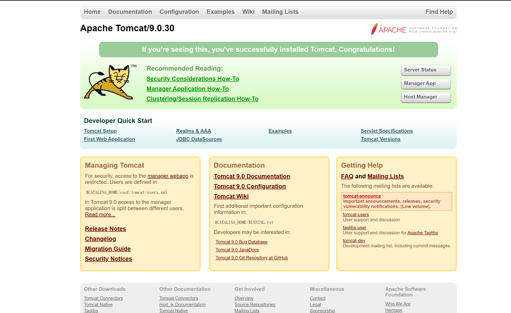
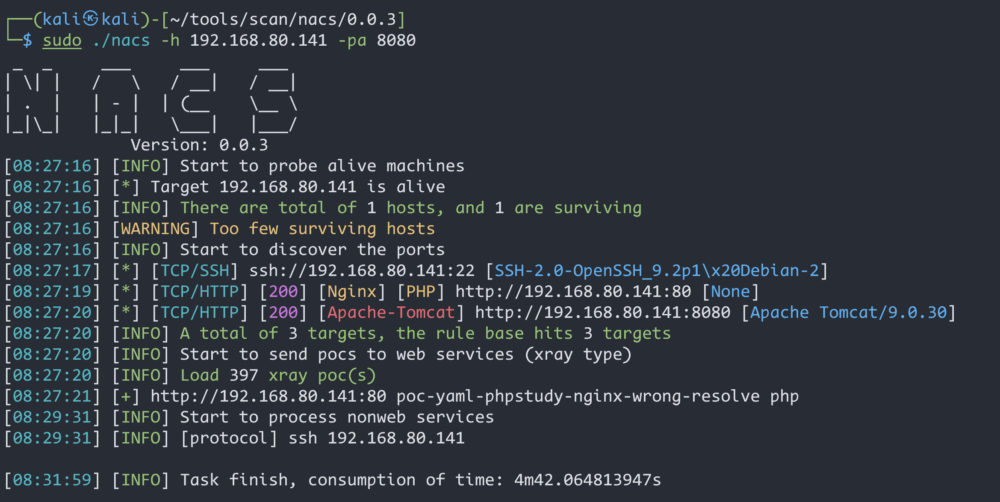
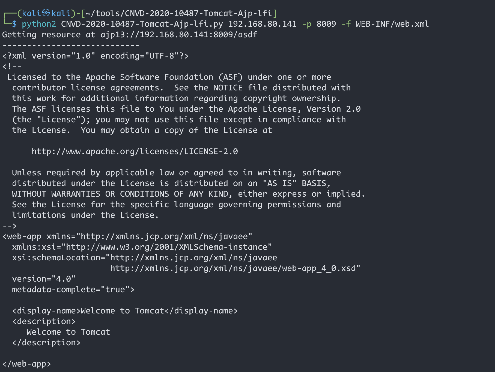
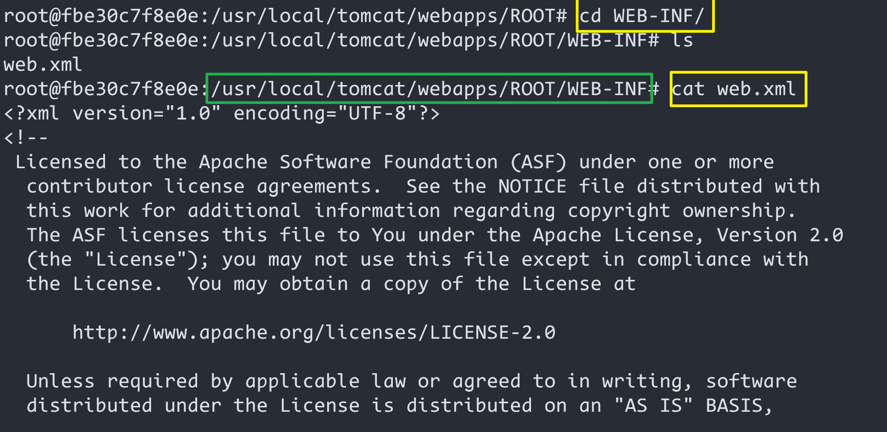
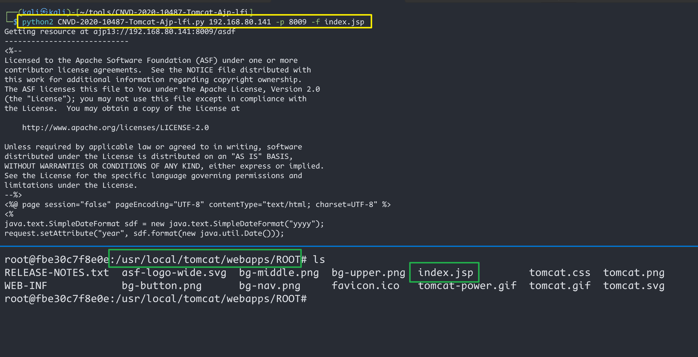

# Aapache_Tomcat_AJP_文件包含漏洞(CVE-2020-1938)

| 说明     | 内容                                                         |
| -------- | ------------------------------------------------------------ |
| 漏洞编号 | CVE-2020-1938                                                |
| 漏洞名称 | Aapache_Tomcat_AJP文件包含漏洞                               |
| 漏洞评级 | 高危                                                         |
| 影响范围 | Tomcat  9.0.30                                               |
| 漏洞描述 | 由于 Tomcat AJP 协议设计上存在缺陷，攻击者通过 Tomcat AJP Connector 可以读取或包含 Tomcat 上所有 webapp 目录下的任意文件 |
| 修复方案 |                                                              |

### 1.1、漏洞描述

ava 是目前 Web 开发中最主流的编程语言，而 Tomcat 是当前最流行的 Java 中间件服务器之一，从初版发布到现在已经有二十多年历史，在世界范围内广泛使用。

[Ghostcat（幽灵猫）](https://www.chaitin.cn/zh/ghostcat) 是由长亭科技安全研究员发现的存在于 Tomcat 中的安全漏洞，由于 Tomcat AJP 协议设计上存在缺陷，攻击者通过 Tomcat AJP Connector 可以读取或包含 Tomcat 上所有 webapp 目录下的任意文件，例如可以读取 webapp 配置文件或源代码。此外在目标应用有文件上传功能的情况下，配合文件包含的利用还可以达到远程代码执行的危害

### 1.2、漏洞等级

高危

### 1.3、影响版本

 9.0.30

### 1.4、漏洞复现

#### 1、基础环境

Path：Vulhub/tomcat/CVE-2020-1938

---

启动测试环境：

```bash
sudo docker-compose up -d
```

访问`http://your-ip:8080/`即可看到




利用如下工具均可测试漏洞：

- https://github.com/chaitin/xray
- https://github.com/YDHCUI/CNVD-2020-10487-Tomcat-Ajp-lfi

#### 2、漏洞扫描



#### 3、漏洞验证

利用工具`CNVD-2020-10487-Tomcat-Ajp-lfi`读取文件




进入到容器里面发现`web.xml` 在`/usr/local/tomcat/webapps/ROOT/WEB-INF`下



经验证，只能读取`ROOT`路径下的文件



