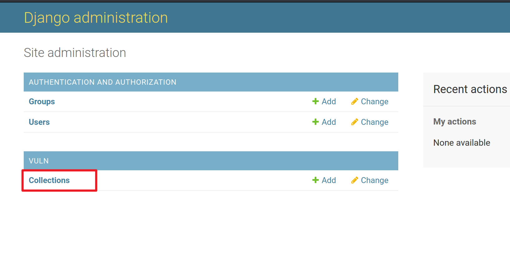
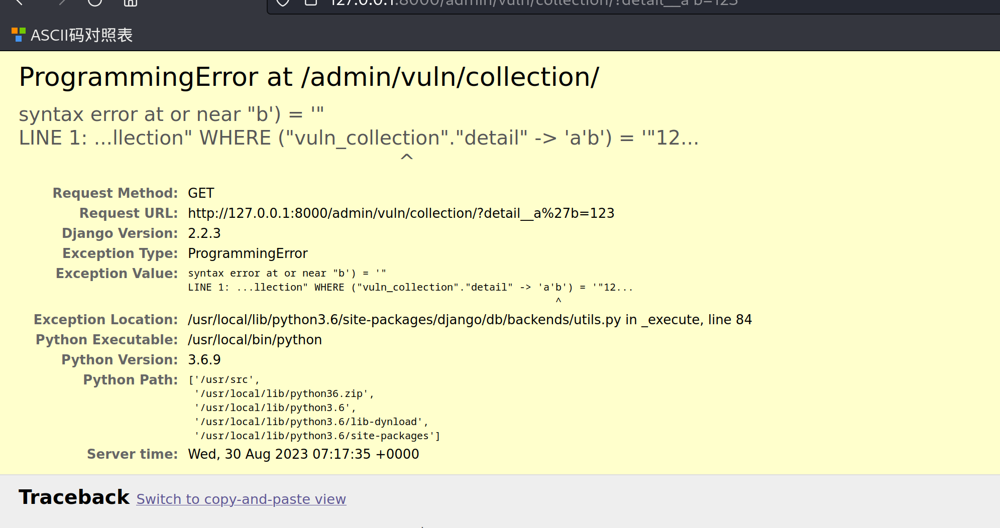

# Django JSONField/HStoreField SQL Injection Vulnerability (CVE-2019-14234)

> 复现环境：Vulhub

环境启动后，访问`http://192.168.80.141:8000`即可看到Django默认首页

#### 漏洞复现

首先登陆后台`http://192.168.80.141:8000/admin/`，用户名密码为`admin`、`a123123123`。

登陆后台后，进入模型`Collection`的管理页面`http://192.168.80.141:8000/admin/vuln/collection/`：

然后在GET参数中构造`detail__a'b=123`提交，其中`detail`是模型`Collection`中的JSONField：

`127.0.0.1:8000/admin/vuln/collection/?detail__a'b=123`

可见，单引号已注入成功，SQL语句报错：

