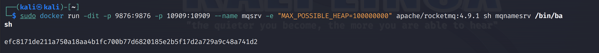
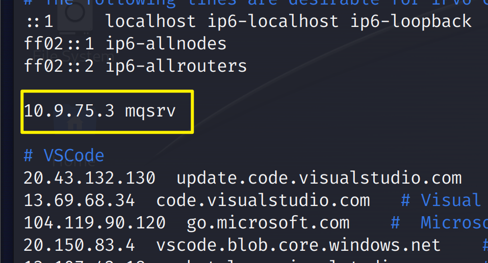
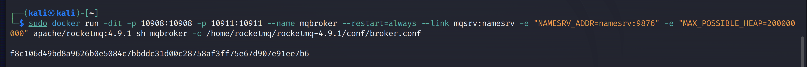
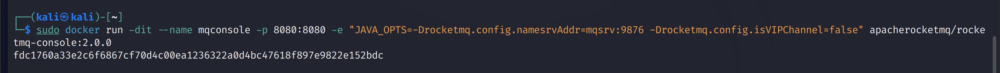
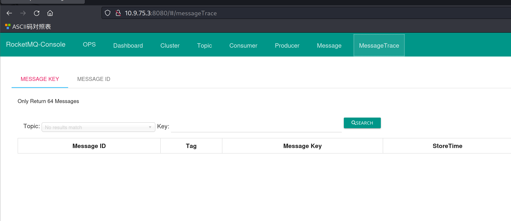

# Apache RocketMQ 命令注入（CVE-2023-33246）

| 说明     | 内容                             |
| -------- | -------------------------------- |
| 漏洞编号 | CVE-2023-33246                   |
| 漏洞名称 | Apache RocketMQ 命令注入         |
| 漏洞评级 | 高危                             |
| 影响范围 | Rocketmq 版本 < 5.1.1 或 < 4.9.6 |
| 漏洞描述 |                                  |
| 修复方案 | <a href="#miao">见底部</a>；     |


### 1.1、漏洞描述

Apache RocketMQ 是一个分布式消息中间件，它支持多种消息模式，如发布/订阅、点对点、广播等，以及多种消息类型，如有序消息、延迟消息、批量消息等。它具有高吞吐量、低延迟、高可靠性、高可扩展性等特点，适用于互联网、大数据、移动互联网、物联网等领域的实时数据处理。

 Apache RocketMQ 在 5.1.1 和 4.9.6 版本之前存在命令注入漏洞。Apache RocketMQ 中的多个组件缺乏权限验证，攻击者可以通过使用更新配置功能，以 RocketMQ 运行的系统用户执行命令。此外，攻击者还可以通过伪造 RocketMQ 协议内容达到相同的利用效果


**危害**

攻击者可以通过使用更新配置功能，以 RocketMQ 运行的系统用户执行命令。此外，攻击者还可以通过伪造 RocketMQ 协议内容达到相同的利用效果。

### 1.2、漏洞等级

### 1.3、影响版本

- 5.0.0 <= Apache RocketMQ < 5.1.1

- 4.0.0 <= Apache RocketMQ < 4.9.6

安全版本

- Apache RocketMQ 5.1.1

- Apache RocketMQ 4.9.6

### 1.4、漏洞复现

#### 1、基础环境

```bash
docker pull apache/rocketmq:4.9.1
docker pull apacherocketmq/rocketmq-console:2.0.0
```

**启动namesrv:**

```bash
sudo docker run -dit -p 9876:9876 -p 10909:10909 --name mqsrv -e "MAX_POSSIBLE_HEAP=100000000" apache/rocketmq:4.9.1 sh mqnamesrv /bin/bash

```



**mqsrv绑定网口IP写host文件**



**启动broker服务**

```bash
sudo docker run -dit -p 10908:10908 -p 10911:10911 --name mqbroker --restart=always --link mqsrv:namesrv -e "NAMESRV_ADDR=namesrv:9876" -e "MAX_POSSIBLE_HEAP=200000000" apache/rocketmq:4.9.1 sh mqbroker -c /home/rocketmq/rocketmq-4.9.1/conf/broker.conf

```



**启用console**

```bash
docker run -dit --name mqconsole -p 8080:8080 -e "JAVA_OPTS=-Drocketmq.config.namesrvAddr=mqsrv:9876 -Drocketmq.config.isVIPChannel=false" apacherocketmq/rocketmq-console:2.0.0
```



---


访问`http://your-ip:{8080}/`即可看到




#### 2、漏洞验证

POC：https://github.com/Serendipity-Lucky/CVE-2023-33246

```bash
java -jar CVE-2023-33246.jar -ip "攻击机IP" -cmd "需要执行的命令"
```


### 1.5、修复建议

<p id="miao">~~~~~~~</p>

目前官方已修复该漏洞，受影响用户可以升级更新到安全版本。官方下载链接：

https://github.com/apache/rocketmq/releases/tag/rocketmq-all-5.1.2

https://github.com/apache/rocketmq/releases/tag/rocketmq-all-4.9.7

