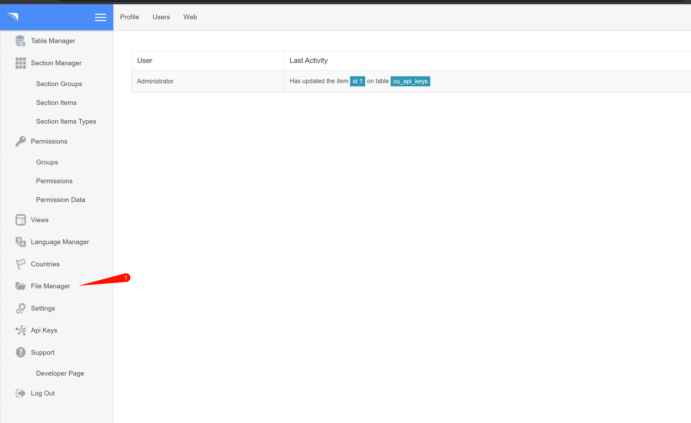

# CuppaCMS文件上传漏洞

| 说明     | 内容                                                         |
| -------- | ------------------------------------------------------------ |
| 漏洞编号 | CVE-2020-26048                                               |
| 漏洞名称 | CuppaCMS文件上传                                             |
| 漏洞评级 | 高危                                                         |
| 影响范围 | CuppaCMS 2019-11-12之前版本                                  |
| 漏洞描述 | CuppaCMS 2019-11-12之前版本存在安全漏洞，攻击者可利用该漏洞在图像扩展内上传恶意文件，通过使用文件管理器提供的重命名函数的自定义请求，可以将图像扩展修改为PHP，从而导致远程任意代码执行 |
|          |                                                              |


### 1.1、漏洞描述

**CuppaCMS是一套内容管理系统（CMS）。 CuppaCMS 2019-11-12之前版本存在安全漏洞，攻击者可利用该漏洞在图像扩展内上传恶意文件，通过使用文件管理器提供的重命名函数的自定义请求，可以将图像扩展修改为PHP，从而导致远程任意代码执行。**

### 1.2、漏洞等级

高危

### 1.3、影响版本

CuppaCMS 2019-11-12之前版本

### 1.4、漏洞复现

#### 1、基础环境

[环境地址](https://yunjing.ichunqiu.com/result?title=CVE-2020-26048%2520)

---

启动后，访问即可看到一个登陆框


登录框存在弱口令`admin:admin`

在`Settings`里发现可以修改允许文件的后缀名，直接添加一个`*.php`


然后找到`File Manager`文件管理



#### 2、漏洞验证

上传php后门文件


```php
<?php @eval($_POST['a']);?>
```

上传成功


访问php文件，看能否解析php，结果显示被禁止，说没有权限访问这个资源


回到文件管理器，猜测可能是`.htaccess`文件加了限制，发现在文件管理器能删除文件，就把.htaccess文件删了，再去访问


验证木马是否可利用


获取flag


以上是通过删除`.htaccess`文件来达到绕过

---

以下通过其他方式进行绕过

在没有修改setting配置的情况下，上传php文件，显示文件类型不允许


修改文件名，文件类型


上传成功！

对上传的文件进行重命名操作


修改后发现还是强加了`.png`后缀


查看数据包


修改重命名的数据包


这个时候就进行了一个绕过，成功上传了`.php`文件


但是访问后还是显示被禁止


这里是因为`.htaccess`的限制

当前目录下的所有文件都收到`.htaccess`的影响


所以，可以将文件上传到上一级目录

当前目录下有一个`a.php`，但是由于权限问题，不能正常访问，修改刚才重命名的数据包，上传到上一个目录


