> 环境地址：https://docs.zblogcn.com/php/#/books/start-05-install

**csrf并不侧重于哪种功能点，只要检测不规范，就可能利用成功，所以我考虑了一下后台添加管理员的地方**

找后台位置，进行登陆

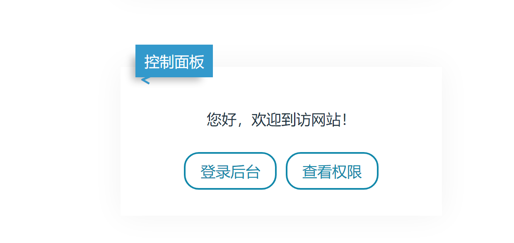

找到`用户管理--新建用户`

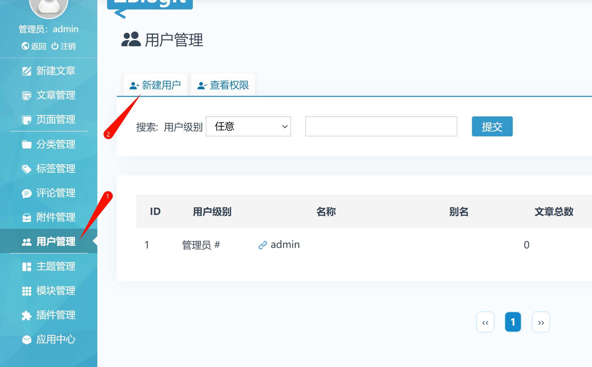


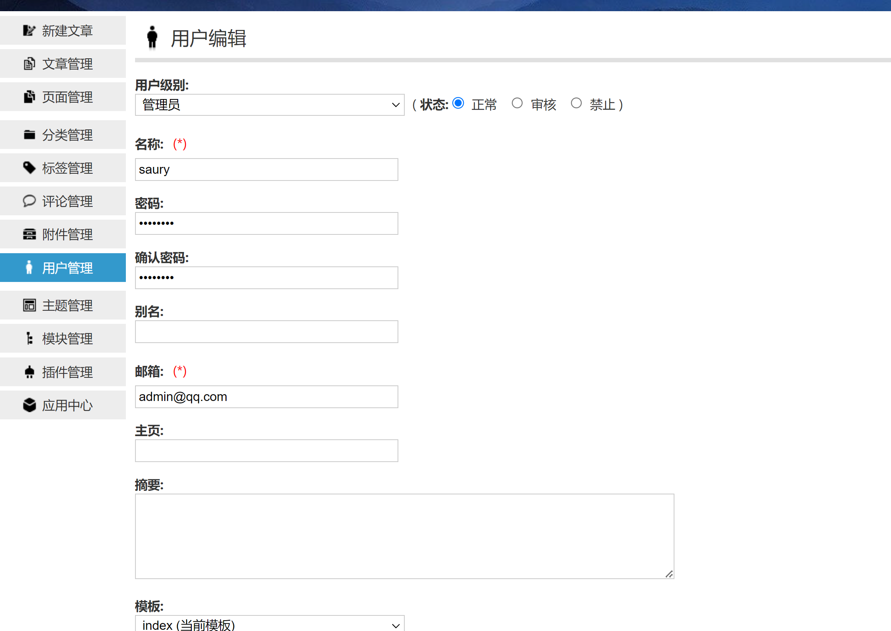


点击提交的同时要开启监听`8008`端口

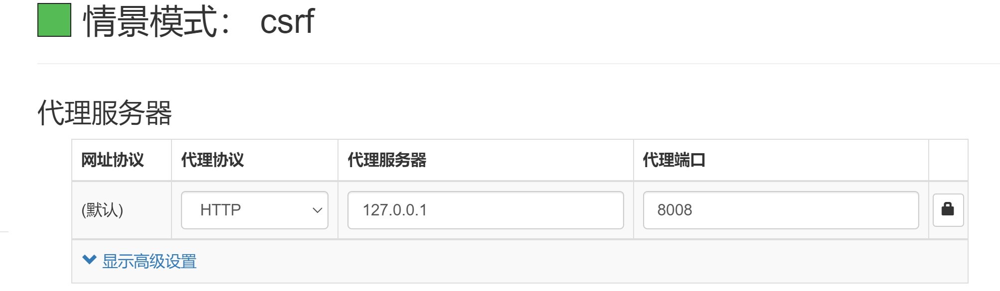

打开`CSRFTester工具`抓取添加用户的数据包


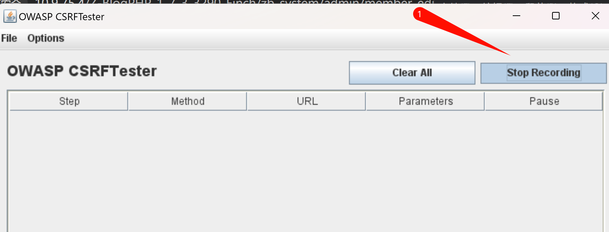

导出数据包

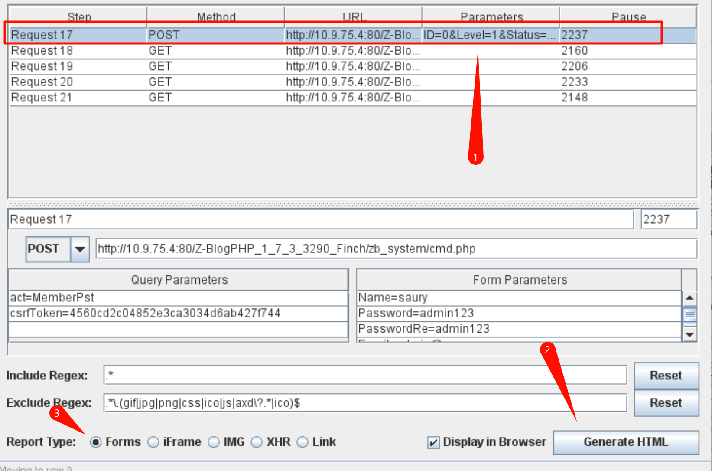

数据包导出后，代理就可以关闭了，然后需要对导出的数据包进行简单的删除修改

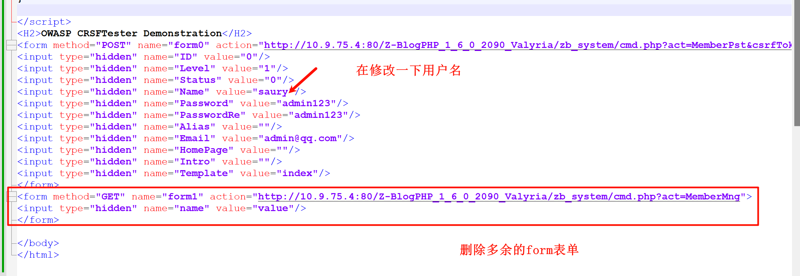

只留下有用的form表单数据，其他的form表单可以删除

对留下的那个form表单数据做简单修改，换一个用户名，因为`saury`这个用户名已经被添加上去了，所以换一个名字，防止重复

然后将导出的`1.html`放到一个可访问的资源地址上去

> 可访问的资源地址：http://192.168.1.100:8089/1.html

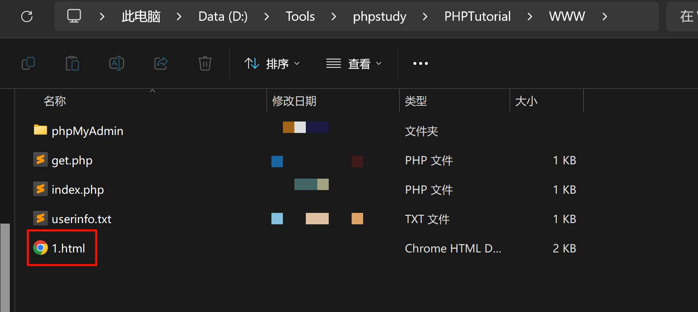

但是并没有成功添加，说明网站做了防护

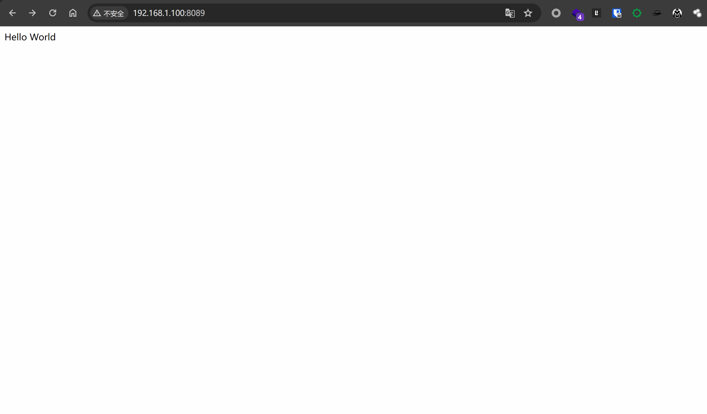

进行代码审计

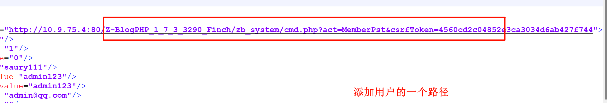


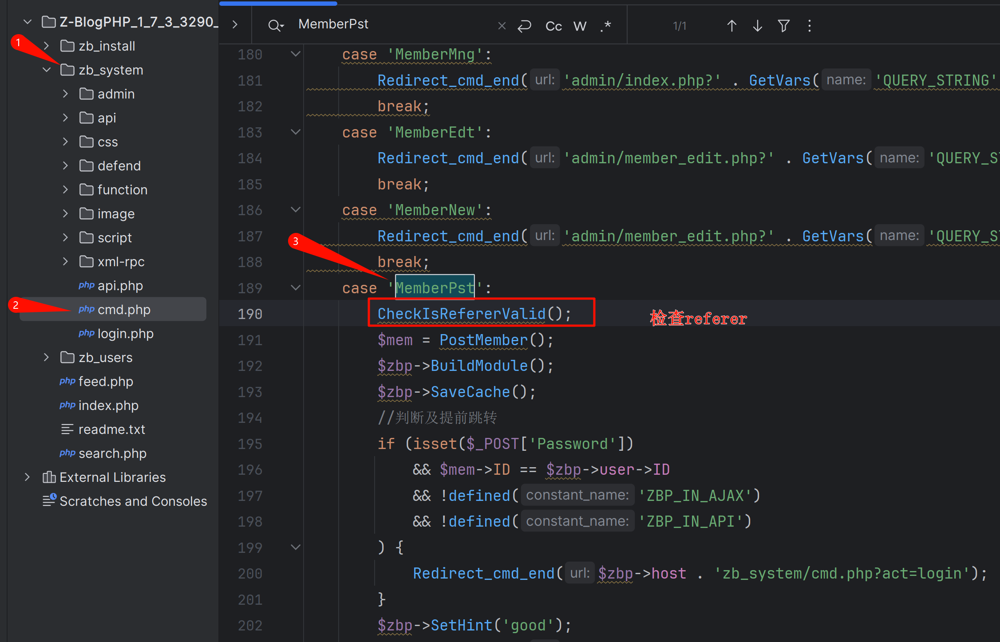

然后按住`Ctrl`,点击`CheckIsRefererValid()`这个函数，跳转


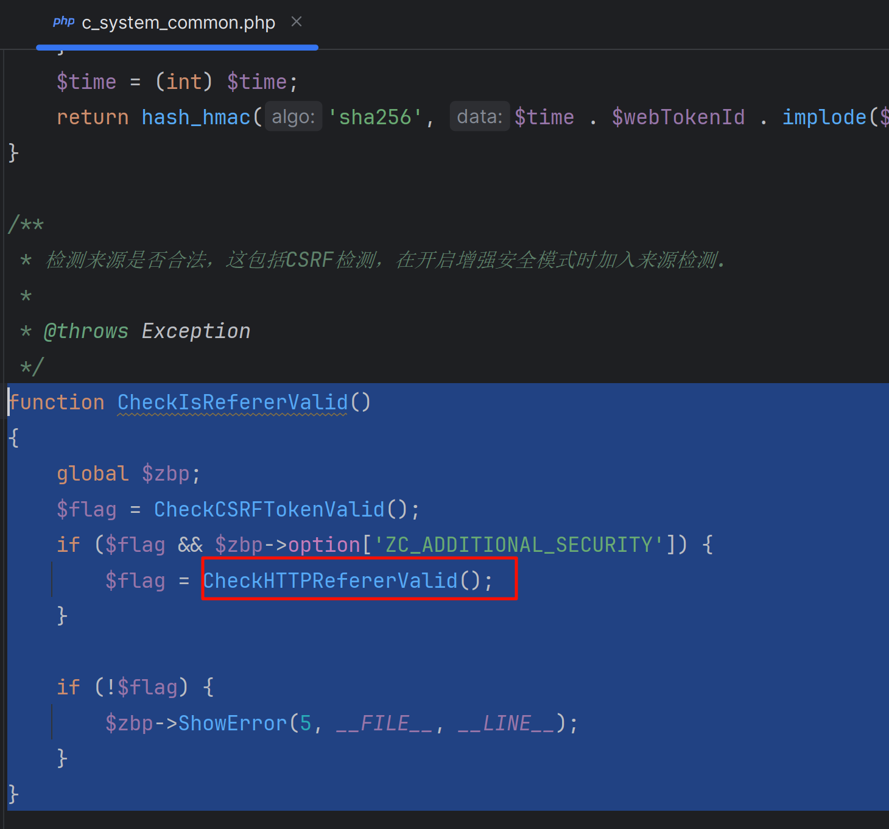

也没有找到具体的代码，继续找`CheckHTTPRefererValid();`

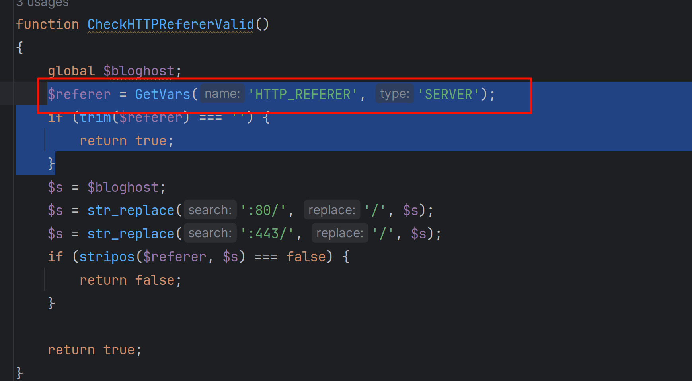

发现了具体的代码，

```php
function CheckHTTPRefererValid()
{
    global $bloghost;
    $referer = GetVars('HTTP_REFERER', 'SERVER');
    if (trim($referer) === '') {
        return true;
    }
    $s = $bloghost;
    $s = str_replace(':80/', '/', $s);
    $s = str_replace(':443/', '/', $s);
    if (stripos($referer, $s) === false) {
        return false;
    }

    return true;
}
```

可以发现代理中是检测了`Referer`字段的

下面就是进行绕过

其实可是在访问`http://192.168.1.100:8089/1.html`的时候，BurpSuite抓包，修改Referer字段来进行绕过，但是这样不是很完善

先来修改数据包绕过一下把

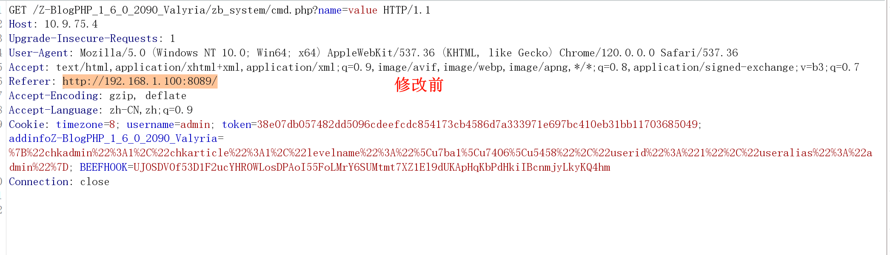

> 没有成功，反正思路就是这么个思路，懂就行！


可以使用下面的两种方法：

```
1、伪造-需要在代码数据包文件固定来源
2、尝试在网站寻找可上传地方，上传数据包文件，取得当前同域名访问地址
```


