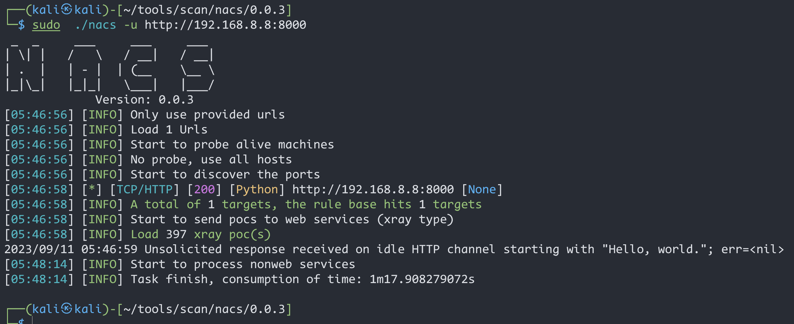
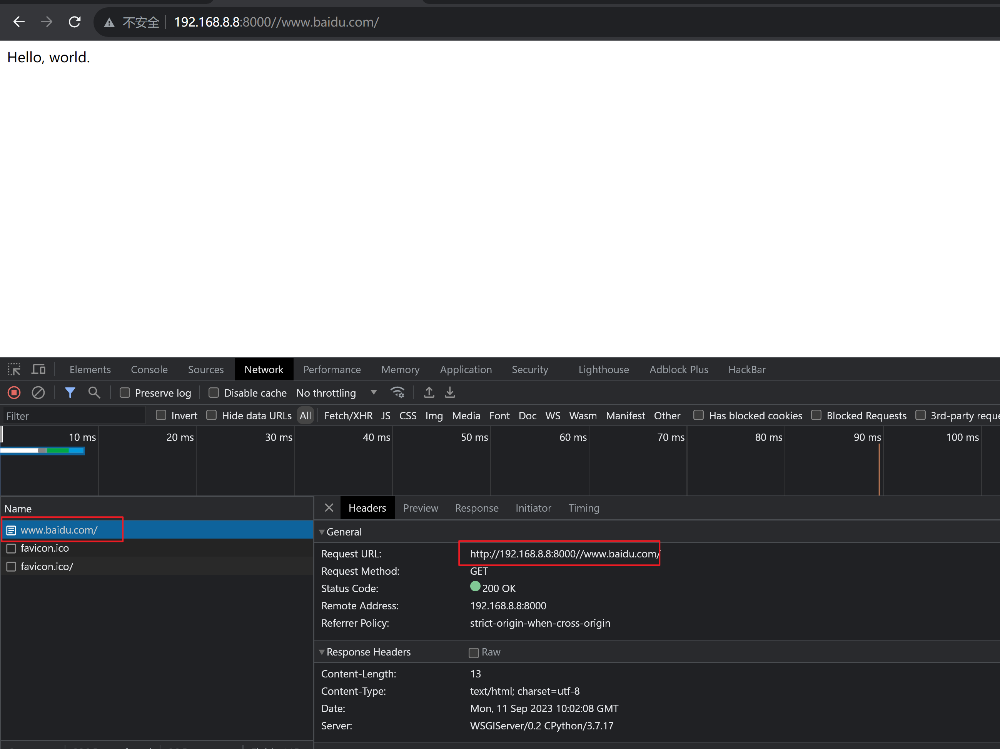

# Django < 2.0.8_任意URL跳转漏洞(CVE-2018-14574)

| 说明     | 内容                                        |
| -------- | ------------------------------------------- |
| 漏洞编号 | CVE-2018-14574                              |
| 漏洞名称 | Django任意URL跳转漏洞                       |
| 漏洞评级 |                                             |
| 影响范围 | Django版本<2.0.8                            |
| 漏洞描述 |                                             |
| 修复方案 | 尽快升级到最新版本，或者至少升级到2.0.8版本 |


### 1.1、漏洞描述

​          Django是一个广泛使用的Python web框架，它有很多方便和强大的功能。但是，像任何其他软件一样，Django也可能存在安全漏洞，这个漏洞在Django的CommonMiddleware中可能导致开放重定向。

​           Django默认配置下，如果匹配上的URL路由中最后一位是`/`，而用户访问的时候没加`/`，Django默认会跳转到带/的请求中。（由配置项中的`django.middleware.common.CommonMiddleware`、`APPEND_SLASH`来决定）。

​        在path开头为`//example.com`的情况下，Django没做处理，导致浏览器认为目的地址是绝对路径，最终造成任意URL跳转漏洞。

该漏洞利用条件是目标`URLCONF`中存在能匹配上`//example.com`的规则。

### 1.2、漏洞等级

### 1.3、影响版本

  Django版本<2.0.8

### 1.4、漏洞复现

#### 1、基础环境

Path：Vulhub/django/CVE-2018-14574


---

启动测试环境：

```bash
sudo docker-compose build
sudo docker-compose up -d
```

访问`http://your-ip:8000/`即可看到


#### 2、漏洞扫描



#### 3、漏洞验证



### 1.5、修复建议

尽快升级到最新版本，或者至少升级到2.0.8版本

```python
pip install --upgrade Django
```

如果你不能立即升级Django，你也可以考虑禁用`X-Forwarded-Host`头，这可以通过在settings.py文件中添加以下配置来实现：

```python
SECURE_PROXY_SSL_HEADER = ('HTTP_X_FORWARDED_PROTO', 'https')  
SECURE_PROXY_SSL_HEADER = None
```

请注意，禁用`X-Forwarded-Host`头可能会影响到你的应用程序的正常运行，特别是如果你的应用程序部署在反向代理服务器后面的时候。所以，只有在你确定这个更改不会影响到你的应用程序的情况下，才应该使用这个方法。