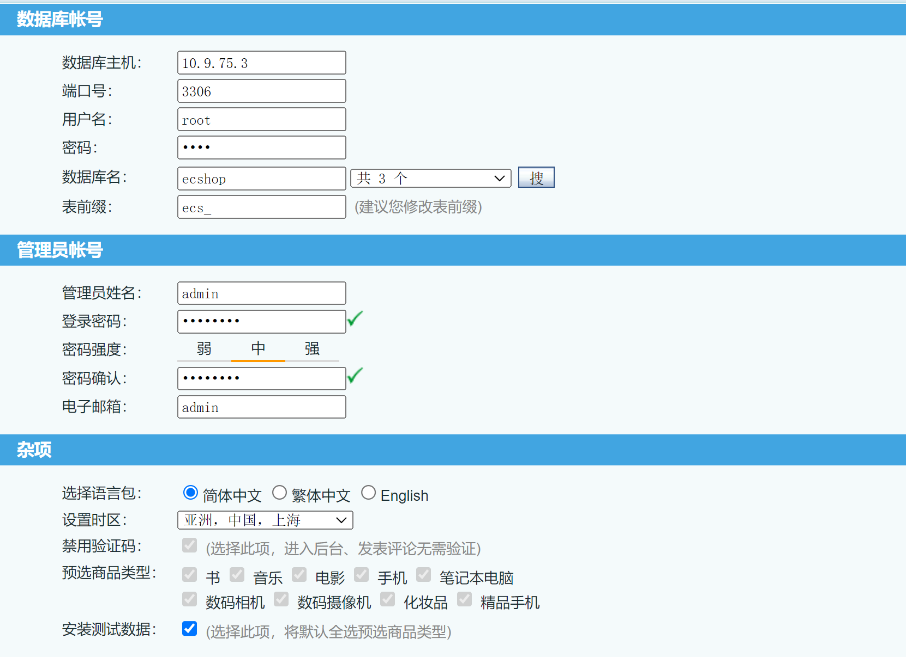

# ECShop 2.x/3.x SQL注入/远程代码执行


### 1.1、漏洞描述

ECShop是一款B2C独立网店系统，适合企业及个人快速构建个性化网上商店。系统是基于PHP语言及MYSQL数据库构架开发的跨平台开源程序。

其2017年及以前的版本中，存在一处SQL注入漏洞，通过该漏洞可注入恶意数据，最终导致任意代码执行漏洞。其3.6.0最新版已修复该漏洞，vulhub中使用其2.7.3最新版与3.6.0次新版进行漏洞复现。


### 1.2、漏洞等级

### 1.3、影响版本

2.x

3.x

### 1.4、漏洞复现

#### 1、基础环境

Path：Vulhub/ecshop/xianzhi-2017-02-82239600/ 

---

启动测试环境：

```bash
sudo docker-compose up -d
```

访问`http://your-ip:{8080}/`即可看到


数据库配置，数据库连接密码依据个人情况而定



如果安装失败，按照提示删除了data文件夹下的install.lock文件，不能没解决问题的话，可以看下数据库到底有没有自己命名的数据库名，有的话，可以进入 docker容器里，将`/var/www/html/`的`install`目录换个 名字，重启访问地址就可以了


#### 2、漏洞扫描

#### 3、漏洞验证

### 1.5、深度利用

#### 1、反弹Shell

#### 2、写入文件

### 1.6、修复建议