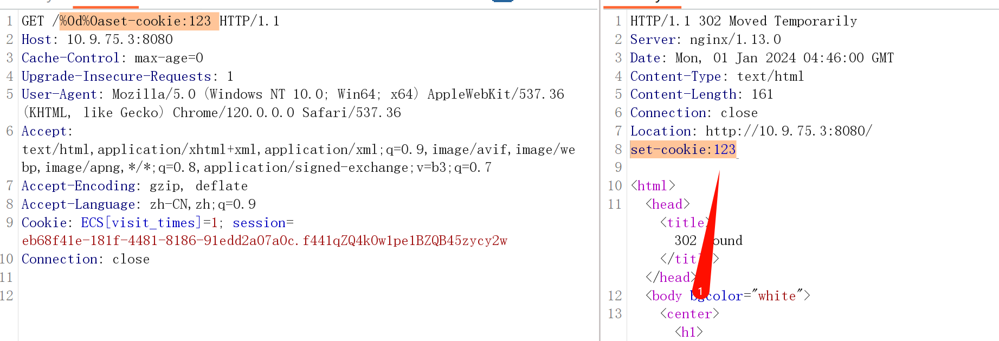
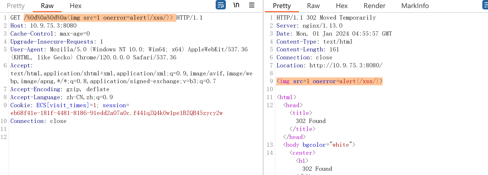
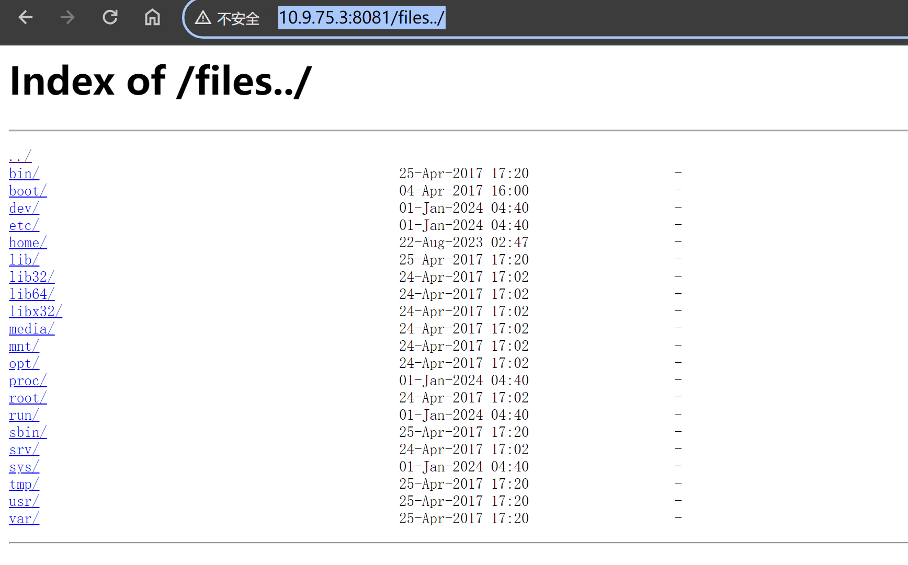
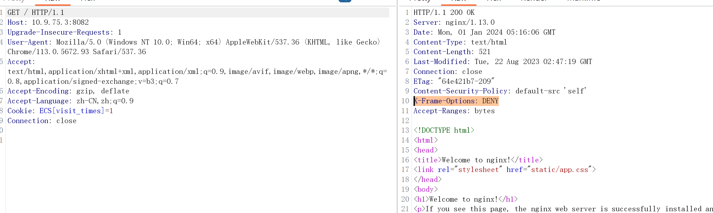
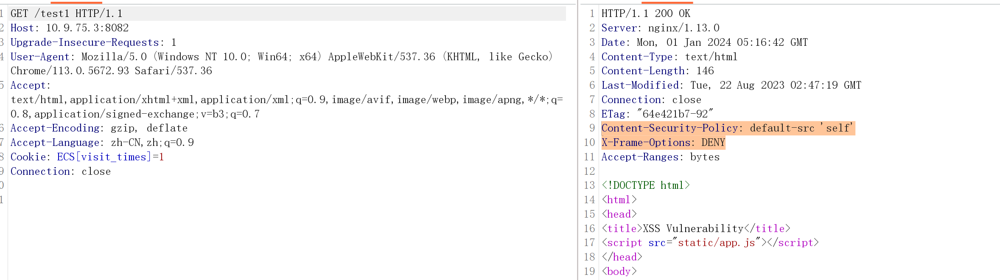
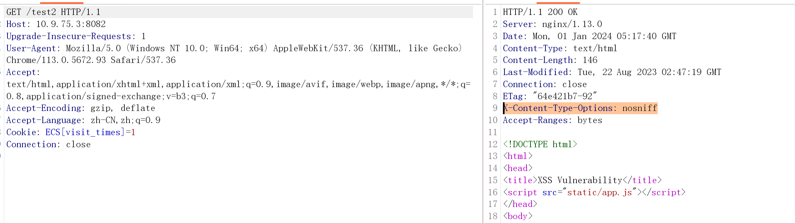
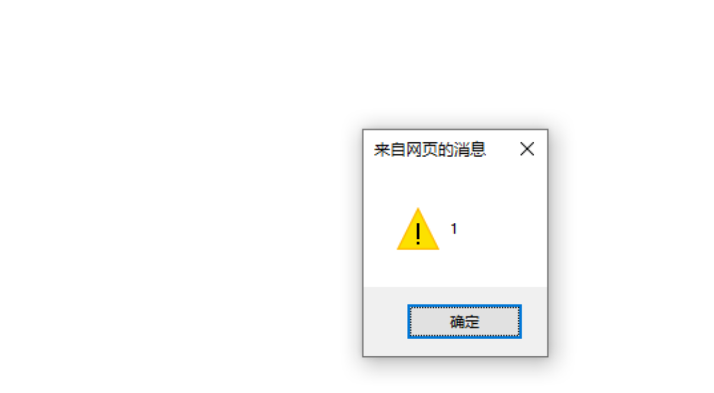

# Nginx 配置错误导致漏洞


#### 基础环境

Path：vulhub/nginx/insecure-configuration

启动测试环境：

```bash
sudo docker-compose up -d
```

运行成功后，Nginx将会监听`8080/8081/8082`三个端口，分别对应三种漏洞。

#### CRLF注入漏洞

CRLF是”回车+换行”(\r\n)的简称，其十六进制编码分别为0x0d和0x0a（URL编码则是%0d,%0a）

在HTTP协议中，HTTP header是用一个CRLF分隔的，HTTP Body是用两个CRLF分隔的，浏览器就是根据这两个CRLF来取HTTP内容并显示出来。一旦我们能够控制HTTP消息头中的字符，注入一些恶意的换行，这样我们就能注入一些会话Cookie或者HTML代码。


这个漏洞是比较容易发现，危害比较小的漏洞。

##### 漏洞原理

nginx的错误配置如下，该配置的用意是让[http](https://so.csdn.net/so/search?q=http&spm=1001.2101.3001.7020)请求跳转到https请求。其中`$uri`就是我们的访问的地址，该变量是可控的。其中`https://$host$uri`会出现在http响应报文中，这样就可以通过改变`$uri`来控制http的响应报文。

```
location / {
    return 302 https://$host$uri;
}
```

##### 漏洞利用

Payload: `http://your-ip:8080/%0d%0aset-cookie:123 `，可注入Set-Cookie头



结合xss漏洞：

Payload：`http://your-ip:8080/%0d%0a%0d%0a `



##### 修复方案：

- Nginx的配置文件`/etc/nginx/conf.d/error1.conf`修改为使用不解码的url跳转。

##### 检测工具

- crlfuzz_1.4.1_windows_amd64
- 项目地址：https://github.com/dwisiswant0/crlfuzz/releases

- 在当前目录下运行cmd：`crlfuzz.exe -u "http://192.168.233.128:8080/"`

---

#### 目录穿越漏洞

##### 漏洞描述

当攻击者能够控制 Nginx [服务器](https://so.csdn.net/so/search?q=服务器&spm=1001.2101.3001.7020)的一个参数（例如 HTTP 请求中的某个参数），并且使用该参数从服务器获取一个文件时，如果未对该参数进行适当的过滤或校验，则攻击者可以通过构造指向其他路径的符号链接或特殊字符序列，来访问服务器上不应被访问的文件或目录。

##### 漏洞原理

Nginx在配置别名（Alias）的时候，如果忘记加`/`，将造成一个目录穿越漏洞。在下面配置中`/files`在匹配字符串的时候可以匹配到 `/files..`，而 `/files..`转化成别名时就会变成 `/home/..`，这样就可以访问到home目录的上一级目录。

```
location /files {
    alias /home/;
}
```

把 `/files`改成 `/files/`即可修改该漏洞。

##### 漏洞利用

Payload：`http://10.9.75.3:8081/files../`



##### 修复方案

- 审查和更新 Nginx 配置：仔细审查 Nginx 的配置文件，特别关注代理和重定向规则，确保没有任何配置错误。确保将请求 URL 和路径正确传递给后端服务器，避免可能导致目录穿越的配置错误。
- 输入验证和过滤：对收到的所有用户输入进行严格的验证和过滤，特别是涉及到文件路径、URL 参数等与文件系统相关的输入。验证用户输入是否符合预期的格式和范围，排除任何可能的恶意输入。
- 规范化路径：在处理用户输入之前，对路径进行规范化处理，以确保路径格式的一致性，并移除任何冗余或不必要的字符。使用可靠的路径规范化函数或库，避免路径解析中的任何安全漏洞。
- 限制访问权限：确保服务器上的文件和目录设置了正确的访问权限。对于敏感文件和目录，只授予必要的最小权限，并限制对它们的访问。这样即使目录穿越成功，攻击者也无法获取敏感信息。

---

#### add_header被覆盖

##### 漏洞描述

在 Nginx 配置中，add_header 指令用于添加响应头信息。该指令的作用是在响应中添加自定义的 HTTP 头部，以便向客户端传递特定的信息。然而，如果在配置中存在错误或竞争条件，攻击者可能会利用这种情况来覆盖或篡改 add_header 指令的内容。

##### 漏洞原理

Nginx的配置文件分为Server、Location、If等一些配置块，并且存在包含关系，和编程语言比较类似。如果在外层配置的一些选项，是可以被继承到内层的。

但这里的继承也有一些特性，比如add_header，子块中配置后将会覆盖父块中的add_header添加的所有HTTP头，造成一些安全隐患。

如下列代码，整站（父块中）添加了CSP头：


```nginx
add_header Content-Security-Policy "default-src 'self'";
add_header X-Frame-Options DENY;

location = /test1 {
    rewrite ^(.*)$ /xss.html break;
}

location = /test2 {
    add_header X-Content-Type-Options nosniff;
    rewrite ^(.*)$ /xss.html break;
}

```

> 补充：
>
> CSP（Content Security Policy）头是一种 HTTP 响应头部，用于指定浏览器加载和执行网页内容时的安全策略。它提供了一种机制，让网站管理员能够控制网页中可执行的内容来源以及允许的操作。
>
> CSP 头通过定义一系列的策略指令来限制浏览器执行的特定操作，包括脚本执行、CSS 样式应用、字体加载、图片显示等。这些策略指令可以防止跨站点脚本攻击（XSS）、点击劫持、数据泄露等安全威胁。
>
> `default-src`：指定默认情况下允许加载内容的来源。

##### 漏洞利用




/test1



/test2



`/test2`的`location`中又添加了`X-Content-Type-Options`头，导致父块中的`add_header`全部失效，`/test2`将`Content-Security-Policy`（内容安全策略）头覆盖。

此时，test2的`CSP`就完全失效了，成功触发XSS：

`http://10.9.75.3:8082/test2#`


IE浏览器中测试：



##### 修复方案

- 检查配置文件：仔细检查 Nginx 的配置文件，特别是涉及到 add_header 指令的部分。确保没有重复的 add_header 指令或者其他指令导致 add_header 被覆盖。

- 使用 always 参数：在 add_header 指令中使用 always 参数，例如 add_header X-Frame-Options "SAMEORIGIN" always;。这样可以确保在所有情况下都会发送相应的头部，包括错误页面和重定向。

- 使用不同的名字：将 add_header 指令的名称更改为独特的名称，以避免与其他指令冲突。例如，将其命名为 my_add_header。

- 块顺序：确保 Nginx 配置文件中加载模块的顺序正确。有些模块可能会修改或覆盖其他模块设置的头部值。将具有更高优先级的模块指令放在较低优先级模块指令之前，以确保正确的设置。

- 使用 location 块：将 add_header 指令放置在适当的 location 块中。根据需要，选择合适的 location 来添加头部，以确保正确地应用到特定的请求或响应。

- 配置测试：在修改配置文件后，重新加载 Nginx 服务，并进行测试以确保修复生效。可以通过发送请求并检查响应头部来验证 add_header 是否正确设置。

- 使用 location 块：将 add_header 指令放置在适当的 location 块中。根据需要，选择合适的 location 来添加头部，以确保正确地应用到特定的请求或响应。

- 配置测试：在修改配置文件后，重新加载 Nginx 服务，并进行测试以确保修复生效。可以通过发送请求并检查响应头部来验证 add_header 是否正确设置。
  