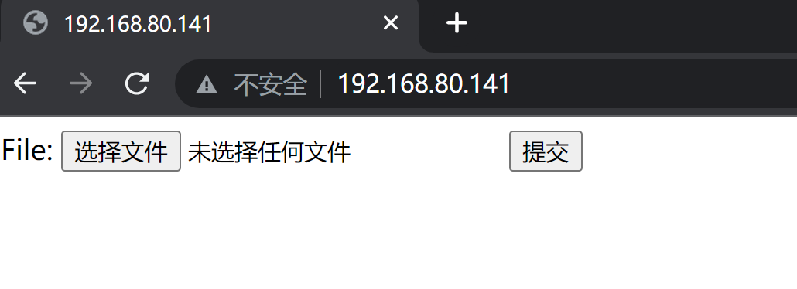
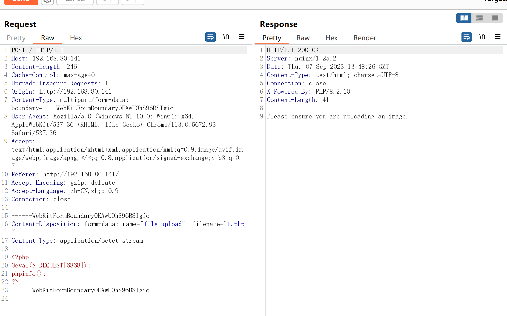
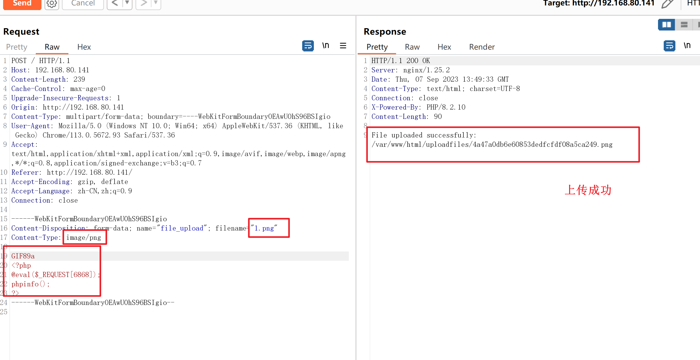
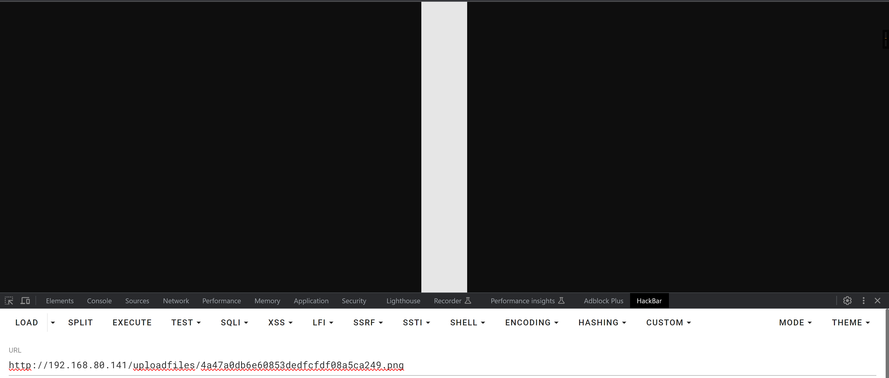
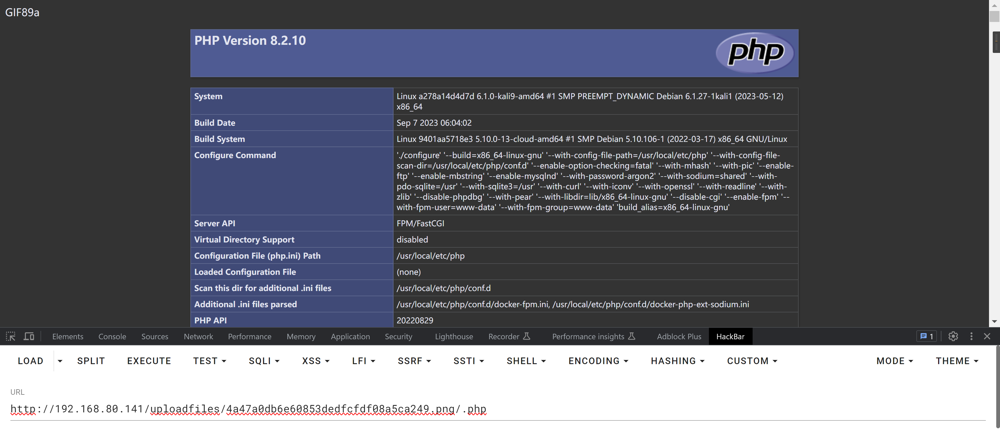
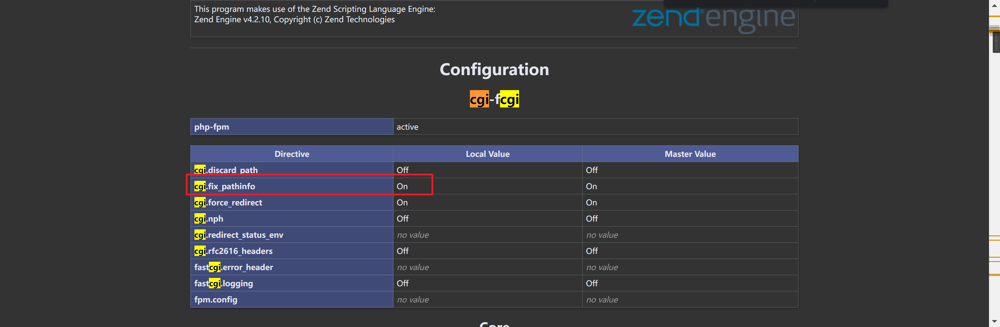
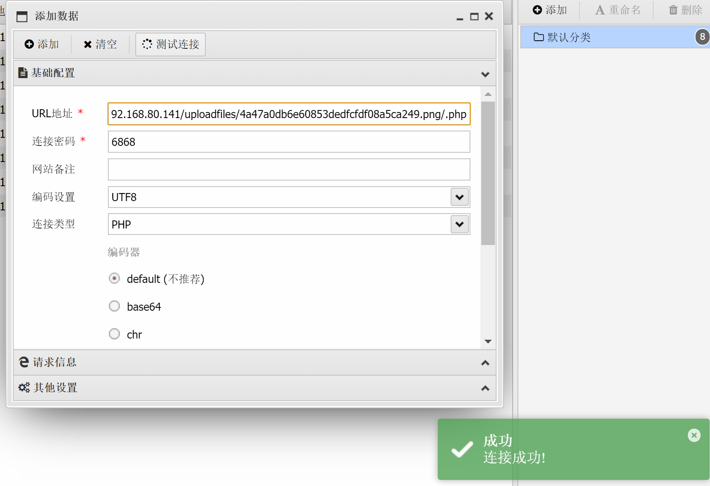
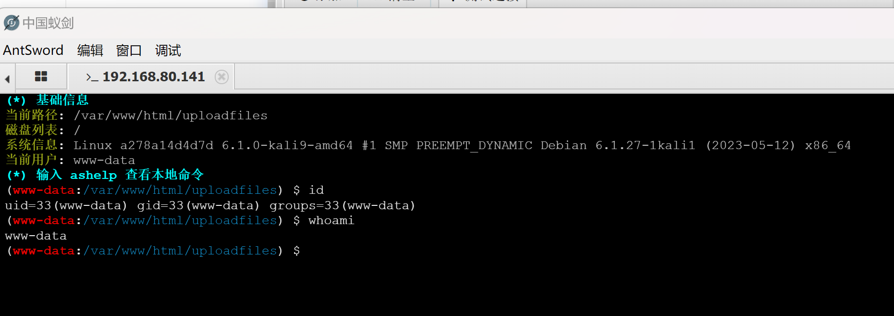

# Nginx 解析漏洞复现

| 说明     | 内容                                                         |
| -------- | ------------------------------------------------------------ |
| 漏洞编号 |                                                              |
| 漏洞名称 |                                                              |
| 漏洞评级 |                                                              |
| 影响范围 |                                                              |
| 漏洞描述 | Nginx 解析漏洞 该解析漏洞是PHP CGI 的漏洞，在PHP的配置文件中有一个关键的选项<br/> cgi.fix_pathinfo默认开启，当URL中有不存在的文件，PHP就会向前递归解析 在一个文件路径（/xx.jpg）后面加上/xx.PHP会将 /xx.jpg /xx.php 解析为 php 文件 |
| 修复方案 |                                                              |


### 1.1、漏洞描述

这个漏洞其实和代码执行没有太大关系，其主要原因是错误地解析了请求的URI，错误地获取到用户请求的文件名，导致出现权限绕过、代码执行的连带影响

Nginx 解析漏洞 该解析漏洞是PHP CGI 的漏洞，在PHP的配置文件中有一个关键的选项
` cgi.fix_pathinfo`默认开启，当URL中有不存在的文件，PHP就会向前递归解析 在一个文件路径（/xx.jpg）后面加上`/.php`会将` /xx.jpg/.php `解析为` php `文件

### 1.2、漏洞等级

### 1.3、影响版本

### 1.4、漏洞复现

#### 1、基础环境

Path：Vulhub/nginx/nginx_parsing_vulnerability

---

启动测试环境：

```bash
sudo docker-compose up -d
```

访问`http://your-ip`即可看到



#### 2、漏洞扫描

#### 3、漏洞验证

上传`1.php`一句话木马，上传失败



修改文件名，文件类型，文件内容



```
uploadfiles/4a47a0db6e60853dedfcfdf08a5ca249.png
```

访问上传的图片



增加`/.php`后缀，被解析成PHP文件



造成这一问题主要跟 PHP的安全选项有关  `cgi`



### 1.5、深度利用

##### GetShell





### 1.6、修复建议