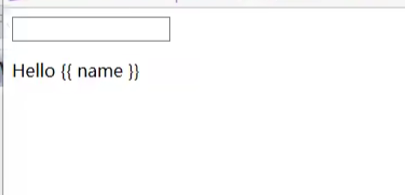
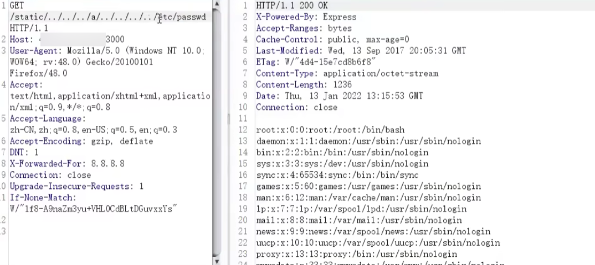
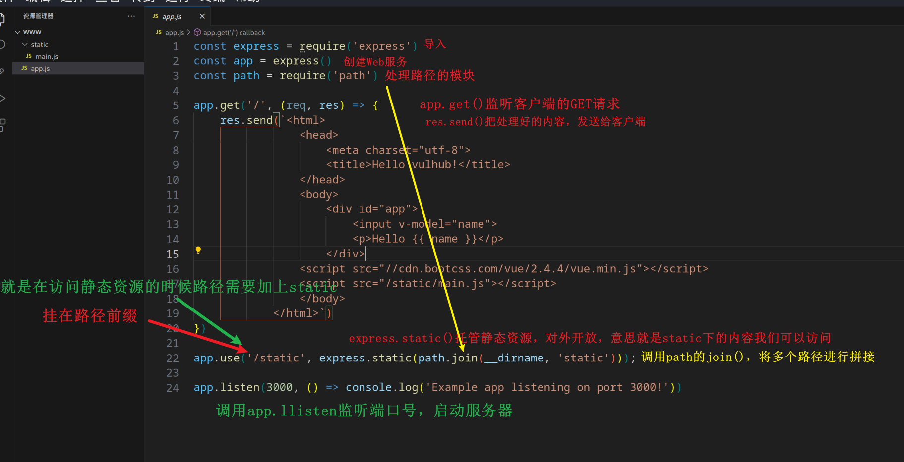
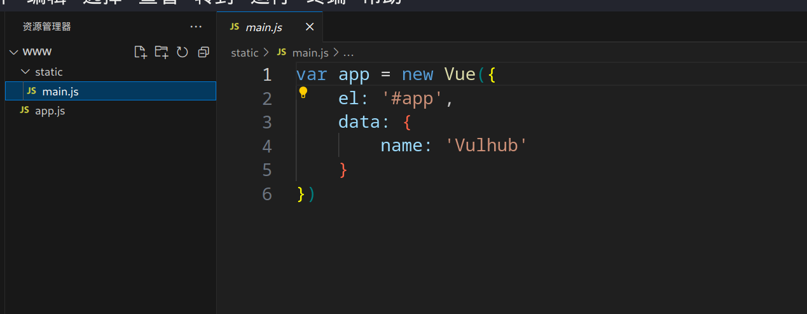

[toc]


### 1.1、漏洞描述

原因是 Node.js 8.5.0 对目录进行normalize操作时出现了逻辑错误，导致向上层跳跃的时候（如`../../../../../../etc/passwd`），在中间位置增加`foo/../`（如`../../../foo/../../../../etc/passwd`），即可使`normalize`返回`/etc/passwd`，但实际上正确结果应该是`../../../../../../etc/passwd`。

express这类web框架，通常会提供了静态文件服务器的功能，这些功能依赖于normalize函数。比如，express在判断path是否超出静态目录范围时，就用到了normalize函数，上述BUG导致normalize函数返回错误结果导致绕过了检查，造成任意文件读取漏洞。

当然，normalize的BUG可以影响的绝非仅有express，更有待深入挖掘。不过因为这个BUG是node 8.5.0 中引入的，在 8.6 中就进行了修复，所以影响范围有限。


### 1.2、影响版本

- Node.js 8.5.0 + Express 3.19.0-3.21.2

- Node.js 8.5.0 + Express 4.11.0-4.15.5

### 1.3、漏洞复现

#### 1、基础环境

Path：Vulhub/node/CVE-2017-14849

---

启动测试环境：

```bash
sudo docker-compose build
sudo docker-compose up -d
```

访问`http://your-ip:{3000}/`即可看到



#### 2、漏洞验证

验证URL：`/static/../../../a/../../../../etc/passwd`

抓包修改请求地址



#### 3、漏洞分析

```js
const express = require('express')
const app = express()
const path = require('path')
 
app.get('/', (req, res) => {
    res.send(`<html>
                <head>
                    <meta charset="utf-8">
                    <title>Hello vulhub!</title>
                </head>
                <body>
                    <div id="app">
                        <input v-model="name">
                        <p>Hello {{ name }}</p>
                    </div>
                <script src="//cdn.bootcss.com/vue/2.4.4/vue.min.js"></script>
                <script src="/static/main.js"></script>
                </body>
            </html>`)
})
 
app.use('/static', express.static(path.join(__dirname, 'static'))); //设置静态文件目录
 
app.listen(3000, () => console.log('Example app listening on port 3000!'))
```



static/main.js被引用源码

```js
var app = new Vue({
    el: '#app',
    data: {
        name: 'Vulhub'
    }
})
```




### 1.4、参考

- https://security.tencent.com/index.php/blog/msg/121