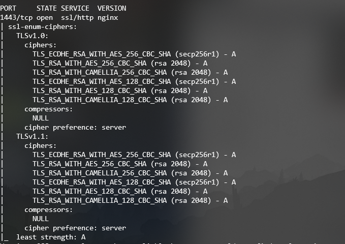
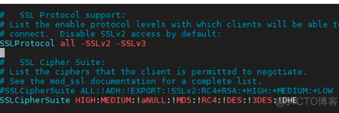
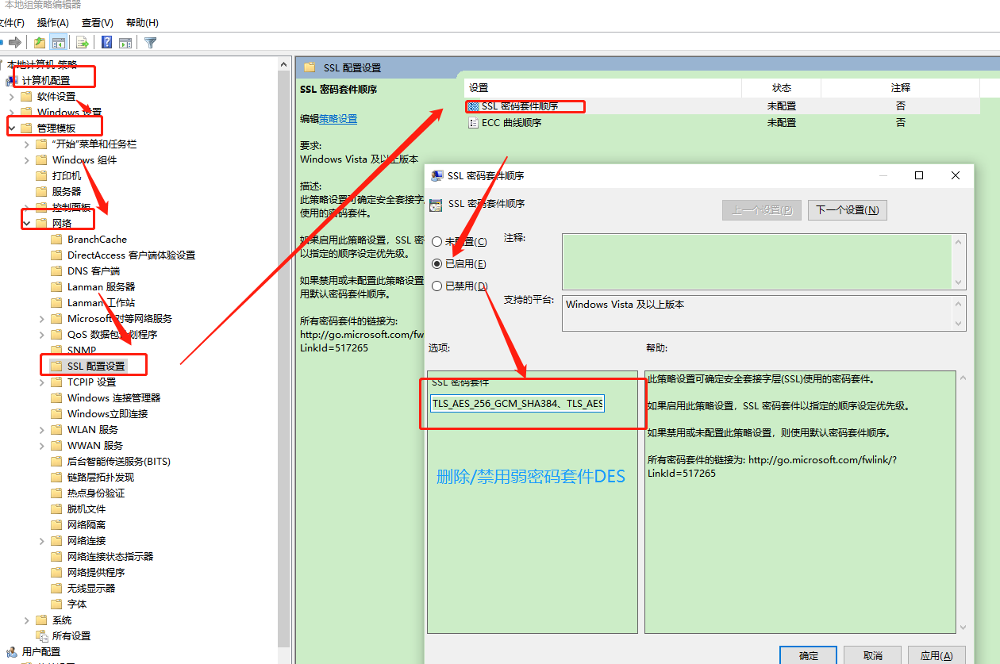
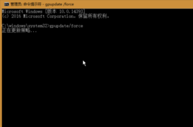
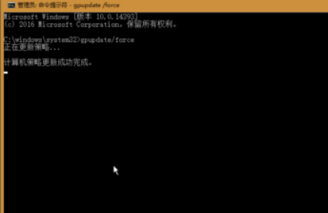

# SSL/TLS协议信息泄露漏洞(CVE-2016-2183)

### :octopus:漏洞介绍

TLS是安全传输层协议，用于在两个通信应用程序之间提供保密性和数据完整性。

TLS, SSH, IPSec协商及其他产品中使用的DES及Triple DES密码存在大约四十亿块的生日界，这可使远程攻击者通过Sweet32攻击，获取纯文本数据。

### :octopus:影响版本

Openssl 1.1.0 之前

### :octopus:漏洞验证

使用`nmap`指定脚本进行扫描

```bash
nmap -sV -p 443 --script ssl-enum-ciphers IP/域名
```


修复后：



### :octopus:修复建议

1、升级Opessl到最新版本

```bash
openssl官方说明：https://www.openssl.org/news/secadv/20160922.txt

请在下列网页下载最新版本： 
https://www.openssl.org/source/
```

2、避免使用IDEA、DES和3DES算法

**对于nginx、apache、lighttpd等服务器禁止使用DES加密算法，主要是修改配置文件**

- nginx

```bash
编辑nginx.conf文件，修改ssl_ciphers后面的参数

ssl_ciphers HIGH:!aNULL:!MD5:!3DES;

之后nginx -t 检查配置文件
nginx -s reload 重启nginx
```

- apache

```bash
编辑 apache配置文件,添加如下配置

vim /etc/httpd/conf.d/ssl.conf

SSLCipherSuite HIGH:MEDIUM:!aNULL:!MD5:!RC4:!DES:!3DES

重启 apache 服务器
service httpd restart
```



- Tomcat

```bash
进入 tomcat 配置文件  ， xx/tomcat/conf/server.xml   ， 找到 ciphers ，将包含的 DES 去掉，例如：

ciphers="TLS_RSA_WITH_AES_128_CBC_SHA,TLS_DHE_RSA_WITH_AES_128_CBC_SHA,TLS_DHE_DSS_WITH_AES_128_CBC_SHA,TLS_ECDHE_ECDSA_WITH_AES_128_CBC_SHA256,TLS_ECDHE_RSA_WITH_AES_128_CBC_SHA256"

重启Tomcat
```


**windows配置**

配置组策略



在"`SSL 密码套件`"下修改 SSL 密码套件算法，仅保留` TLS 1.2 SHA256` 和 `SHA384 密码套件`、`TLS 1.2 ECC GCM 密码套件`（可先复制该选项原始数值并备份到记事本作回退备用，然后删除原有内容替换为：


```
TLS_ECDHE_ECDSA_WITH_AES_128_GCM_SHA256_P256,TLS_ECDHE_ECDSA_WITH_AES_128_GCM_SHA256_P384,TLS_ECDHE_ECDSA_WITH_AES_128_GCM_SHA256_P521,TLS_ECDHE_ECDSA,WITH_AES_256_GCM_SHA384_P384,TLS_ECDHE_ECDSA_WITH_AES_256_GCM_SHA384_P521,TLS_RSA_WITH_AES_128_CBC_SHA256,TLS_RSA_WITH_AES_256_CBC_SHA256,TLS_ECDHE_RSA_WITH_AES_128_CBC_SHA256_P256,TLS_ECDHE_RSA_WITH_AES_128_CBC_SHA256_P384,TLS_ECDHE_RSA_WITH_AES_128_CBC_SHA256_P521,TLS_ECDHE_RSA_WITH_AES_256_CBC_SHA384_P256,TLS_ECDHE_RSA_WITH_AES_256_CBC_SHA384_P384,TLS_ECDHE_RSA_WITH_AES_256_CBC_SHA384_P521,TLS_ECDHE_ECDSA_WITH_AES_128_CBC_SHA256_P256,TLS_ECDHE_ECDSA_WITH_AES_128_CBC_SHA256_P384,TLS_ECDHE_ECDSA_WITH_AES_128_CBC_SHA256_P521,TLS_ECDHE_ECDSA_WITH_AES_256_CBC_SHA384_P384,TLS_ECDHE_ECDSA_WITH_AES_256_CBC_SHA384_P521,TLS_DHE_DSS_WITH_AES_128_CBC_SHA256,TLS_DHE_DSS_WITH_AES_256_CBC_SHA256,TLS_RSA_WITH_NULL_SHA,TLS_RSA_WITH_AES_128_CBC_SHA,TLS_DHE_DSS_WITH_AES_128_CBC_SHA
```

设置完后重启策略组

- 1、按Windows+X，选择命令提示符(管理员)，在弹出的用户控制窗口中点击同意;

- 2、在命令提示符中输入：  `gpupdate /force `    后按回车运行;





重启系统

### :octopus:参考资料

- :panda_face:https://www.cnblogs.com/you-men/p/13642078.html
- :panda_face:https://segmentfault.com/a/1190000038486901
- :panda_face:https://www.trustauth.cn/wiki/6938.html


# SSL/TLS 受诫礼(BAR-MITZVAH)攻击漏洞(CVE-2015-2808)