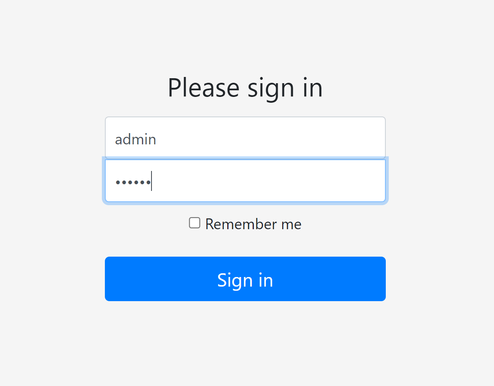
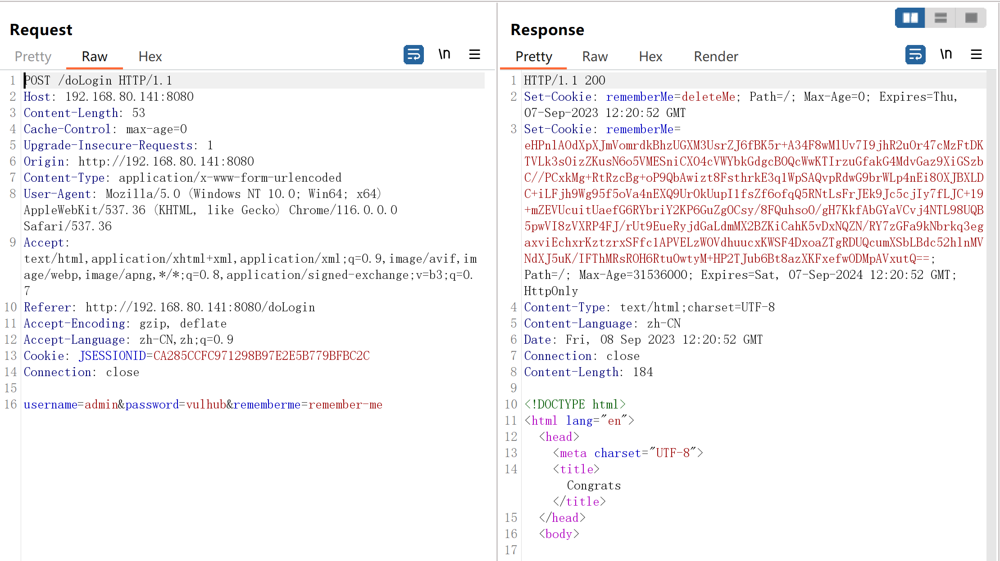

# Apache_Shiro_1.2.4_反序列化漏洞（CVE-2016-4437）

| 说明     | 内容                                                         |
| -------- | ------------------------------------------------------------ |
| 漏洞编号 | CVE-2016-4437                                                |
| 漏洞名称 | Apache_Shiro_1.2.4_反序列化漏洞                              |
| 漏洞评级 | 高危                                                         |
| 影响范围 | Shiro <= 1.2.5                                               |
| 漏洞描述 | Apache Shiro 1.2.4及以前版本中，加密的用户信息序列化后存储在名为remember-me的Cookie中。攻击者可以使用Shiro的默认密钥伪造用户Cookie，触发Java反序列化漏洞，进而在目标机器上执行任意命令 |
| 修复方案 |                                                              |

### 1.1、漏洞描述

Apache Shiro是一款开源安全框架，提供身份验证、授权、密码学和会话管理。Shiro框架直观、易用，同时也能提供健壮的安全性。

Apache Shiro 1.2.4及以前版本中，加密的用户信息序列化后存储在名为remember-me的Cookie中。攻击者可以使用Shiro的默认密钥伪造用户Cookie，触发Java反序列化漏洞，进而在目标机器上执行任意命令。

**漏洞原理：**

Apache  shiro框架提供了记住我的功能（Rememberme),用户登录成功后生成经过加密并编码的cookie。cookie的key为rememberme，cookie的值是经过对相关的信息进行序列化，然后实用aes加密，最后在使用b ase64编码处理形成的。

在服务端接收到cookie值时，按照如下步骤来解析处理：

```
1、检索RememberMe cooike的值
2、b ase 64解码
3、使用aes解密（加密秘钥硬编码）
4、进行反序列化操作（未做过过滤处理）
在调用反序列化时未进行任何过滤，导致可以出发远程代码执行漏洞
```

**利用条件：**

由于使用了aes加密，想要成功利用漏洞则需要获取ase的加密秘钥，而在shiro的1.2.4之前的版本中使用的硬编码。其中默认秘钥的b  ase64编码后的值为kPH+bIxk5D2deZiIxcaaaA==，这里就可以通过构造恶意的序列化对象进行编码，加密，然后欧威cooike加密发送，服务端接受后会解密并触发反序列化漏洞。

尽管目前已经更新了许多版本，官方并没有反序列化漏洞本身解决方法，而是通过去掉硬编码的秘钥，使其每次生成一个密码来解决给漏洞。但是目前一些开源系统、教程范例代码都使用了固定的编码，这里可以通过搜索引擎，github等来收集秘钥，通过漏洞检查与利用的成功率

### 1.2、漏洞等级

高危

### 1.3、影响版本

Shiro <= 1.2.5

### 1.4、漏洞复现

#### 1、基础环境

Path：Vulhub/shiro/CVE-2016-4437

---

启动测试环境：

```bash
sudo docker-compose up -d
```

访问`http://your-ip:{端口}/`即可看到，可使用`admin:vulhub`进行登录




#### 2、漏洞分析


未登录的情况下，请求包中的`cookie`没有`rememberMe`字段，返回包`set-cookie`里面也没有`deleteme`字段


登录失败的话，不管勾选`RememberMe`字段没有，返回包都会有`remeberme=deleteme`字段


不勾选`RememberMe`字段，登陆成功的话，返回包`set-Cookie`会有`rememberMe=deleteMe`字段。但是之后的所有请求中`Cookie`都不会有`rememberMe`字段


勾选`RememberMe`字段，登陆成功的话，返回包`set-Cookie`会有经过==加密后==的`rememberMe=deleteMe`字段，还会有`rememberMe`字段，之后的所有请求中`Cookie`都会有`rememberMe`字段



#### 3、漏洞验证

利用[Shiro_exploit](https://github.com/insightglacier/Shiro_exploit)这样的`exp`工具


反弹到kali机器上


反弹Shell成功


