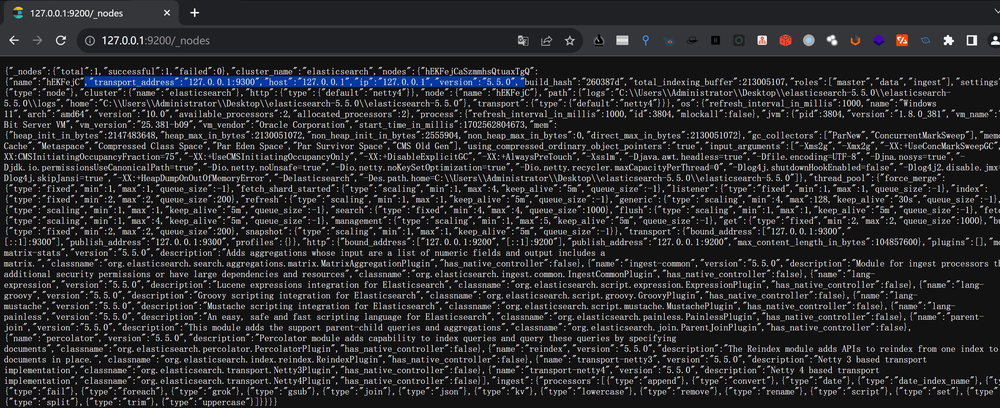

# Elasticsearch 未授权访问

### 1.1、漏洞描述

Elasticsearch服务普遍存在一个未授权访问的问题，攻击者通常可以请求一个开放9200或9300的服务器进行恶意攻击Elasticsearch未授权访问可导致ES中存储的数据被任意查看，主要的危害是数据泄漏。

除了未授权访问，历史上还出现过几个漏洞，⽐如远程命令执⾏、任意⽂件读取、写webshell等。

免费开源的Elasticsearch可能存在未授权访问漏洞。该漏洞导致，攻击者可以拥有Elasticsearch的所有权限。可以对数据进行任意操作。业务系统将面临敏感数据泄露、数据丢失、数据遭到破坏甚至遭到攻击者的勒索

### 1.2、漏洞等级

### 1.3、影响版本

### 1.4、漏洞复现

#### 1、基础环境

> 下载地址：https://artifacts.elastic.co/downloads/elasticsearch/elasticsearch-5.5.0.zip 
>
> 解压后，进入bin目录，双击执行 elasticsearch.bat


访问`http://127.0.0.1:{9200}/`即可看到


#### 2、漏洞扫描


#### 3、漏洞验证

`http://127.0.0.1:9200/_cat/`


`http://127.0.0.1:9200/_cat/master`


查看节点数据：`http://127.0.0.1:9200/_nodes`



#### 4、POC验证

```python
import requests
import argparse
from termcolor import colored


def Elasticsearch_check(ip, port=9200):
    try:
        res = requests.get(f'http://{ip}:{port}/_cat')
    except Exception as e:
        print(e)
    if "_cat/master" in res.text:
        print(colored('[+] Elasticsearch Unauthorized', color='red'))


if __name__ == '__main__':
    parser = argparse.ArgumentParser()
    parser.add_argument('ip', help='test IPAddress')
    args = parser.parse_args()

    Elasticsearch_check(args.ip)

```


### 1.5、修复建议

1、限制IP访问，绑定固定IP

```
打开配置文件config/elasticsearch.yml，修改network.host字段，将其改成192.168.0.1（举例）将其监听在本地，同时修改http.port字段，将其运行在其他端口上。 
```


2、添加认证功能与白名单模式修改配置文件config/elasticsearch.yml，将端口设置认证如下：

```
http.basic.enabled true           

\#开关，开启会接管全部HTTP连接http.basic.user“admin”           

\#账号http.basic.password“password”        

\#密码http.basic.ipwhitelist[“localhost”,”127.0.0.1”]  

\#白名单内的IP访问不需要通过账号和密码认证，支持IP和主机名，不支持IP区间或者正则。
```


 