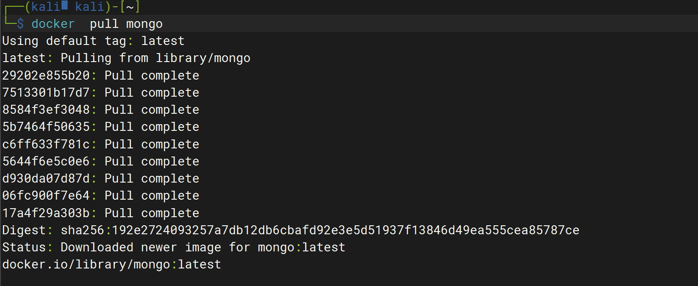
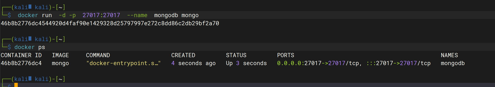
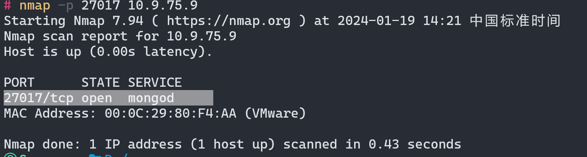
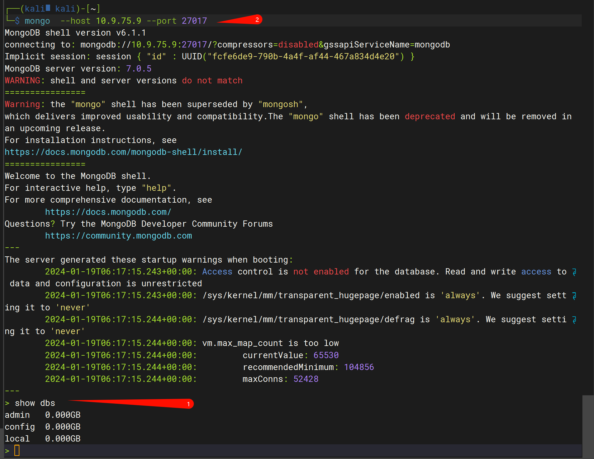

# MongoDB未授权

### 漏洞描述

MongoDB未授权漏洞是指攻击者可以未经身份验证地远程访问MongoDB数据库服务器的漏洞。这种漏洞通常是由于管理员没有正确配置数据库安全选项，比如没有启用身份验证或者没有限制远程访问的IP地址等所导致的。

攻击者可以利用这种漏洞来获取敏感数据、修改数据库记录，甚至是删除整个数据库。
MongoDB默认端口是`27017`

### 环境搭建

```bash
docker  pull mongo
```



```bash
 docker run  -d -p  27017:27017  --name  mongodb mongo
```




nmap扫描开放端口



### 漏洞复现

#### MSF验证

```bash
 use auxiliary/scanner/mongodb/mongodb_login
 set rhosts 192.xxx.xxx.xxx
 set threads 15
 exploit
```

#### 命令行验证

```bash
 mongo  --host 10.9.75.9 --port 27017
```





### 修复建议

1、在admin数据库中增加用户，设置复杂的密码；

2、配置文件/etc/mongod.conf中，设置auth=true;

3、配置文件/etc/mongod.conf中，设置bind_ip=127.0.0.1