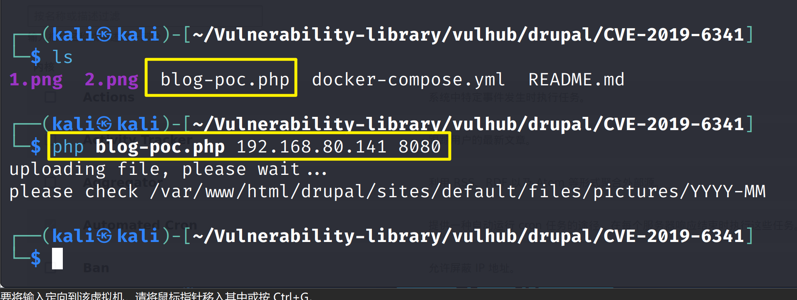
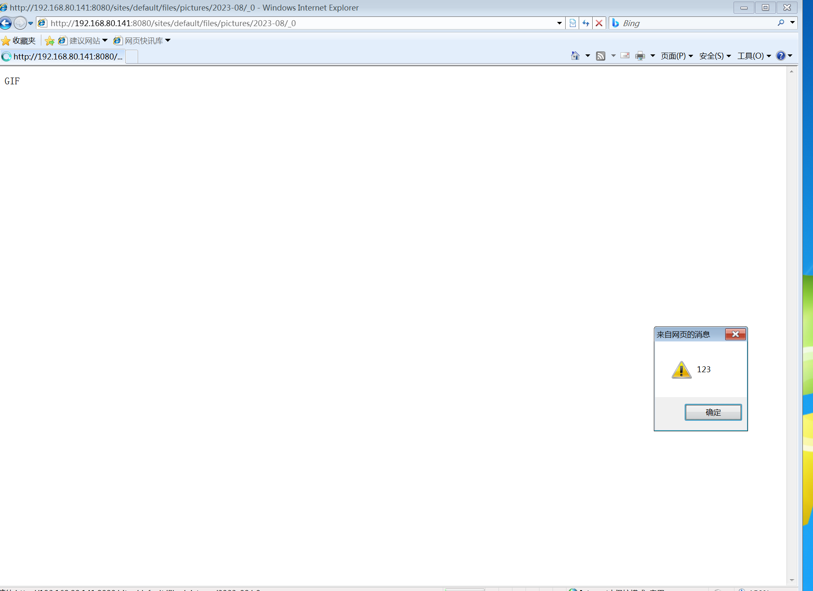

# Drupal XSS漏洞（CVE-2019-6341）

> 复现环境：Vulhub

环境启动后，访问 `http://192.168.80.141:8080/` 将会看到drupal的安装页面，一路默认配置下一步安装。因为没有mysql环境，所以安装的时候可以选择sqlite数据库

#### 漏洞复现

该漏洞需要利用drupal文件模块上传文件的漏洞，伪造一个图片文件，上传，文件的内容实际是一段HTML代码，内嵌JS，这样其他用户在访问这个链接时，就可能触发XSS漏洞。

Drupal 的图片默认存储位置为 `/sites/default/files/pictures/<YYYY-MM>/`，默认存储名称为其原来的名称，所以之后在利用漏洞时，可以知道上传后的图片的具体位置。

输入如下命令，即可使用PoC构造样本并完成上传功能，第一个参数为目标IP 第二个参数为目标端口。

```php
php blog-poc.php 192.168.80.141 8080
```



文件上传后的地址`http://192.168.80.141:8080/sites/default/files/pictures/2023-08/_0`

在火狐，Google，Edge浏览器都不行

在IE浏览器里触发XSS弹框

