# IIS_7.o/7.5解析漏洞

| 说明     | 内容                          |
| -------- | ----------------------------- |
| 漏洞编号 |                               |
| 漏洞名称 |                               |
| 漏洞评级 |                               |
| 影响范围 |                               |
| 漏洞描述 |                               |
| 修复方案 | 打补丁<br >上设备<br>升级组件 |


### 1.1、漏洞描述

漏洞原理：

```
cgi.fix_path=1
1.png/.php
```

该漏洞不是由于代码或者框架引起，而是由于**配置**问题引起的漏洞

### 1.2、漏洞等级

### 1.3、影响版本

IIS_7.o/7.5

### 1.4、漏洞复现

#### 1、基础环境

windows server 2008

---

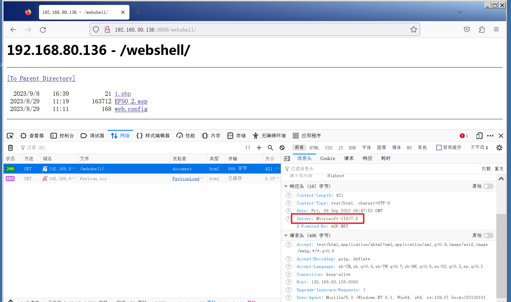

在服务器路径下创建`1.php`脚本

```bash
<?php
phpinfo();
?>
```

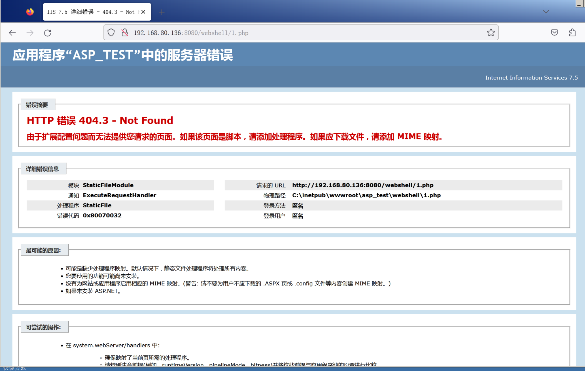

#### 2、漏洞扫描

#### 3、漏洞验证

IIS想要运行PHP，中间有个技术叫`FASTCGI`

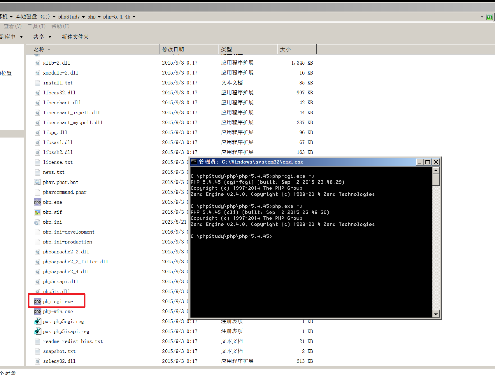

放访问`1.php`的时候，交给`php-cgi.exe`来执行，解释完的执行结果再返回给浏览器

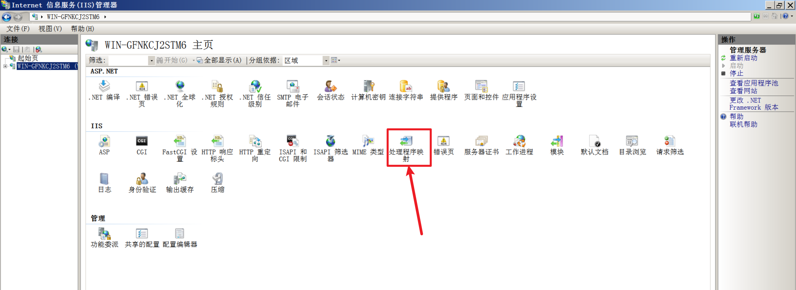

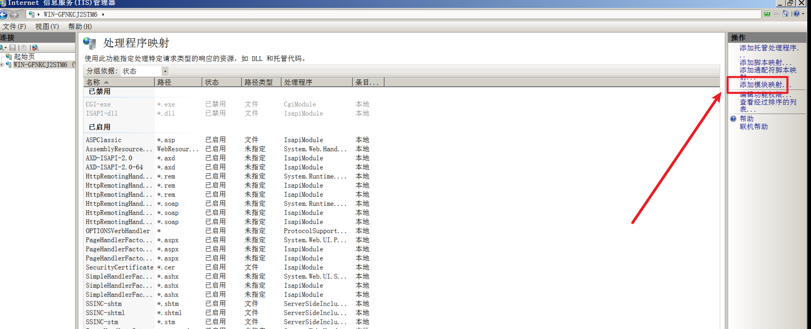

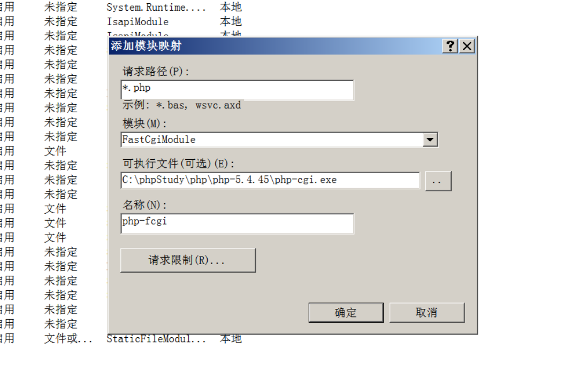

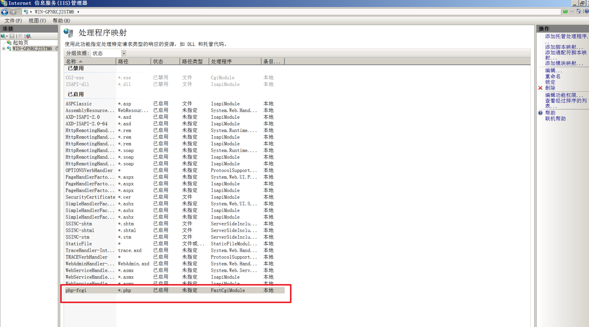

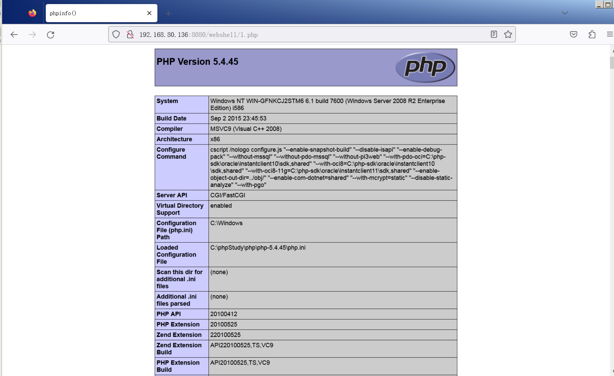


如果把`1.php`后缀改成`1.png`

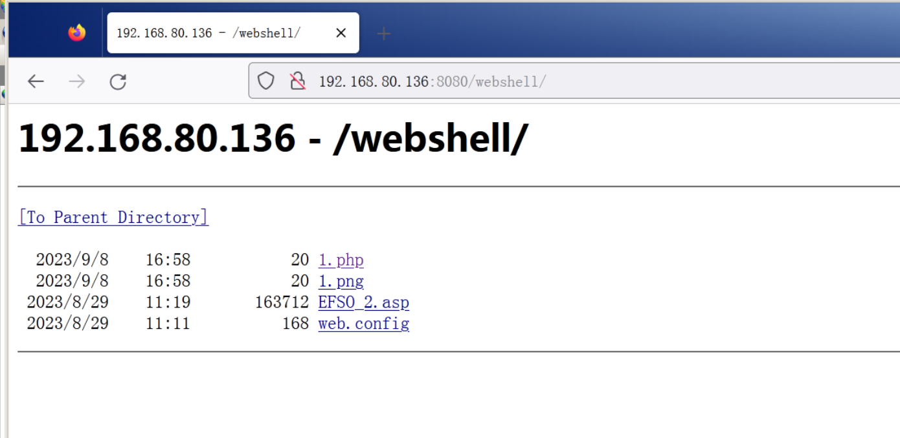

访问`1.png`，报错

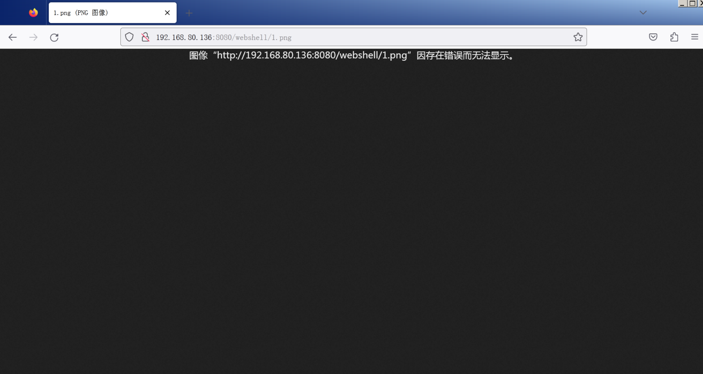

在`1.png`后面加上`/.php`

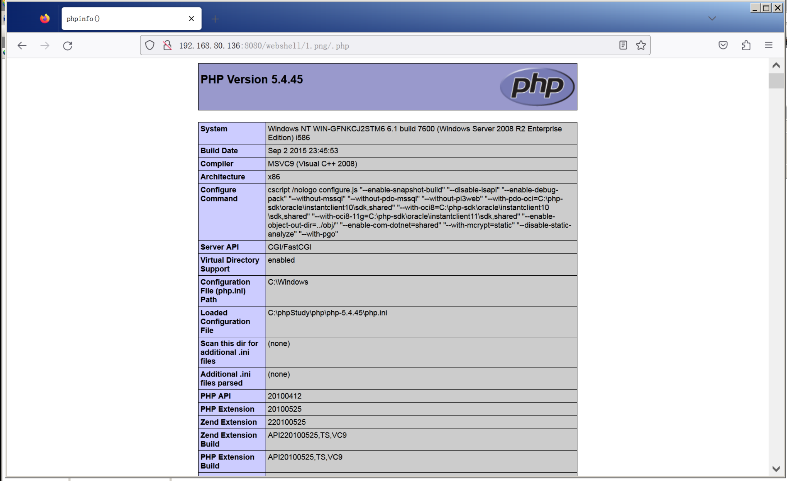

这里之所以能够以`1.png/.php`的方式访问，是因为下面的对勾没有勾上

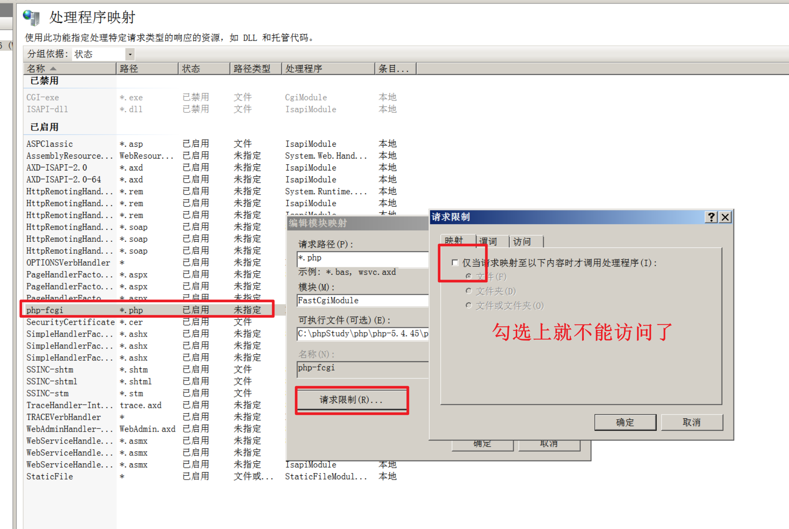

### 1.5、修复建议

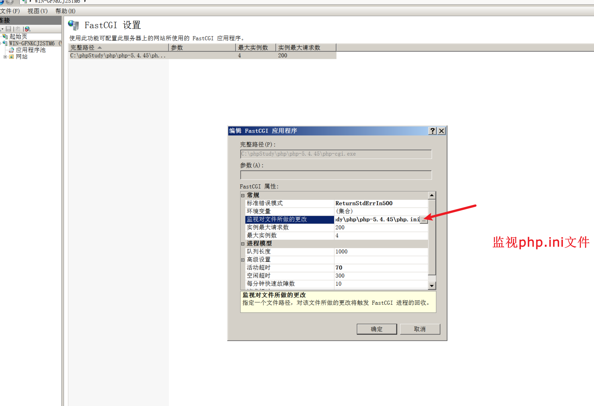

之所以能够以`1.png/.php`的方式解析php文件

是因为php的安全 选项`cgi.fix_pathinfo=1`，需要把它改成0

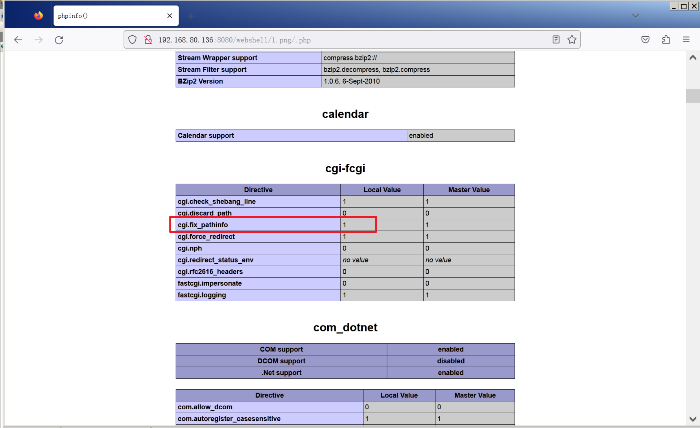

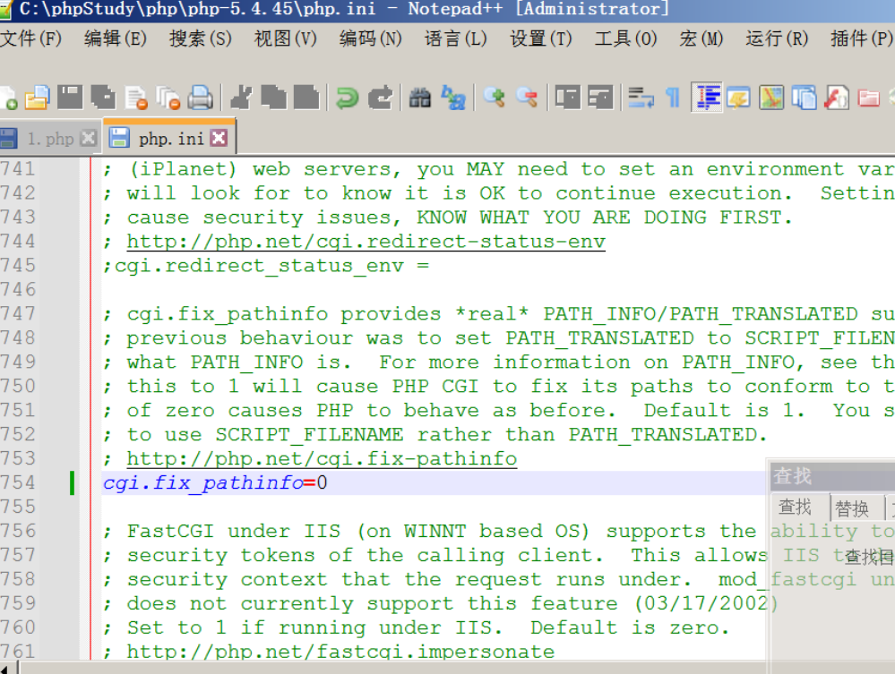

就是不能通过`/.php`的方式访问了

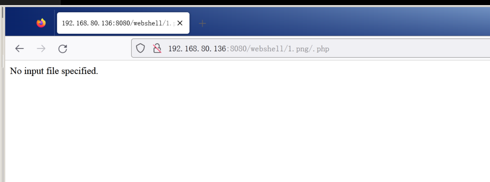