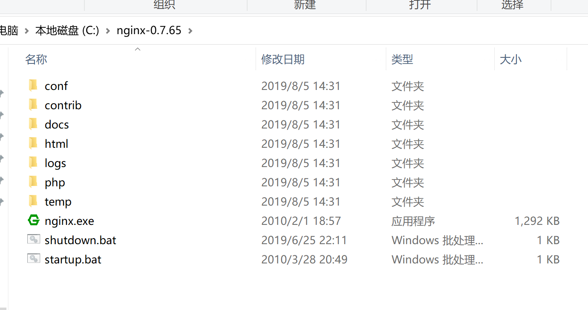
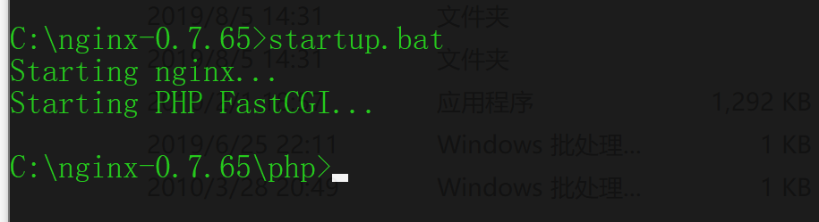
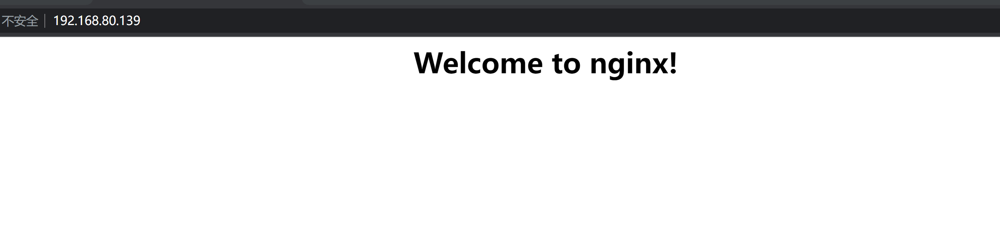
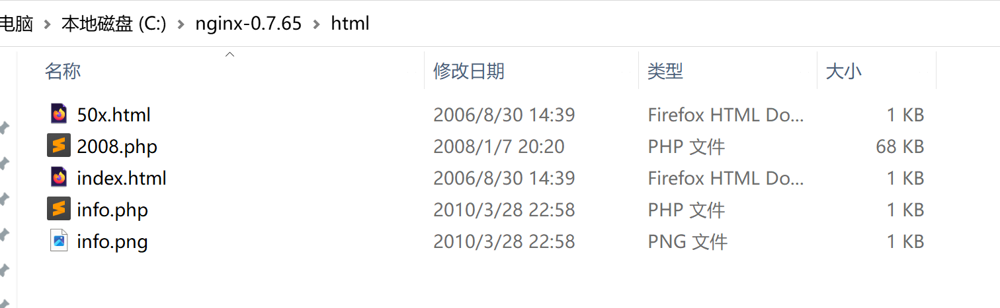
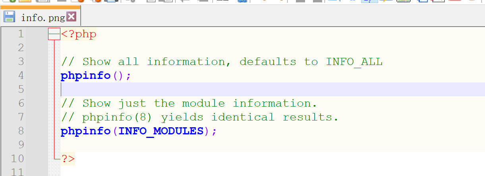
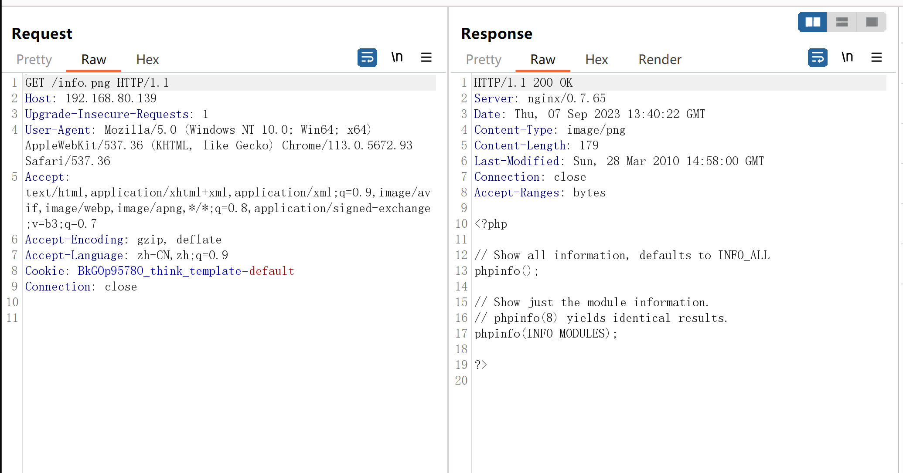
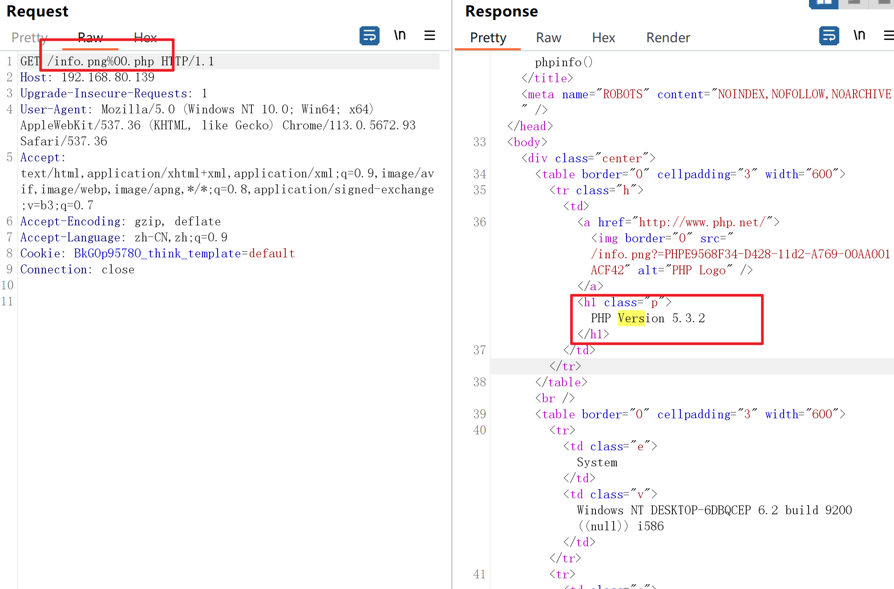

# Nginx_0.7.65_空字节漏洞

### 1.1、漏洞描述

### 1.2、漏洞等级

### 1.3、影响版本

0.7.65

### 1.4、漏洞复现

#### 1、基础环境

> 链接：https://pan.baidu.com/s/1GBEb6ig6ogiQfXq-yj_Vhw 
> 提取码：8gov

---

运行根目录下的`startup.bat`就OK了

启动`nginx`

访问`http://your-ip`即可看到

#### 2、漏洞扫描

#### 3、漏洞验证

在`html`文件夹中有一个`info.png`

查看 该`info.png`源码

浏览器访问该png图片，`bp`抓取数据包

00截断

